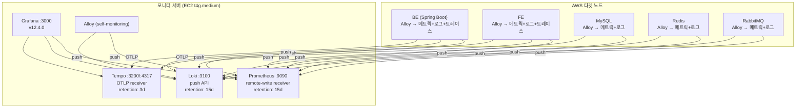

# V2 모니터링 시스템 (v1.0.0)

- 작성일: 2026-03-05
- 최종수정일: 2026-03-05
- 작성자: jsh
- 상태: draft
- 관련문서: [개선보고서](../../../project/reports/2026-03-05_v2-monitoring-review_improve.md)

---

## 1. 설계 배경

### V1 → V2 전환

V1은 GCP 단일 VM에서 Prometheus가 직접 pull하는 구조였다. V2에서 AWS 멀티 인스턴스 환경으로 전환하면서 수집 방식도 재설계했다.

| 항목 | V1 | V2 |
|------|-----|-----|
| 인프라 | GCP 단일 VM | AWS 6개 인스턴스 분산 |
| 수집 방식 | Prometheus pull (크로스 클라우드) | **Alloy push** (동일 VPC 내) |
| 에이전트 | Promtail + Node Exporter (2개) | **Alloy 1개** (통합) |
| 트레이싱 | 없음 | **Tempo** + OTel (준비) |
| 로그 | systemd journal + 앱 파일 | Docker 로그 + journal |

### Push 모델 선택 이유

1. **방화벽 단순화**: 타겟 노드에서 모니터로 outbound만 허용 (pull은 모니터 → 각 노드 inbound 필요)
2. **크로스 클라우드 용이**: NAT IP만 SG에 등록하면 GCP에서도 push 가능
3. **에이전트 통합**: Alloy가 메트릭/로그/트레이스를 단일 바이너리로 수집 → push

### 기술 선택

| 컴포넌트 | 선택 | 근거 |
|----------|------|------|
| 에이전트 | Grafana Alloy | Promtail EOL(2026-03-02). 메트릭+로그+트레이스 통합 수집 |
| 메트릭 저장 | Prometheus (remote-write) | 생태계 호환성, PromQL, 경량 |
| 로그 저장 | Loki | Grafana 네이티브 통합, LogQL |
| 트레이스 저장 | Tempo | Grafana 네이티브 통합, TraceQL, 경량 |
| 시각화 | Grafana | 데이터소스 통합, 프로비저닝 자동화 |
| 실행 환경 | Docker Compose (host 모드) | 단일 서버, 간단한 구성, K8S 전환 시까지 유지 |

---

## 2. 아키텍처

### 전체 구조



### 데이터 흐름

| 데이터 | 프로토콜 | 엔드포인트 |
|--------|---------|-----------|
| 메트릭 | Prometheus remote_write | `http://{MONITOR_IP}:9090/api/v1/write` |
| 로그 | Loki push API | `http://{MONITOR_IP}:3100/loki/api/v1/push` |
| 트레이스 | OTLP gRPC | `{MONITOR_IP}:4317` |
| 트레이스 | OTLP HTTP | `{MONITOR_IP}:4318` |

### 네트워크/보안

- **모니터 서버**: EIP 할당 (15.165.213.200) — IP 고정으로 Alloy 설정 안정성 확보
- **SG 인바운드**: VPC CIDR(10.0.0.0/18)에서만 9090/3100/4317/4318 허용
- **Grafana 접근**: ADMIN_IP(211.244.225.211/32)에서만 3000 허용
- **Alloy 배포**: S3 Gateway VPC Endpoint 경유 (NAT 불필요)

---

## 3. 스택 구성

### 모니터 서버

Docker Compose (`network_mode: host`) 기반. 데이터는 Docker named volume에 저장.

| 서비스 | 이미지 | 포트 | Retention | 핵심 설정 |
|--------|--------|------|-----------|----------|
| Prometheus | `prom/prometheus:v3.2.1` | 9090 | 15일 | `--web.enable-remote-write-receiver`, `scrape_configs: []` (순수 수신 모드) |
| Loki | `grafana/loki:3.4.2` | 3100 | 360h (15일) | TSDB v13, compactor, `ingestion_rate_mb: 10` |
| Tempo | `grafana/tempo:2.7.1` | 3200, 4317, 4318 | 72h (3일) | local filesystem, OTLP gRPC+HTTP |
| Grafana | `grafana/grafana:12.4.0` | 3000 | — | 파일 프로비저닝 (datasources + dashboards) |

### Alloy 에이전트

Alloy의 실행 방식은 환경에 따라 다르다.

| 환경 | 실행 방식 | 이유 |
|------|----------|------|
| **AWS 노드** (BE/FE/MySQL/Redis/MQ/Monitor) | systemd 직접 실행 | 기존 인스턴스에 SSM으로 Alloy만 추가 설치하는 방식 |
| **GCP AI Server** | Docker Compose 서비스 | Terraform 프로비저닝 시 docker-compose에 앱과 함께 묶어 배포 |
| **GCP vLLM** | Docker Compose 서비스 | 동일 |

**AWS (systemd)**:
| 항목 | 값 |
|------|-----|
| 서비스 | `alloy.service` (root, systemd override) |
| 설정 파일 | `/etc/alloy/config.alloy` (S3에서 pull) |
| 데이터 | `/var/lib/alloy/` |
| HTTP UI | `localhost:12345` (readiness: `/ready`) |

**GCP (Docker Compose)**:
```yaml
alloy:
  image: grafana/alloy:latest
  network_mode: host
  volumes:
    - /var/run/docker.sock:/var/run/docker.sock:ro
    - /opt/app/config.alloy:/etc/alloy/config.alloy:ro
  command: ["run", "/etc/alloy/config.alloy"]
  restart: unless-stopped
```
설정은 Terraform `templatefile()`로 렌더링하여 `/opt/app/config.alloy`에 배치.

### 노드별 수집 항목

| Config | Node Exporter | Docker 로그 | Journal | 서비스 Exporter | OTLP |
|--------|:---:|:---:|:---:|:---:|:---:|
| config-be.alloy | O | O | O | Spring Actuator `:8080` | O |
| config-fe.alloy | O | O | O | — | O |
| config-mysql.alloy | O | — | O | `prometheus.exporter.mysql` | — |
| config-redis.alloy | O | — | O | `prometheus.exporter.redis` | — |
| config-mq.alloy | O | — | O | RabbitMQ Plugin `:15692` | — |
| config-monitor.alloy | O | O | O | — | — |

**Node Exporter 수집**: cpu, diskstats, filesystem, loadavg, meminfo, netdev, uname

---

## 4. 라벨 설계

### 메트릭 라벨

모든 Alloy config에 `prometheus.relabel`로 공통 적용:

```alloy
prometheus.relabel "instance_label" {
  forward_to = [prometheus.remote_write.default.receiver]
  rule {
    target_label = "instance"
    replacement  = "{ENV_PREFIX}-{서버명}"  // 예: dev-dojangkok-v2-be
  }
  rule {
    source_labels = ["job"]
    regex         = "integrations/unix"
    target_label  = "job"
    replacement   = "node"
  }
}
```

결과: `{instance="dev-dojangkok-v2-be", job="node"}`

### 로그 라벨

**Docker 로그** (BE/FE/Monitor):
```alloy
loki.source.docker "containers" {
  labels = { job = "docker", host = "{ENV_PREFIX}-{서버명}" }
}
```
→ `{job="docker", host="dev-dojangkok-v2-be", container="springboot-app"}`

**systemd Journal** (전체 6개 노드):
```alloy
loki.source.journal "systemd" {
  labels = { job = "journal", host = "{ENV_PREFIX}-{서버명}" }
}
```
→ `{job="journal", host="dev-dojangkok-v2-mysql", unit="mysql.service"}`

### 라벨 요약

| 라벨 | 소스 | 용도 | 예시 |
|------|------|------|------|
| `instance` | prometheus.relabel | 메트릭 서버 식별 | dev-dojangkok-v2-be |
| `job` | 정적/relabel | 데이터 유형 구분 | node, docker, journal, integrations/mysql |
| `host` | loki.source 정적 | 로그 서버 식별 | dev-dojangkok-v2-mysql |
| `container` | discovery.relabel | Docker 컨테이너명 | springboot-app, prometheus |
| `unit` | loki.relabel | systemd 서비스명 | mysql.service, alloy.service |

### 주요 쿼리 예시

```promql
# 특정 서버 CPU 사용률
100 - (avg by (instance) (rate(node_cpu_seconds_total{mode="idle", instance="dev-dojangkok-v2-be"}[5m])) * 100)

# 전체 서버 메모리 사용률
(1 - node_memory_MemAvailable_bytes / node_memory_MemTotal_bytes) * 100

# Alloy up 상태
up{job="node"}
```

```logql
# 서버별 전체 로그
{host="dev-dojangkok-v2-mysql"}

# Docker 컨테이너 로그
{job="docker", host="dev-dojangkok-v2-be", container="springboot-app"}

# systemd 서비스 로그
{job="journal", unit="mysql.service"}

# 에러 필터
{host="dev-dojangkok-v2-be"} |= "ERROR"
```

---

## 5. 대시보드

6개 대시보드를 Grafana 파일 프로비저닝으로 자동 등록.

| # | 대시보드 | 주요 패널 | 데이터소스 |
|---|----------|----------|-----------|
| 1 | **Overview** | 전체 노드 상태 (Up/Down), CPU/메모리/디스크 요약, 서비스 상태 | Prometheus |
| 2 | **Node Exporter** | CPU, 메모리, 디스크, 네트워크, 로드 (노드별 상세) | Prometheus |
| 3 | **Backend** | Spring Boot HTTP 메트릭, JVM, 에러율 + **BE 로그 패널** | Prometheus + Loki |
| 4 | **RabbitMQ** | 큐별 메시지 수/속도, 연결, 채널, 메모리, 각 큐 상태 | Prometheus |
| 5 | **MySQL** | 쿼리 처리량, 연결, InnoDB 버퍼 + **slow query 로그** | Prometheus + Loki |
| 6 | **Redis** | 메모리, 히트율, 연결, 키 수, 커맨드 통계 | Prometheus |

### 알림 규칙 (후순위)

`alert-rules.yml`에 12개 규칙 정의. 발송 채널은 미설정 상태.

| 그룹 | 규칙 | 조건 | 심각도 |
|------|------|------|--------|
| instance_health | InstanceDown | `up == 0` 3분 | critical |
| instance_health | HighCpuUsage | CPU > 85% 5분 | warning |
| instance_health | HighMemoryUsage | 메모리 > 90% 5분 | warning |
| instance_health | DiskSpaceLow | 디스크 > 85% 5분 | warning |
| instance_health | DiskSpaceCritical | 디스크 > 95% 2분 | critical |
| service_health | MySQLDown | `mysql_up == 0` 2분 | critical |
| service_health | RedisDown | `redis_up == 0` 2분 | critical |
| service_health | MySQLConnectionHigh | 연결 > 80% 5분 | warning |
| service_health | MySQLSlowQueries | slow query > 0.1/s 5분 | warning |
| service_health | RedisMemoryHigh | 메모리 > 80% 5분 | warning |
| service_health | RabbitMQQueueDepth | 큐 > 1000 10분 | warning |
| service_health | RabbitMQHighUnacked | unacked > 500 5분 | warning |

---

## 6. 배포/운영

### IaC (Terraform)

`monitoring/2-v2/terraform/`에서 EC2, SG, EIP를 관리.

| 리소스 | 설명 |
|--------|------|
| `aws_instance.monitor` | 모니터 서버 EC2 (t4g.medium) |
| `aws_eip.monitor` | 고정 IP (15.165.213.200) |
| `aws_security_group.monitor` | 인바운드 규칙 (9090/3100/4317/4318/3000) |

State: 로컬 (`terraform.tfstate`)

### 스크립트 실행 순서

```
00_preflight.sh [env]     # 환경 변수, AWS credentials, 리소스 검증
01_create_monitor.sh [env] # EC2 + SG + IAM + EIP 생성
01.5_create_s3.sh [env]   # S3 버킷 + VPC Endpoint 확인
02_install_stack.sh [env]  # SSM → Docker Compose 배포
03_install_alloy.sh [env]  # Alloy 설정 S3 업로드 + 전체 노드 배포
04_verify.sh [env]        # 헬스체크
99_cleanup.sh [env]       # 전체 삭제
```

### Alloy 배포 방식

| 대상 | 방식 | 설명 |
|------|------|------|
| BE/FE (ASG) | Launch Template user_data | 인스턴스 부팅 시 S3에서 설정 pull + Alloy 설치 |
| MySQL/Redis/MQ | SSM `AWS-RunShellScript` | S3에서 설정 pull + Alloy 재시작 |
| Monitor | SSM `AWS-RunShellScript` | localhost push (동일 호스트) |

### 설정 템플릿 치환

스크립트가 Alloy 설정의 플레이스홀더를 환경에 맞게 치환:

| 플레이스홀더 | 치환 값 | 예시 |
|-------------|---------|------|
| `MONITOR_IP_PLACEHOLDER` | 모니터 서버 IP | 15.165.213.200 |
| `ENV_PREFIX_PLACEHOLDER` | 환경 접두사 | dev-dojangkok-v2 |

### 환경 변수 (.env)

| 변수 | 설명 | 예시 |
|------|------|------|
| MONITOR_IP | 모니터 서버 EIP | 15.165.213.200 |
| ENV_PREFIX | 네이밍 접두사 | dev-dojangkok-v2 |
| ADMIN_IP | Grafana 접근 IP | 211.244.225.211/32 |
| DEV_VPC_CIDR | VPC CIDR | 10.0.0.0/18 |
| S3_BUCKET | 설정 버킷 | ktb-team14-dojangkok-deploy |
| GF_SECURITY_ADMIN_PASSWORD | Grafana 비밀번호 | (설정 참조) |

---

## 7. 트러블슈팅

### SSM /bin/sh 이슈

SSM `AWS-RunShellScript`는 기본 `/bin/sh`로 실행. bash 전용 문법(`[[`, `${!var}`) 사용 시 에러 발생.
- **해결**: `bash -c` 래핑 또는 POSIX 호환 문법 사용

### Alloy Docker 소켓 접근

Alloy가 Docker 로그를 읽으려면 `/var/run/docker.sock` 접근 필요.
- **해결**: systemd override에서 `User=root`로 실행

### Monitor Alloy localhost

모니터 서버는 Prometheus/Loki가 같은 호스트이므로 `MONITOR_IP_PLACEHOLDER` 대신 `localhost` 사용. OTLP receiver 제외 (Tempo가 4317 점유).

### Loki/Tempo readiness 응답 차이

`curl -sf localhost:3100/ready` 결과가 환경마다 다를 수 있음 (텍스트 vs JSON). 동작 자체는 정상 — 스크립트에서 HTTP 상태 코드로 판별.

### Ubuntu 24.04 AWS CLI

Ubuntu 24.04 기본 패키지에 AWS CLI v1 없음.
- **해결**: `awscli-exe-linux-aarch64.zip`으로 v2 수동 설치 (`03_install_alloy.sh`에서 자동 처리)

---

## 8. 디렉토리 구조

```
monitoring/2-v2/                  # SoT (Source of Truth)
├── terraform/                    # IaC (EC2, SG, EIP)
│   ├── main.tf
│   ├── variables.tf
│   ├── outputs.tf
│   └── terraform.tfvars
├── configs/                      # 모니터 서버 설정
│   ├── docker-compose.yml
│   ├── prometheus.yml
│   ├── loki-config.yml
│   ├── tempo-config.yml
│   ├── grafana-datasources.yml
│   ├── grafana-dashboards.yml
│   ├── alert-rules.yml
│   ├── .env.example
│   └── dashboards/
│       ├── overview.json
│       ├── node-exporter.json
│       ├── backend.json
│       ├── rabbitmq.json
│       ├── mysql.json
│       └── redis.json
├── alloy/                        # Alloy 에이전트 설정 (템플릿)
│   ├── config-be.alloy
│   ├── config-fe.alloy
│   ├── config-mysql.alloy
│   ├── config-redis.alloy
│   ├── config-mq.alloy
│   ├── config-monitor.alloy
│   └── install-alloy.sh
├── 00_preflight.sh
├── 01_create_monitor.sh
├── 01.5_create_s3.sh
├── 02_install_stack.sh
├── 03_install_alloy.sh
├── 04_verify.sh
├── 99_cleanup.sh
├── env.example
└── docs/
    └── README.md                 # 이 문서
```

---

## 9. 참고 문서

| 문서 | 위치 | 내용 |
|------|------|------|
| 개선보고서 | `project/reports/2026-03-05_v2-monitoring-review_improve.md` | 문제점 목록 + 개선 방안 |
| 아키텍처 정리 | `project/reports/2026-03-05_v2-monitoring-architecture.md` | 상세 아키텍처 문서 |
| 구축 현황 보고서 | `project/reports/2026-02-26_monitoring-v2-setup_report.md` | V2 초기 구축 기록 |
| V1→V2 전환 | `wiki/2-v2/guide/v2-monitoring.md` | Alloy/Tempo 도입 기록 |
| 대시보드 이용 가이드 | `wiki/1-bigbang/guide/monitoring/monitoring-page-guide.md` | 팀원용 Grafana 사용법 |
| 라벨 가이드 | `project/reports/2026-02-26_monitoring-v2-label-guide_report.md` | Alloy 라벨 설계 상세 |
