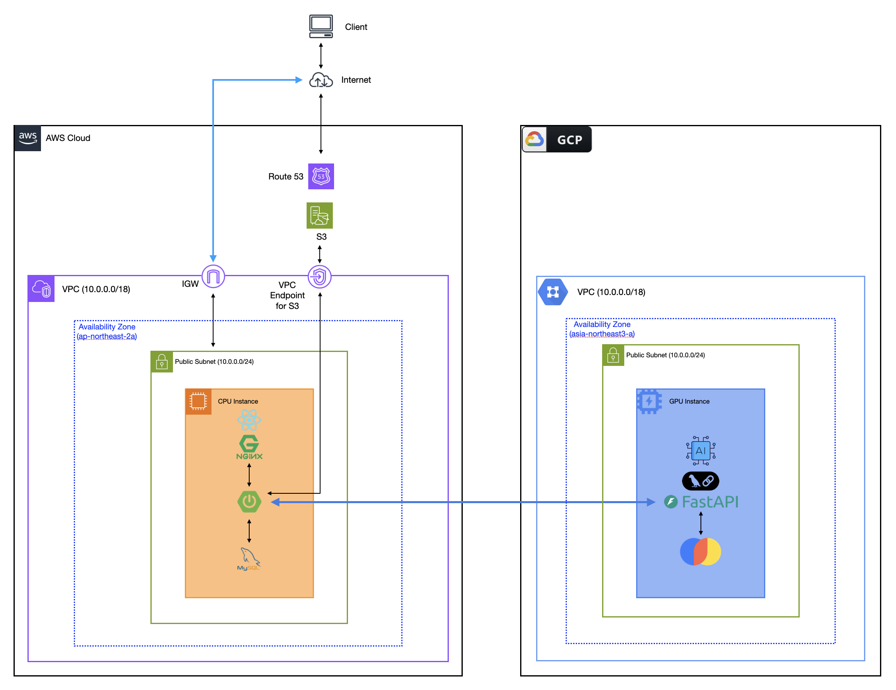
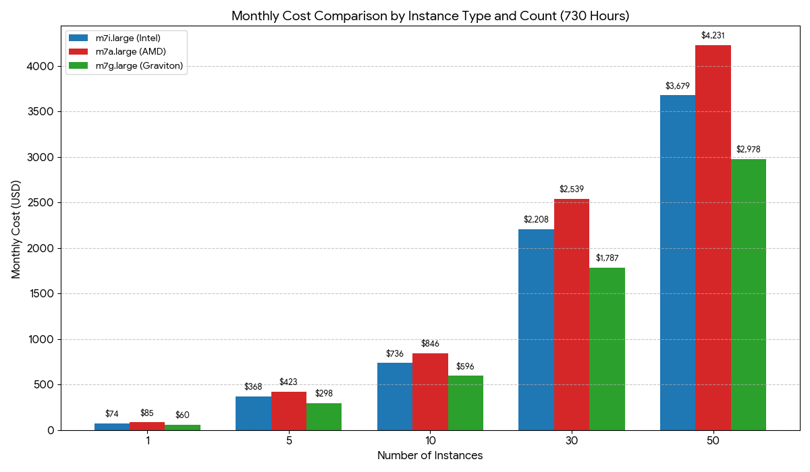

# 1단계 : Big Bang 방식 수작업 배포 설계

- 작성일: 2026-01-05
- 최종수정일: 2026-01-15

## 개요

**도장콕**은 임차인의 부동산 임대 계약 과정(계약 전·계약 중)을 지원하는 서비스입니다. <br>
핵심 기능: 쉬운 계약서(해설+리스크 검증) | 집노트(답사/비교/체크리스트) | 임대 매물 커뮤니티

**본 문서**: MVP 단계의 수작업 배포 아키텍처를 다룹니다. AWS+GCP 멀티클라우드 구성, 단일 인스턴스 기반으로 빠른 출시와 비용 최적화에 초점을 맞춘 설계입니다.

본 문서 범위: MVP 1단계 수작업(Big Bang) 배포 설계이며, 자동화(CI/CD)·컨테이너화는 후속 단계에서 다룹니다.

## 목차
1. [수작업 배포 아키텍처 다이어그램](#1-수작업-배포-아키텍처-다이어그램)
2. [한계점](#2-한계점)
3. [배포 절차 설명서](#3-배포-절차-설명서)
   - [A. Frontend 배포](#a-frontend-배포)
   - [B. Backend 배포](#b-backend-배포)
   - [C. FastAPI (AI Server) 배포](#c-fastapi-ai-server-배포)
   - [D. 전체 배포 (Full Deploy)](#d-전체-배포-full-deploy)
4. [부록](#4-부록)

---

## **1. 수작업 배포 아키텍처 다이어그램**


### 주요 특징 - (AWS + GCP 멀티 클라우드 버전)

1. **AWS + GCP 멀티 클라우드 인프라** : 운영 비용 최적화를 위해 멀티 클라우드(AWS, GCP) 인프라 구축
2. **단일 인스턴스 구성** : 인스턴스 타입(CPU / GPU) 별로 각각 단일 인스턴스 구성
3. **Only Public Subnet** : 인스턴스를 하나의 Public Subnet 에 구성
4. **주요 구성**
    1. FE : 빌드한 React 앱을 NginX에 배포. NginX는 리버스 프록시, TLS/SSL 종단 역할 수행
    2. BE : Spring Boot 앱을 내장 톰캣으로 배포
    3. DB : 모든 데이터를 하나의 관계형 데이터베이스에서 관리
    4. AI : FastAPI로 WAS와의 통신을 중계하며, LangChain과 ChromaDB(VectorDB)를 사용
5. **배포 방식** : 모든 인스턴스가 인터넷에 연결되므로 다음 두 가지 방식 사용 가능
    1. 대상 서버 내에서 최신버전 코드 merge 및 빌드 후 배포
    2. 외부 환경에서 빌드 파일 구성 후 대상 서버에 FTP or SCP로 전송하여 배포
6. **인스턴스 사양**
    1. CPU Instance : **`m7g.large`**(월 약 USD 59 (시간당 USD 0.0816))
    2. GPU Instance : **`n1-standard-2`**
        1. GCP의 경우 GPU 및 인스턴스를 따로 대여해서 연결하는 방식
        2. **`n1-standard-2`** : (월 약 USD 89 (시간당 USD 0.1218785))
        3. **`NVIDIA T4 (16GB)`** : (월 약 USD 270 (시간당 USD 0.37))
        → 온디맨드로 서비스 시 **월 약 USD 359 소진 예상**

### 세부 근거

**“관리 포인트의 증가를 감수하고도 AWS + GCP 멀티 클라우드로 구성한 이유는 무엇인가요?”**

1. **클라우드 운영비용 최적화 - 현재 확보한 AWS 예산 만으로 운영 불가 판정**
    - AWS의 경우 USD 700, 한화 약 100만원 정도의 AWS 크래딧을 확보한 상태
    - GCP의 경우 USD 300, 한화 약 43만원 정도의 GCP 크래딧을 확보한 상태
    - GPU 인스턴스 비용 절감을 위한 몇 가지 방법이 있으나, 해당 서비스 특성상 GPU 인스턴스를 스팟 인스턴스나 서버리스로 제공하기에는 한계점 존재
        - **`스팟 인스턴스`** : 다운타임 시점을 개발자가 제어할 수 없어 서비스 신뢰도가 크게 저하
        - **`서버리스`** : cold start 문제로 AI 응답시간이 크게 느려짐, Docker Container 사용불가
        - 즉, GPU 인스턴스를 온디멘드로 운영해야 한다는 결론에 도달
    - 인스턴스 비용을 따져보면 AWS 단독으로 운영할 경우 현재 최소 구성으로도 12 중 8주가 채 되기 전에 모든 예산을 소진한다는 계산이 나옴
      1. CPU Instance : **`m7g.large`**(월 약 USD 59 (시간당 USD 0.0816))
      2. GPU Instance
        1. **`g5g.xlarge`**(월 약 USD 372 (시간당 USD 0.5166))
        2. **`g4dn.xlarge`**(월 약 USD 465 (시간당 USD 0.647))
    - 단일 인스턴스 구성으로도 월 약 USD 430, 12주 예산 USD 700의 60%를 4주만에 소진
2. **GCP가 가장 많은 무료 크래딧 및 GPU 인스턴스 접근성, 지속 가능성 확보가능**
    - 문제정의 : 현재 회사의 비용지출 최소화 및 서비스 개발 및 운영이 가능한 인프라 설계
    - 전제조건 : V1 릴리즈 부터는 24시간 365일 상시 가동해야 함
    현재 검토 단계에서는 다음을 기준으로 판단하였음.
      - 지금 당장 운영한다고 했을 때 회사에 추가적인 지출이 발생하지 않는 가?
      - 장기적으로 서비스를 운영해야하는 관점에서 지속 가능한 방법인 가?
      - 유지보수 비용을 너무 높이지는 않는 가?
    - 클라우드 벤더사별 조사
        1. **GCP**
            - 신규 계정에 대해서 $300의 무료 크래딧을 제공, 이를 GPU 인스턴스에 사용할 수 있음.
            - 무료 계정에서는 사용 불가하나 유료 계정으로 전환한 뒤, $300 무료 크래딧을 GPU 인스턴스에 투입 가능함
            - Vertex AI와 같은 강력한 AI 클라우드 제품군을 함께 지원하여 추후의 결합 고려 가능
        2. **AWS**
            - 현재 회사가 $700 수준의 지원금을 확보하고 있는 상황
            - 당장 지출이 발생하지 않고 복잡한 멀티 클라우드를 운영하지 않아도 된다는 장점이 있음
            - 추후 서비스 인프라가 EKS, RDS 등과 같은 고비용 완전 관리형 서비스를 사용한다고 할 때, 예산 부족현상이 발생할 수 있음.
        3. **Azure**
            - [Virtual Machines 시리즈 | Microsoft Azure](https://azure.microsoft.com/ko-kr/pricing/details/virtual-machines/series/#purchase-options)
            - 신규 계정에 대해서 $200 달러 크래딧을 지급함.
            - 이론적으로는 해당 크래딧을 GPU 인스턴스에 사용할 수 있지만, 실제로는 정책적으로 제한되어 잘 안된다는 자료가 많음
        4. **NHN Cloud**
            - [GPU Instance : NHN Cloud](https://www.nhncloud.com/kr/service/compute/gpu-instance)
            - 대체로 고사양의 GPU 인스턴스를 임대
            - 최저사양 기준으로도 한 달 기준 50만원 정도의 비용 발생 → 현실적으로 사용이 어려움
        5. **KT Cloud**
            - [KT Cloud GPU Instances](https://cloud.kt.com/product/productDetail?prodId=P000000006)
            - 대체로 고사양의 GPU 인스턴스를 임대
            - 최저사양 기준으로도 한 달 기준 500만원 정도의 비용 발생 → 현실적으로 사용이 어려움
        6. **Runpod**
            - [Runpod | The cloud built for AI](https://www.runpod.io/?pscd=get.runpod.io&ps_partner_key=OGJiMWJlY2IyN2Q0&gad_source=1&gad_campaignid=23403791504&gbraid=0AAAABA-x6a45isz3uyai258mQKMiN-qFw&gclid=CjwKCAiA3-3KBhBiEiwA2x7FdAjbg59NiwF1Em-YM34nF9dpj07m0HmTAMJ1cERV_2ZLnn6RLMwFzBoCOzwQAvD_BwE&ps_xid=kT34qMaZvrs54Y&gsxid=kT34qMaZvrs54Y&gspk=OGJiMWJlY2IyN2Q0)          
            - 회사가 약 $210(30만원) 수준의 지원금을 가지고 있음.
            - 모델 학습이나 일시적인 개발 및 테스트 용도로는 적절함
            - 하지만 이를 서비스용으로 사용할 경우 한달 기준 30 ~ 45만원 정도의 비용이 발생
        7. **NCP**
            - [Naver Cloud Platform](https://www.ncloud.com/v2/product/compute/gpuServer)
            - 최저사양 기준으로도 한 달 기준 50만원 정도의 비용 발생 → 현실적으로 사용이 어려움
        8. **Ellice Cloud**
            - [엘리스클라우드](https://elice.cloud/ko)
            - 최저사양 기준 한 달 24만원 정도의 비용 발생 (가장 저렴하기는 함)
            - 무료 크래딧을 ‘시간’ 개념으로 제공하며, 약 4시간 정도 지원 → 추가 지출없이 지속적인 사용은 어려움
        9. **Oracle Cloud**
            - [Oracle의 베어 메탈 GPU 서비스](https://www.oracle.com/kr/cloud/compute/gpu/)
            - 신규 계정에 대해서 $300 상당의 무료 크래딧을 지급하나, 이것으로 GPU 인스턴스를 생성하는 것은 불가능함
        10. **가비아**   
            - [가비아 IDC: GPU 서버](https://idc.gabia.com/gpu)
            - 최저사양 기준 한 달 30만원 정도의 비용 발생
            - 무료 크래딧 30만원이 존재하나 계정 생성 시 지급이 아닌 별도 신청서 작성 절차가 필요함

**"GPU 인스턴스를 사용하지 않는 방향은 고려할 수 없나요? GPU가 꼭 필요한 이유는 무엇인가요?"**

1. 핵심 워크로드가 GPU 친화적이며 동시성에 취약
  - OCR은 CNN 기반 추론으로 행렬 연산 비중이 높고, CPU에서는 처리 시간이 길어질 뿐 아니라 동시 요청 증가 시 병목현상 심화
  - 특히 해당 서비스는 OCR 대상 문서를 임대차계약서/등기부등본 2종으로 정의했고, 각 문서가 다수 페이지로 구성되어 요청 1건당 연산량과 편차가 큼
  - 단일 인스턴스 내에 WAS/DB까지 함께 구성하는 구조에서는 CPU 점유가 커질수록 전체 서비스 안정성에 직접 영향을 주게 됨
2. AI를 사용하는 핵심기능 SLA를 5분으로 정의
  - 팀에서는 “쉬운 계약서” 기능이 사용자 관점에서 여전히 유효한 가치를 가지는 응답시간의 상한선을 논의
  - 사용자가 실제로 현장에서 서비스를 사용하여 도움을 받아야한다는 특성과 대기 허용 범위를 고려해 SLA를 5분으로 정의함
  - 즉, “OCR + RAG + LLM을 포함한 쉬운 계약서 기능”은 피크 시간에도 대부분의 요청이 5분 내 완료되어야 함
  - CPU 기반 서빙은 문서 페이지 수/품질 및 동시 요청에 따라 지연 편차가 커져, 혼잡 상황에서 SLA를 안정적으로 보장하기 어려움

**"GPU를 사용할 수 밖에 없는 상황이라면, 온디맨드를 고집해야하는 이유는 무엇인가요?"**

1. AI 기능은 본 서비스의 핵심가치 + 시장 가능성을 확인하는 단계
  - 가장 쉬운 방법은 온디맨드로 AI 기능을 서빙하되, 사용 패턴이 적은 새벽 시간대는 AI 기능을 제한 하는 방법임
  - 이 방식을 적용하면 24시간 상시 가동방식에 비해 이론적으로 30% 수준의 비용절감이 가능
  - 하지만 현재는 시장 가능성을 확인하는 단계로서 사용 패턴을 데이터로 검증할 수는 없는 단계
  - 즉, 지금 단계에서는 비용 절감보다, 사용 패턴 데이터 확보가 더 중요하므로 24시간 AI 기능 서빙이 필요함
2. Spot 인스턴스 방식의 한계
  - Spot 인스턴스 방식의 경우, 획기적인 비용 절감이 가능하나 다운타임을 예측할 수 없음
  - 이를 보완하기 위해 보통 1개의 온디맨드 인스턴스와 여러 개의 Spot 인스턴스를 클러스터로 구성하지만, 현재는 단일 인스턴스 단계
  - Spot 인스턴스 1개로 서비스를 운영하기에는 서비스의 신뢰도에 큰 악영향을 줄 수 있음
3. 서버리스 방식의 한계 - SLA 관점에서 응답 시간 변동성이 큼
  - AI 핵심 기능의 SLA를 5분으로 정의한 상황에서, 서버리스 환경의 콜드 스타트로 인한 초기 지연은 전체 SLA의 상당 부분을 차지할 수 있음
  - 이는 응답 시간의 예측 가능성을 떨어뜨려, 핵심 기능 품질 관리 측면에서 적합하지 않다고 판단


**“단일 인스턴스로 구성한 이유는 무엇인가요?”**

1. **빠른 개발 및 배포가 중요한 단계**
    - 현재 단계는 서비스의 빠른 출시를 위해 빠른 개발 및 배포가 중요한 시점
    - 최소 관리 포인트의 관점으로 접근해야 하므로 단일 인스턴스가 유리함
2. **시장에서의 가능성을 확인하는 단계**
    - 현재는 서비스 출시 후 해당 서비스의 시장 가능성을 확인이 필요한 시점
    - 따라서 고비용, 대규모 인프라보다 저비용의 소규모 인프라가 비용적, 비즈니스 관점에서 유리함
    - 인스턴스 수의 증가는 곧 운영 비용의 증가를 의미하므로 단일 인스턴스 구성이 현재 목적에 부합

**“AI까지도 모두 단일 인스턴스로 서브하도록 구성할 수는 없었나요? 왜 2개로 분리했나요?”**

1. **확장성**
    - GPU 인스턴스는 CPU 인스턴스에 비해 매우 비싼 자원
    - 서비스 특성상 GPU를 사용하는 AI 작업보다 DB에 데이터를 저장, 조회하는 CPU 사용 작업이 훨씬 많음
    - GPU 인스턴스 하나로만 구성할 경우 Scale-Up, Scale-Out을 비싼 GPU 인스턴스 대상으로 해야 함
    - 작업 성격에 따라 CPU / GPU 인스턴스로 분리해둬야 많이 수행되는 작업의 특성별로 구분하여 선택적으로 Scale-Up이나 Scale-Out을 적용할 수 있음.
2. **장애격리 및 서비스 가용성**
    - GPU 인스턴스로 모든 것을 서빙하다가 해당 인스턴스가 다운되면 서비스 전체가 중단
    - 현재처럼 CPU / GPU 인스턴스로 분리해두면 GPU 인스턴스가 다운되어도, CPU 인스턴스에서 서비스하는 웹 서버, DB는 여전히 살아있기 때문에 서비스의 전반적인 기능은 여전히 사용할 수 있음

**“모든 인스턴스를 Public Subnet에 배치한 이유는 무엇인가요?”**

1. **운영 및 배포 흐름**
    - 현재 단계는 수동 배포를 가정한 상황임
    - Private / Public Subnet 을 구분할 경우 인스턴스를 세팅하는 과정부터 빌드파일 전달까지 모든 과정이 배로 복잡해짐. (NAT Gateway, SSH 터널링 등)
    - 모든 인스턴스가 인터넷에 연결된다는 보안 취약점이 발생하지만 초기에는 보안 그룹을 통한 SSH 접근 IP 제한, 최소 포트 개방 등 네트워크 접근 제어를 적용하여 관리 가능한 수준으로 통제할 수 있다고 판단
2. **운영 비용 및 복잡도 관리**
    - Subnet을 Private / Public 으로 구분할 경우 Bastion Host 및 NAT를 구성해야 함.
    - 이는 추가 비용과 운영 복잡도를 증가시키는 요인이 되며, 현재 단계에서는 과한 설계라고 판단

**“모든 인스턴스를 Public Subnet에 배치함으로서 발생하는 문제와 완화 방법은 무엇인가요?”**
- 모든 인스턴스가 인터넷에 연결된다는 보안 취약점이 발생
- 초기에는 보안 그룹을 통한 SSH 접근 IP 제한, 최소 포트 개방 등 네트워크 접근 제어를 적용하여 관리 가능한 수준으로 통제할 수 있다고 판단

**“React 앱 배포 시 Nginx를 선택한 이유는 무엇인가요?”**

다음 3가지 제약조건을 가장 종합적으로 잘 만족하는 솔루션이 Nginx 입니다.
1. React 애플리케이션은 CSR 방식으로 빌드된 정적 파일로 제공한다.
2. Web Server, WAS, DB는 하나의 인스턴스에 함께 구성한다.
3. 대상 서버 환경은 ARM64 기반 Ubuntu 24.04 LTS로 통일한다.

위의 3가지 제약조건을 기준으로 총 7개의 Web Server 를 비교한 뒤, Nginx로 결정했습니다.

-> [Web Server 관련 의사결정 세부내용](https://github.com/100-hours-a-week/14-team-DojangKok-cloud/wiki/Web-Server-%EA%B4%80%EB%A0%A8-%EC%9D%98%EC%82%AC%EA%B2%B0%EC%A0%95-%EA%B8%B0%EB%A1%9D)

그리고 팀 내 인프라 담당자들이 가장 익숙하고 운영 경험이 많은 웹 서버 기술로, 설정 오류나 장애 발생 시 대응 속도와 품질 측면에서 리스크를 최소화할 수 있다.

**“CPU 인스턴스 타입을 ARM 기반 프로세서 Graviton 인스턴스로 사용하는 이유는 무엇인가요?”**

1. **비용 효율성 및 성능**
    
    1. Graviton3 기준, 같은 가격 대비 x86보다 **최대 40% 높은 성능** 제공
    2. x86보다 상대적으로 더 저렴한 비용을 책정하고 있음
    3. 인스턴스 수가 증가할수록 비용 격차 폭은 점점 커짐 → 장기적으로도 의미있는 선택
2. **성능 일관성**
    - **x86의 경우 SMT 방식으로 하나의 물리 코어를 두고 스레드간 경합이 발생**
    - **반면 Graviton은** 모든 vCPU가 물리적인 코어이며, SMT를 사용하지 않아, 리소스 경합이 없음
    - 이웃 스레드의 간섭이 없으므로 성능이 훨씬 안정적이고 예측 가능함
    - 캐시 메모리 오염이 적어 웹 서버나 데이터베이스 처럼 응답 속도가 중요한 워크로드에 유리함
3. **하드웨어 수준의 보안**
    - AWS는 Graviton 칩셋 설계 단계부터 보안 기능을 하드웨어 레벨에 내장
    - 추가적인 소프트웨어 설정 없이 DRAM의 데이터를 256비트 키로 항상 암호화 → 물리공격 방어
    - Graviton3 이상에서는 해커가 메모리 주소를 변조하여 악성 코드를 실행하는 공격(ROP 등)을 방어하기 위한 보안 기능이 하드웨어적으로 탑재되어 있기 때문에 보안적으로도 더욱 우수함

**“AWS 단일 인스턴스 사양을 m7g.large로 선정한 이유는 무엇인가요?”**

1. **프로세서 선정 관점 - Graviton 프로세서가 주는 이점**
    - 해당 내용은 위에서 언급하였으므로 생략
2. **버스터블 CPU 관점 - 일관된 성능을 제공하기 위함**
    - t4g 계열 인스턴스 사용 시 비용 절감에 유리한 것은 사실
    - 하지만 t계열의 버스터블 CPU 인스턴스는 CPU 크래딧 소진 시 큰 성능저하가 발생
    - 시장 가능성을 확인하는 단계여도 사용 서비스이므로 일관된 성능을 제공하는 것이 중요
    - 따라서 m계열 인스턴스로 일관된 성능을 제공하도록 구성
3. **메모리 사용량 고려**
    - 현재 서비스는 서비스의 시장 가능성을 확인하는 단계에 해당함
    - “시장 가능성이 있다”의 기준은 CCU(동접자 수) 팀 내에서 50명으로 정의
    - V1 기준 MySQL이 감당해야하는 QPS를 100 QPS(50 CCU X 2 QPS)로 가정
    - 따라서 MySQL 조회 성능에 중요한 InnoDB Buffer Pool의 크기를 1GB로 설정
        - V1에서 사용자 당 하루에 1 or 2건, 동시접속자 50명 기준 일 50에서 100건 정도의 결과가 쌓일 것으로 예상
        - 결과 1건 저장 텍스트(체크리스트 + 쉬운 계약서): 보수적으로 **~100KB**
        - InnoDB는 16KB 페이지 단위 캐시 + 인덱스 접근 등을 고려해서 1건당 Buffer Pool 워킹셋을 160KB(= 10페이지 × 16KB)로 산정
        - 최근 30일 핫 워킹셋은 약 0.5GB 수준이므로 인덱스/오버헤드 및 성장 여유를 반영해 Buffer Pool을 1GB로 설정한다.
    - 또한 해당 인스턴스에서 Nginx, Spring Boot 앱도 같이 실행해야하므로 추가 3GB 메모리 필요
    - 즉, 2vCPU, 8GB RAM 사양이 필요할 것으로 인식함
    - 단일 인스턴스여도 해당 목표치 내에서는 안정적 서빙이 되어야 하므로 **`m7g.large`**로 최종사양선정
    - 추가적인 안정성 확보를 위해 SWAP 메모리도 4GB 정도 할당할 예정 (EBS 용량 할당 시 참고)

**"현재 설계에서의 병목지점은 무엇으로 보시나요?"**
1. 쉬운 계약서 워크플로우 (GPU 인스턴스)
   - LLM은 확률적 생성 모델로 동작하므로, 입력 길이/출력 토큰 분포/샘플링 파라미터 등에 따라 추론 시간이 가변적으로 변화함. 이로 인해 개별 요청 단위에서의 응답 생성 소요 시간을 사전에 정량적으로 예측하는 데에는 구조적인 한계가 존재함.
   - 본 서비스에서 '쉬운 계약서' 기능은 커스텀 LLM 연동이 포함되어 있으며, 요청 1건당 여러 장의 계약서가 포함되므로 연산량이 크고 입력 크기(페이지 수, 토큰 길이 등)에 따른 처리 시간 편차가 큰 특성을 가짐
   - 이로 인해 전체 시스템의 처리 한계는 WAS나 DB보다 GPU 추론 처리량에 의해 먼저 결정될 가능성이 높음
   - 따라서 한계는 NVIDIA T4 16GB GPU 1장 기준 추론 처리율(μ)을 유입률(λ)이 초과하는 순간부터 대기 큐가 지속적으로 증가하고 p95 응답 지연이 급격히 상승하는 전환점으로 정의함
   - 이 한계 이전에는 동시 처리 제한, 요청 큐잉, 입력 크기 제한 등을 통해 안정적인 처리율을 유지하고, 이후에는 GPU 수평 확장과 모델 최적화를 통해 대응하는 전략을 고려하고 있음
2. 관계형 Database
   - MVP 단계에서는 AI 모델이 생성한 장문의 응답 결과(체크리스트, 쉬운 계약서 등)를 모두 관계형 DB에서 관리하는 구조
   - 이로 인해 단순 트래픽 증가보다는 데이터 누적 및 쓰기·조회 워킹셋 증가에 따른 DB 메모리 및 IO 병목이 발생할 가능성이 있음
   - 특히 InnoDB Buffer Pool에 적재되지 못한 데이터 접근이 증가할 경우, 디스크 IO가 발생하며 조회 지연과 p95 응답 시간 상승으로 이어질 수 있음
   - 따라서 DB 영역의 한계는 핫 워킹셋이 Buffer Pool을 초과하여 디스크 IO 기반 접근이 증가하기 시작하는 시점으로 인식하고 있으며, 해당 지점 이후에는 캐시 도입, 데이터 수명 관리, 또는 DB 분리 등의 구조적 대응이 필요하다고 판단

## **2. 한계점**

1. **수동, 수작업 배포**
    1. 배포 시 다운타임이 발생
    2. 빌드 과정에서 서버 리소스를 사용
    3. 로컬 개발환경과 배포 환경 간의 런타임 차이를 사전에 감지불가
    4. 배포 담당자의 실수 발생 가능성 (ex. 잘못된 명령어, 잘못된 버전 등)
    5. 배포를 위해 인적자원 투입이 지속적으로 발생
2. 단일 인스턴스 구조 - 단일 장애점
    1. 단일 인스턴스 다운 시 전체 서비스 장애
    2. 트래픽 증가 대응 방법을 오직 Scale-Up에만 의존 (Stateful 한 인스턴스 이기 때문)
3. **Public Subnet Only 구조로 인한 외부 공격지점 증가**
    1. 모든 애플리케이션이 인터넷에 연결되므로 DDoS, Brute Force 등과 같은 공격에 노출됨

## 3. 배포 절차 설명서

### A. Frontend 배포

- **위치**: CPU Instance `/var/www/dojangkok`
- **소요시간**: 약 5분

**다운타임: 0분 (무중단)**

| 구분 | 예상 시간 | 산정 근거 |
|------|:---------:|----------|
| 서비스 중단 | 0분 | Nginx는 정적 파일을 메모리에 캐시하여 서빙. 파일 교체 중에도 기존 캐시로 응답 가능 |
| Nginx reload | 0분 | `nginx -s reload`는 graceful reload로, 기존 worker가 요청 처리 완료 후 종료. 새 worker가 즉시 시작되어 다운타임 없음 |

| 단계 | 작업 | 명령어 | 예상 시간 | 실패 시 대응 |
|:----:|------|--------|:---------:|--------------|
| 1 | 코드 Pull | `cd /app/frontend && git pull origin main` | 30초 | 충돌 시 수동 해결 |
| 2 | 의존성 설치 | `npm ci` | 1분 | node_modules 삭제 후 재시도 |
| 3 | 프로덕션 빌드 | `npm run build` | 2분 | 빌드 에러 확인 후 수정 |
| 4 | 빌드 파일 배포 | `rm -rf /var/www/dojangkok/* && cp -r build/* /var/www/dojangkok/` | 10초 | 권한 확인 |
| 5 | 캐시 무효화 | `nginx -s reload` | 5초 | `nginx -t`로 설정 검증 |
| 6 | 브라우저 확인 | 메인 페이지 접속 테스트 | 1분 | 캐시 삭제 후 재확인 |

<details>
<summary>실패 대응 전략 상세</summary>

| 단계 | 실패 유형 | 대응 행동 | 근거 |
|:----:|----------|----------|------|
| 1 | git 충돌 | 수동 해결 | 자동 머지 실패 시 코드 무결성 보장 불가. 충돌 내용 확인 후 의도에 맞게 해결 필요 |
| 2 | npm ci 실패 | node_modules 삭제 후 재시도 | 캐시 손상 또는 lock 파일 불일치가 주 원인. 클린 설치로 대부분 해결 |
| 3 | 빌드 실패 | 에러 확인 후 수정 | 빌드 에러는 코드 문제. 배포 전 로컬에서 빌드 테스트 권장 |
| 4 | 권한 오류 | 권한 확인 | `/var/www/` 디렉토리 소유권/권한 문제. `chown`, `chmod`로 해결 |
| 5 | Nginx 설정 오류 | `nginx -t`로 검증 | 설정 파일 문법 오류 사전 검증. 오류 시 reload 자동 실패로 서비스 보호 |
| 6 | 페이지 로드 실패 | 캐시 삭제 후 재확인 | 브라우저 캐시로 인한 오탐 방지. 시크릿 모드 또는 강력 새로고침 권장 |

</details>

**롤백 트리거 조건**:

| 단계 | 롤백 조건 | 롤백 범위 | 판단 기준 |
|:----:|----------|----------|----------|
| 3 | 빌드 실패 | 롤백 불필요 | 이전 빌드 파일이 그대로 서빙 중. 코드 수정 후 재배포 |
| 4 | 파일 복사 실패 | 백업에서 복원 | 부분 복사로 인한 파일 손상 시 백업 사용 |
| 6 | 주요 페이지 500 에러 | 이전 빌드로 복원 | 3회 연속 새로고침 후에도 에러 지속 시 |
| 6 | 콘솔 critical 에러 | 이전 빌드로 복원 | 핵심 기능(로그인, API 호출) 불가 시 |

<details>
<summary>Frontend 배포 스크립트</summary>

```bash
#!/bin/bash
# /app/scripts/deploy_frontend.sh

echo "=== React 프론트엔드 배포 시작 ==="

cd /app/frontend
git pull origin main
npm ci
npm run build

rm -rf /var/www/dojangkok/*
cp -r build/* /var/www/dojangkok/

nginx -s reload

echo "=== React 배포 완료 ==="
curl -s -o /dev/null -w "%{http_code}" http://localhost
```

</details>

<details>
<summary>Frontend 롤백 스크립트</summary>

```bash
#!/bin/bash
# /app/scripts/rollback_frontend.sh

set -e

echo "=== React 프론트엔드 롤백 시작 ==="

DEPLOY_DIR="/var/www/dojangkok"
BACKUP_DIR="/var/www/backup"

LATEST_BACKUP=$(ls -td $BACKUP_DIR/frontend_backup_* 2>/dev/null | head -1)

if [ -z "$LATEST_BACKUP" ]; then
    echo "백업 파일을 찾을 수 없습니다."
    exit 1
fi

echo "복원할 백업: $LATEST_BACKUP"

rm -rf $DEPLOY_DIR/*
cp -r "$LATEST_BACKUP"/* $DEPLOY_DIR/

sudo nginx -s reload

echo "롤백 완료"
curl -s -o /dev/null -w "HTTP 응답: %{http_code}\n" http://localhost
```

</details>

<details>
<summary>Frontend 배포 체크리스트</summary>

**배포 전**
- [ ] main 브랜치 최신화 확인
- [ ] 배포할 커밋 확인 (`git log -1`)
- [ ] `.env` 파일 변경사항 확인
- [ ] `package.json` 의존성 변경 유무

**배포 중**
- [ ] 코드 Pull 성공
- [ ] `npm ci` 완료
- [ ] `npm run build` 성공 (에러 없음)
- [ ] build 폴더 복사 완료
- [ ] Nginx 리로드 완료

**배포 후**
- [ ] 메인 페이지 HTTP 200 응답
- [ ] 주요 페이지 로드 확인 (로그인, 체크리스트)
- [ ] 브라우저 콘솔 에러 없음
- [ ] 배포 완료 공지
- [ ] 배포 기록 작성 (날짜, 버전, 변경사항)

</details>

---

### B. Backend 배포

- **위치**: CPU Instance `/app/backend`
- **소요시간**: 약 12분

**다운타임: 3-5분**

| 구분 | 예상 시간 | 산정 근거 |
|------|:---------:|----------|
| 서비스 중단 | 10초 | `systemctl stop` 명령 실행 시간 |
| Gradle 빌드 | 3분+ | 중간 규모 Spring Boot 프로젝트 기준. clean build 시 의존성 해결 + 컴파일 + 패키징 포함 |
| Spring Boot 기동 | 10-30초 | Cold start 기준. Auto-configuration, Bean 생성, 커넥션 풀 초기화 포함 |
| 헬스체크 안정화 | 30초-1분 | JVM Warm-up 및 DB 커넥션 풀 초기화 대기 |

> **참고**: Gradle 빌드 중에는 서비스가 중단되어 있으므로, 실제 다운타임 = 서비스 중단 ~ 헬스체크 성공까지의 시간

| 단계 | 작업 | 명령어 | 예상 시간 | 실패 시 대응 |
|:----:|------|--------|:---------:|--------------|
| 1 | 디코 공지 | "배포 시작합니다 (예상 12분)" | 1분 | - |
| 2 | 서비스 상태 확인 | `systemctl status dojangkok` | 1분 | 이상 시 배포 중단 |
| 3 | MySQL 백업 | `mysqldump -u root -p dojangkok > backup_$(date +%Y%m%d_%H%M).sql` | 2분 | 백업 실패 시 배포 중단 |
| 4 | 백업 파일 확인 | `ls -la backup_*.sql \| tail -1` | 30초 | - |
| 5 | 코드 Pull | `cd /app && git fetch && git pull origin main` | 1분 | 충돌 시 수동 해결 |
| 6 | 환경변수 확인 | `diff .env .env.example` | 1분 | 누락 시 추가 |
| 7 | **서비스 중단** | `systemctl stop dojangkok` | 10초 | - |
| 8 | Gradle 빌드 | `./gradlew clean build -x test` | 3분+ | 빌드 실패 시 롤백 |
| 9 | 서비스 시작 | `systemctl start dojangkok` | 30초 | - |
| 10 | 헬스체크 | `curl -s localhost:8080/health` | 1분 | 실패 시 로그 확인 |
| 11 | 기능 테스트 | 로그인, 체크리스트 조회, 문서 업로드 | 2분 | 실패 시 롤백 |
| 12 | 디코 완료 공지 | "배포 완료" | 30초 | - |

<details>
<summary>실패 대응 전략 상세</summary>

| 단계 | 실패 유형 | 대응 행동 | 근거 |
|:----:|----------|----------|------|
| 2 | 서비스 이상 | 배포 중단 | 기존 서비스 불안정 상태에서 배포 시 장애 원인 추적 어려움. 먼저 현재 상태 안정화 필요 |
| 3 | 백업 실패 | 배포 중단 | 백업 없이 배포 진행 시 롤백 불가. 디스크 공간/권한 문제 우선 해결 |
| 5 | git 충돌 | 수동 해결 | 자동 머지 실패는 코드 충돌 의미. 의도 확인 후 수동 머지 필요 |
| 6 | 환경변수 누락 | 추가 후 진행 | 환경변수 누락 시 런타임 에러 발생. 배포 전 확인으로 장애 예방 |
| 8 | 빌드 실패 | 롤백 | 컴파일 에러는 코드 문제. 서비스 중단 상태이므로 즉시 이전 버전으로 복원 |
| 10 | 헬스체크 실패 | 로그 확인 | 기동 실패 원인 다양 (포트 충돌, DB 연결, 설정 오류). 로그로 원인 파악 후 조치 |
| 11 | 기능 테스트 실패 | 롤백 | 핵심 기능 장애는 사용자 영향 직접적. 빠른 롤백으로 서비스 복구 우선 |

</details>

**롤백 트리거 조건**:

| 단계 | 롤백 조건 | 롤백 범위 | 판단 기준 |
|:----:|----------|----------|----------|
| 8 | 빌드 실패 | 코드 롤백 | `git checkout HEAD~1` 후 재빌드 |
| 10 | 헬스체크 3회 연속 실패 | 코드 롤백 + 서비스 재시작 | 60초 간격 3회 `/health` 체크 실패 시 |
| 11 | OAuth 로그인 실패 | 코드 롤백 | 인증 불가 = 서비스 사용 불가 |
| 11 | 핵심 API 500 에러 | 코드 롤백 | 체크리스트 조회, 문서 업로드 중 1개 이상 실패 |
| 11 | 응답시간 10초 초과 | 모니터링 후 판단 | 3회 측정 평균. 지속 시 롤백 |

<details>
<summary>Backend 배포 스크립트</summary>

```bash
#!/bin/bash
# /app/scripts/deploy_backend.sh

set -e

echo "=== Spring Boot 백엔드 배포 시작 ==="
echo "현재 시간: $(date)"

BACKUP_DIR="/app/backups"
APP_DIR="/app/backend"

# 1. 사전 확인
echo "[1/8] 서비스 상태 확인..."
systemctl status dojangkok --no-pager || true

# 2. MySQL 백업
echo "[2/8] MySQL 백업 중..."
mkdir -p $BACKUP_DIR
mysqldump -u root -p"$MYSQL_ROOT_PASSWORD" dojangkok > "$BACKUP_DIR/backup_$(date +%Y%m%d_%H%M).sql"
echo "백업 완료: $(ls -la $BACKUP_DIR/*.sql | tail -1)"

# 3. 코드 동기화
echo "[3/8] 코드 Pull..."
cd $APP_DIR
git fetch origin
git pull origin main

# 4. 환경변수 확인
echo "[4/8] 환경변수 확인..."
if [ -f .env.example ]; then
    diff .env .env.example || echo "환경변수 차이 확인 필요"
fi

# 5. 서비스 중단
echo "[5/7] 서비스 중단..."
sudo systemctl stop dojangkok

# 6. Gradle 빌드
echo "[6/7] Gradle 빌드 중... (약 3분 소요)"
./gradlew clean build -x test

# 7. 서비스 시작
echo "[7/7] 서비스 시작..."
sudo systemctl start dojangkok

# 헬스체크 (최대 60초 대기)
echo "헬스체크 대기 중..."
for i in {1..12}; do
    if curl -s localhost:8080/health | grep -q "UP"; then
        echo "Spring Boot 서버 정상 기동"
        break
    fi
    echo "  대기 중... ($i/12)"
    sleep 5
done

systemctl status dojangkok --no-pager

echo "=== Spring Boot 배포 완료 ==="
echo "완료 시간: $(date)"
```

</details>

<details>
<summary>Backend 롤백 스크립트</summary>

```bash
#!/bin/bash
# /app/scripts/rollback.sh

echo "=== 긴급 롤백 시작 ==="

# 1. 이전 커밋으로 복원
cd /app
git log --oneline -5
git checkout HEAD~1

# 2. 재빌드
./gradlew clean build -x test

# 3. 서비스 재시작
sudo systemctl restart dojangkok

# 4. (필요 시) DB 복원
# mysql -u root -p dojangkok < backup_YYYYMMDD_HHMM.sql

echo "=== 롤백 완료, 헬스체크 확인 필요 ==="
curl -s localhost:8080/health
```

</details>

<details>
<summary>Backend 배포 체크리스트</summary>

**배포 전**
- [ ] main 브랜치 최신화 확인
- [ ] 배포할 커밋 확인 (`git log -1`)
- [ ] `application.yml` / `.env` 변경사항 확인
- [ ] `build.gradle` 의존성 변경 유무

**배포 중**
- [ ] 서비스 중단 (`systemctl stop dojangkok`)
- [ ] 코드 Pull 성공 (충돌 없음)
- [ ] Gradle 빌드 성공
- [ ] 서비스 시작 (`systemctl start dojangkok`)

**배포 후**
- [ ] `/health` 응답 확인
- [ ] 주요 기능 수동 테스트 (OAuth 로그인, 체크리스트 조회, 문서 업로드)
- [ ] 에러 로그 확인 (`tail -100 /var/log/dojangkok/error.log`)
- [ ] 배포 완료 공지
- [ ] 배포 기록 작성 (날짜, 버전, 변경사항)

</details>

---

### C. FastAPI (AI Server) 배포

- **위치**: AI Instance `/app/ai-server`
- **소요시간**: 약 8분

**다운타임: 1-2분**

| 구분 | 예상 시간 | 산정 근거 |
|------|:---------:|----------|
| 서비스 재시작 | 5-10초 | Uvicorn worker 프로세스 종료 및 재시작. Python 인터프리터 초기화 포함 |
| FastAPI 기동 | 3-5초 | 의존성 로딩 + 라우터 등록. Spring Boot 대비 경량 프레임워크로 빠른 시작 |
| 모델 로딩 | 30초-1분 | LangChain + ChromaDB 초기화. 벡터 인덱스 메모리 로딩 시간 포함 |
| 헬스체크 안정화 | 10-20초 | GPU 워밍업 및 첫 추론 준비 |

> **참고**: 의존성 설치(`pip install`)는 서비스 중단 전에 수행되므로 다운타임에 포함되지 않음

| 단계 | 작업 | 명령어 | 예상 시간 | 실패 시 대응 |
|:----:|------|--------|:---------:|--------------|
| 1 | AI 인스턴스 접속 | `ssh ai-server` | 30초 | SSM Session Manager 사용 |
| 2 | 코드 Pull | `cd /app/ai-server && git pull origin main` | 30초 | 충돌 시 수동 해결 |
| 3 | 가상환경 활성화 | `source venv/bin/activate` | 5초 | venv 재생성 |
| 4 | 의존성 설치 | `pip install -r requirements.txt` | 2분 | 캐시 삭제 후 재시도 |
| 5 | 서비스 재시작 | `sudo systemctl restart fastapi` | 30초 | 로그 확인 |
| 6 | 헬스체크 | `curl -s localhost:8000/health` | 30초 | 30초 대기 후 재확인 |
| 7 | AI 기능 테스트 | 계약서 분석 API 호출 테스트 | N+분 | 롤백 |

<details>
<summary>실패 대응 전략 상세</summary>

| 단계 | 실패 유형 | 대응 행동 | 근거 |
|:----:|----------|----------|------|
| 1 | SSH 접속 실패 | SSM Session Manager 사용 | 네트워크 이슈 또는 SSH 키 문제. SSM은 AWS 콘솔 기반으로 별도 인증 |
| 2 | git 충돌 | 수동 해결 | 자동 머지 실패 시 코드 무결성 보장 불가 |
| 3 | venv 활성화 실패 | venv 재생성 | 가상환경 손상 시 `python -m venv venv`로 재생성 |
| 4 | pip install 실패 | 캐시 삭제 후 재시도 | `pip cache purge` 후 재시도. 의존성 충돌 시 버전 고정 확인 |
| 5 | 서비스 재시작 실패 | 로그 확인 | `journalctl -u fastapi -n 50`으로 원인 파악. 포트 충돌, 권한 문제 등 |
| 6 | 헬스체크 실패 | 30초 대기 후 재확인 | 모델 로딩 시간 고려. 3회 실패 시 로그 확인 |
| 7 | AI 기능 실패 | 롤백 | 추론 실패는 사용자 영향 직접적. 빠른 롤백으로 복구 |

</details>

**롤백 트리거 조건**:

| 단계 | 롤백 조건 | 롤백 범위 | 판단 기준 |
|:----:|----------|----------|----------|
| 5 | 서비스 시작 실패 | 코드 롤백 | `git checkout HEAD~1` 후 서비스 재시작 |
| 6 | 헬스체크 3회 연속 실패 | 코드 롤백 | 30초 간격 3회 `/health` 체크 실패 시 |
| 7 | 계약서 분석 API 실패 | 코드 롤백 | 핵심 AI 기능 불가 = 서비스 운영 필요성 하락 |
| 7 | 응답시간 N초 초과 | 모니터링 후 판단 | AI 작업 특성상 긴 응답 허용, 단 N+초 초과 시 롤백 |
| 7 | GPU OOM 에러 | 코드 롤백 + 인스턴스 재시작 | 메모리 누수 또는 모델 크기 문제. 인스턴스 레벨 복구 필요 |

<details>
<summary>FastAPI 배포 스크립트</summary>

```bash
#!/bin/bash
# /app/scripts/deploy_ai_server.sh (AI Instance에서 실행)

echo "=== FastAPI AI 서버 배포 시작 ==="
echo "현재 시간: $(date)"

cd /app/ai-server

# 코드 업데이트
git fetch origin
git pull origin main

# 가상환경 활성화 및 의존성 설치
source venv/bin/activate
pip install -r requirements.txt --quiet

# 서비스 재시작
sudo systemctl restart fastapi

# 헬스체크 (최대 30초(임시) 대기)
echo "헬스체크 대기 중..."
for i in {1..6}; do
    if curl -s localhost:8000/health | grep -q "ok"; then
        echo "FastAPI 서버 정상 기동"
        break
    fi
    sleep 5
done

# 간단한 AI 기능 테스트
echo "AI 기능 테스트..."
curl -s -X POST localhost:8000/api/v1/analyze \
    -H "Content-Type: application/json" \
    -d '{"text": "테스트 계약서 내용"}' | head -c 100

echo ""
echo "=== FastAPI 배포 완료 ==="
```

</details>

<details>
<summary>FastAPI 롤백 스크립트</summary>

```bash
#!/bin/bash
# /app/scripts/rollback_ai.sh (AI Instance)

set -e

echo "=== FastAPI 긴급 롤백 시작 ==="
echo "시간: $(date)"

APP_DIR="/app/ai-server"

cd $APP_DIR

# 이전 버전 확인 및 복원
echo "최근 커밋 히스토리:"
git log --oneline -5

echo "이전 커밋으로 복원 중..."
git checkout HEAD~1

# 의존성 재설치
source venv/bin/activate
pip install -r requirements.txt --quiet

# 서비스 재시작
sudo systemctl restart fastapi

# 헬스체크
echo "헬스체크 대기 중..."
sleep 5
if curl -s localhost:8000/health | grep -q "ok"; then
    echo "롤백 완료 - 서버 정상"
else
    echo "롤백 후 서버 상태 확인 필요"
fi
```

</details>

<details>
<summary>FastAPI 배포 체크리스트</summary>

**배포 전**
- [ ] main 브랜치 최신화 확인
- [ ] 배포할 커밋 확인 (`git log -1`)
- [ ] `.env` 파일 변경사항 확인
- [ ] `requirements.txt` 의존성 변경 유무

**배포 중**
- [ ] AI 인스턴스 접속 성공
- [ ] 코드 Pull 성공 (충돌 없음)
- [ ] 가상환경 활성화
- [ ] 의존성 설치 완료
- [ ] 서비스 재시작 (`systemctl restart fastapi`)

**배포 후**
- [ ] `/health` 응답 확인
- [ ] AI 기능 수동 테스트 (계약서 분석 API, 체크리스트 생성)
- [ ] 에러 로그 확인 (`journalctl -u fastapi -f`)
- [ ] 배포 완료 공지
- [ ] 배포 기록 작성 (날짜, 버전, 변경사항)

</details>

---

### D. 전체 배포 (Full Deploy)

모든 컴포넌트를 순차적으로 배포하는 경우:

```bash
#!/bin/bash
# /app/scripts/deploy_all.sh

echo "=========================================="
echo "  도장콕 전체 배포"
echo "  $(date '+%Y-%m-%d %H:%M:%S')"
echo "=========================================="

# 1. React (다운타임 없음)
echo "[1/3] React 배포..."
/app/scripts/deploy_frontend.sh

# 2. Spring Boot (다운타임 3-5분)
echo "[2/3] Spring Boot 배포..."
echo "서비스 중단이 발생합니다."
/app/scripts/deploy_backend.sh

# 3. FastAPI (별도 인스턴스, 다운타임 1-2분)
echo "[3/3] FastAPI 배포..."
ssh ai-server '/app/scripts/deploy_ai_server.sh'

echo "=========================================="
echo "  전체 배포 완료"
echo "=========================================="
```

| 배포 유형 | 총 소요시간 | 다운타임 |
|----------|:-----------:|:--------:|
| React만 | 5분 | 0분 |
| Spring Boot만 | 12분 | 3-5분 |
| FastAPI만 | 8분 | 1-2분 |
| **전체 배포** | **25분** | **3-5분** (Spring Boot만) |


## 4. 부록
<details>
<summary>시장조사 및 사용자 수 예측</summary>

## 1. 트래픽 산정 결과

1. **DAU (일 활성 사용자)** : 50~100명으로 산정합니다.
2. **MAU (월 활성 사용자)** : 200~400명으로 산정합니다.
3. **피크 동시접속** : DAU의 30%인 15~30명을 기준으로 합니다.
4. **일 API 요청** : 인당 20건 가정 시 약 1,500건입니다.
5. **일 AI 요청** : 인당 2건 가정 시 100~200건입니다.
6. **피크 처리량** : 5 req/s를 기준으로 설계합니다.

**"이 수치는 어떻게 산정했나요?"**

두 가지 독립적인 방법으로 트래픽을 산정하고, 교차 검증했습니다.

**1. 벤치마크 기반 추정**
- HUG 안심전세앱(월 7~10만 명)을 벤치마크로 삼았습니다.
- 도장콕과 기능적으로 가장 유사한 서비스이기 때문입니다.
- 이 중 0.2~0.5%가 도장콕으로 유입된다고 가정하면 MAU 200~400명입니다.

**2. 유사 사례 분석**
- Product Hunt 런칭 통계와 인디 앱 리텐션 데이터를 참고했습니다.
- 마케팅 없이 순수 검색 유입만으로는 MAU 50~200명 수준입니다.
- 이는 최악의 시나리오에 해당합니다.

## 2. 시장 분석

### 2.1 부동산 앱 시장 현황

1. **전체 시장 규모** : 상위 4개 앱(직방, 호갱노노, 네이버부동산, 다방)의 MAU 합계가 약 645만입니다.
2. **중복 제외 순사용자** : 400~450만 명으로 추정됩니다.
3. **도장콕 포지셔닝** : 매물 탐색(직방)도, 시세 분석(호갱노노)도 아닌 "계약 케어" 영역입니다.

**"왜 안심전세앱을 벤치마크로 선택했나요?"**

크게 2가지 이유가 있습니다.

**1. 기능적 유사성**
- 안심전세앱은 등기부등본 열람, 보증금 반환보증 조회 등 전세사기 방지 기능을 제공합니다.
- 도장콕의 핵심 기능(체크리스트, 쉬운 계약서)과 목적이 동일합니다.

**2. 시장 규모의 현실성**
- 정부가 운영하고 2년간 홍보해온 서비스가 월 7~10만 명입니다.
- 신규 서비스인 도장콕이 이보다 많은 사용자를 확보하기는 어렵습니다.
- 따라서 이 수치를 상한선으로 삼고, 점유율을 보수적으로 산정했습니다.

### 2.2 도장콕 포지셔닝

1. **직방/다방** : "어디서 살까?"에 답하는 매물 탐색 서비스입니다.
2. **호갱노노** : "얼마가 적정가?"에 답하는 시세 분석 서비스입니다.
3. **안심전세앱** : "이 집이 안전한가?"에 답하지만, 등기부 열람 수준입니다.
4. **도장콕** : "이 계약서가 안전한가?"와 "계약할 때 뭘 확인해야 하나?"에 답합니다.

**"도장콕의 시장 기회는 무엇인가요?"**

계약서 분석이라는 빈 공간입니다.

- 직방에서 집을 찾고, 호갱노노로 시세를 확인한 사람이 계약서를 들고 와서 도장콕으로 검토하는 흐름입니다.
- 기존 서비스와 경쟁이 아닌 보완 관계입니다.
- 다만 사용 빈도가 낮습니다(1~2년에 한 번). 이 점은 리스크이자 기회입니다.

## 3. 유입률 산정 근거

**"안심전세앱 대비 0.2~0.5%라는 유입률은 어떻게 산정했나요?"**

유입률이 낮은 3가지 이유가 있습니다.

**1. 추가 앱 설치 동기 부족**
- 안심전세앱으로 기본적인 확인이 가능합니다.
- 추가 앱을 찾아 나서는 사람은 소수입니다.

**2. 인지도 부재**
- 도장콕은 신규 서비스라 존재 자체를 모릅니다.
- 안심전세앱은 정부가 2년간 홍보했지만, 도장콕은 그런 자원이 없습니다.

**3. 마케팅 예산 0**
- 광고나 프로모션 없이 순수하게 입소문과 검색 유입에 의존해야 합니다.
- 초기에는 이게 매우 제한적입니다.

**계산 결과**:
- 안심전세앱 7만 명 × 0.3% = 210명 (MAU)
- 안심전세앱 10만 명 × 0.4% = 400명 (MAU)
- 중앙값으로 **MAU 200~400명**을 채택했습니다.

## 4. DAU/MAU 비율

**"DAU를 MAU의 25%로 산정한 이유는 무엇인가요?"**

일반 앱보다 높게 잡은 이유가 있습니다.

1. **일반 앱 DAU/MAU** : 10~20%입니다.
2. **도장콕 특성** : 계약 준비 기간(1~2주)에 매일 접속합니다.
3. **사용 패턴** : 체크리스트 확인, 계약서 분석 등 반복적 사용이 예상됩니다.
4. **결론** : 25%로 약간 높게 산정했습니다.

## 5. 계절성 분석

**"이사철 효과를 어떻게 반영했나요?"**

이사철 특수가 약해지고 있어, 크게 반영하지 않았습니다.

1. **1인가구 증가** : 학기나 결혼 일정에 덜 구애받아 연중 이사합니다.
2. **학령인구 감소** : "입학 전 학군 이사" 수요가 분산됐습니다.
3. **결혼 시기 분산** : 봄 결혼 집중 패턴이 사라졌습니다.
4. **정책 변화 빈번** : 정책 발표 직후 비정기 수요가 발생합니다.

**결론**: 피크 대비 1.3~1.5배 설계로 충분합니다 (과거 2배 불필요).

</details>

<details>
<summary>AI 모델 서빙 방식 종합 비교</summary>

## 1. 서비스 개요 비교

| 고려 요소 | SaaS - Fireworks AI (서버리스/오픈소스) | AWS Bedrock / GCP Vertex AI (매니지드) | 직접 서버 구축 (SageMaker/GCE) |
| --- | --- | --- | --- |
| **서비스 유형** | 오픈소스 모델 전문 추론 플랫폼 | 클라우드 네이티브 매니지드 AI 서비스 | IaaS 기반 자체 인프라 구축 |
| **주요 모델** | Llama 3.x, DeepSeek, Qwen, Mixtral, DBRX 등 200+ 오픈소스 모델 | Claude, Nova, Gemini, PaLM, Titan 등 독점 모델 + 일부 오픈소스 | 모든 오픈소스 모델 (직접 설치) |
| **멀티모달 지원** | 텍스트, 이미지, 음성, 임베딩 지원 | 텍스트, 이미지, 비디오, 음성 등 포괄 지원 | 모델에 따라 자유롭게 구성 |
| **제공 업체** | Fireworks AI (前 PyTorch 팀 창업) | Amazon / Google | Self-managed |

## 2. 커스텀 모델(Fine-tuning) 서빙 비교

| 고려 요소 | Fireworks AI (서버리스/오픈소스) | AWS Bedrock / GCP Vertex AI (매니지드) | 직접 서버 구축 (SageMaker/GCE) |
| --- | --- | --- | --- |
| **Fine-tuning 방식** | LoRA, SFT, DPO, RLHF, 양자화 학습 지원 | Supervised Fine-tuning, Model Distillation, LoRA (제한적) | 모든 방식 가능 (전체 파라미터 튜닝 포함) |
| **커스텀 모델 서빙** | Serverless (추가비용 없음, Base 모델과 동일 가격) | Provisioned Throughput 필수 (시간당 전용 자원 구매) | 인스턴스 고정비 (GPU 서버 24/7 가동) |
| **모델 배포 시간** | 수 분 내 배포 (API 호출만으로 완료) | 수 시간~수일 (Provisioned 설정 필요) | 수 시간~수일 (환경 구성 필요) |
| **지원 모델 제한** | 대부분의 오픈소스 모델 지원 | Llama, Mistral, Flan 등 일부 모델만 커스텀 가능 | 제한 없음 |

## 3. 비용 구조 상세 비교

| 구분 | Fireworks AI (서버리스) | AWS Bedrock (Provisioned) | AWS SageMaker / GCP Vertex |
| --- | --- | --- | --- |
| **비용 모델** | 순수 사용량 기반 (Token) | 시간당 고정비 (Commitment) | 인스턴스 시간당 과금 (GPU) |
| **유지 비용 (Idle)** | **0원** (미사용시 과금 없음) | **매우 높음** (시간당 $20~50, 미사용시에도 과금) | **높음** (GPU 사양에 따라 다름, 24/7 과금) |
| **커스텀 모델 할당비** | **없음** (Base 모델과 동일) | **필수 구매** (Provisioned Throughput) | 인스턴스 24/7 가동 비용 |
| **최소 약정 비용** | 없음 | ~$15,000/월 (1-month commitment 기준) | GPU 인스턴스 비용 (예: ml.g5.12xlarge $4.10/h) |
| **입력 토큰 가격 예시** | $0.20/1M tokens (Llama 3.1 70B) | $0.72/1K tokens (Claude 3) | 인스턴스 비용에 포함 |
| **출력 토큰 가격 예시** | $0.90/1M tokens (Llama 3.1 70B) | $2.16/1K tokens (Claude 3) | 인스턴스 비용에 포함 |
| **배치 추론 할인** | 50% 할인 | 50% 할인 (일부 모델) | N/A (자체 구현) |
| **프롬프트 캐싱** | 지원 (할인 적용) | 지원 (할인 적용) | 자체 구현 필요 |

## 4. 성능 및 운영 비교

| 고려 요소 | Fireworks AI (서버리스/오픈소스) | AWS Bedrock / GCP Vertex AI (매니지드) | 직접 서버 구축 (SageMaker/GCE) |
| --- | --- | --- | --- |
| **응답 속도 (Latency)** | **최상** (FireAttention 최적화, 최대 300 token/sec) | **우수** (안정적이나 가변적, 공유 인프라) | **보통** (직접 최적화 필요, TensorRT-LLM 등) |
| **처리량 (Throughput)** | 초당 수천 토큰, 분당 600+ 요청 | Model Unit 단위로 제한 | GPU 사양에 비례 |
| **확장성 (Scaling)** | **자동** (초당 수천 토큰 가능) | **구매한 단위(Unit) 내 제한** | **직접 오토스케일링 설정 필요** |
| **Cold Start** | 거의 없음 (서버리스 최적화) | Provisioned는 없음, On-demand는 있음 | 설정에 따라 다름 |
| **SLA** | 99.9% (Enterprise) | 99.9% (AWS/GCP 표준) | 자체 관리 |

## 5. 보안 및 컴플라이언스 비교

| 고려 요소 | Fireworks AI (서버리스/오픈소스) | AWS Bedrock / GCP Vertex AI (매니지드) | 직접 서버 구축 (SageMaker/GCE) |
| --- | --- | --- | --- |
| **데이터 보안** | 보통 (공용 API, 암호화 전송) | **최고** (VPC 내 격리, 데이터 미학습 보장) | **최고** (인프라 전체 통제) |
| **인증/규정준수** | SOC 2 Type II, GDPR, HIPAA | SOC 2, HIPAA, GDPR, FedRAMP, ISO 27001 | 직접 인증 획득 필요 |
| **데이터 학습 정책** | 기본적으로 미학습 (Enterprise 옵션) | **명시적 미학습 보장** | 완전 통제 |
| **VPC/프라이빗 배포** | Enterprise 플랜에서 지원 | **기본 지원** (VPC Endpoint, PrivateLink) | **완전 지원** (물리/네트워크 완전 격리) |
| **감사 로깅** | 지원 (Enterprise) | CloudWatch/Cloud Logging 통합 | 자체 구현 |

## 6. 관리 부담 (DevOps) 비교

| 고려 요소 | Fireworks AI (서버리스/오픈소스) | AWS Bedrock / GCP Vertex AI (매니지드) | 직접 서버 구축 (SageMaker/GCE) |
| --- | --- | --- | --- |
| **인프라 관리** | **최저** (API만 호출) | **낮음** (대부분 클라우드 관리) | **높음** (오토스케일링, 엔진 관리) |
| **모델 업데이트** | 자동 (플랫폼 제공) | 자동 (신규 버전 출시시) | 수동 (직접 배포) |
| **모니터링** | 대시보드 제공 | CloudWatch/Stackdriver 통합 | Prometheus/Grafana 등 직접 구축 |
| **장애 대응** | 플랫폼 자동 처리 | 클라우드 자동 복구 | 자체 처리 (HyperPod 등 활용 가능) |
| **필요 인력** | 최소 (개발자만) | 소규모 (클라우드 엔지니어 1~2명) | 전담팀 필요 (MLOps, Infra) |

## 7. 국내 규제 대응 비교

| 고려 요소 | Fireworks AI (서버리스/오픈소스) | AWS Bedrock / GCP Vertex AI (매니지드) | 직접 서버 구축 (SageMaker/GCE) |
| --- | --- | --- | --- |
| **국내 규제 대응 (SLA)** | **낮음** (해외 스타트업, 국내 인증 미보유) | **높음** (국내외 다수 인증 보유, 서울 리전) | **보통** (직접 설계 및 인증 필요) |
| **개인정보 국외이전** | 고지 필요 (개인정보보호법 제28조의8) | AWS 서울 리전 사용시 국내 유지 가능 | 국내 서버 사용시 이슈 없음 |
| **ISMS-P 대응** | 추가 검토 필요 | 용이 (AWS/GCP 인증 활용) | 직접 대응 필요 |
| **금융권 활용** | 제한적 (금융보안원 검토 필요) | 가능 (금융 클라우드 이용 가이드 충족) | 가능 (자체 보안 심사) |

## 8. 사용 시나리오별 추천

| 시나리오 | 추천 옵션 | 이유 |
| --- | --- | --- |
| **스타트업 MVP/PoC** | Fireworks AI | 초기 비용 0원, 빠른 시작, 다양한 모델 테스트 |
| **변동성 높은 트래픽** | Fireworks AI | 사용량 기반 과금, 자동 스케일링 |
| **금융/의료 등 규제 산업** | AWS Bedrock + VPC | 데이터 격리, 국내 인증, 감사 로깅 |
| **대규모 일관된 트래픽** | AWS Bedrock Provisioned / 직접 구축 | 예측 가능한 비용, 안정적 성능 |
| **최고 수준 보안 필요** | 직접 서버 구축 | 완전한 인프라 통제 |
| **특수 모델/최신 연구** | 직접 서버 구축 | 제한 없는 모델 선택 |
| **엔터프라이즈 프로덕션** | AWS Bedrock / Fireworks Enterprise | 관리형 서비스, SLA 보장 |

## 9. 주요 고객사 레퍼런스

| 플랫폼 | 주요 고객사 |
| --- | --- |
| Fireworks AI | Uber, DoorDash, Shopify, Notion, Cursor, GitLab, Samsung |
| AWS Bedrock | 금융권, 대기업, 공공기관 (국내 다수) |
| 직접 구축 | 네이버, 카카오, 삼성전자 등 대형 테크 기업 |

</details>