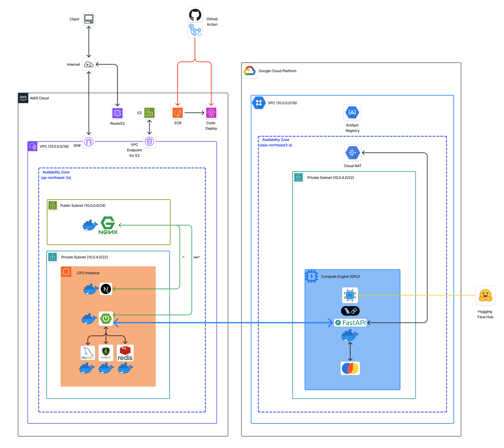
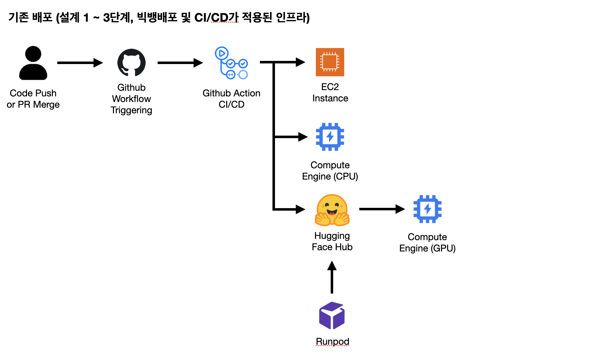
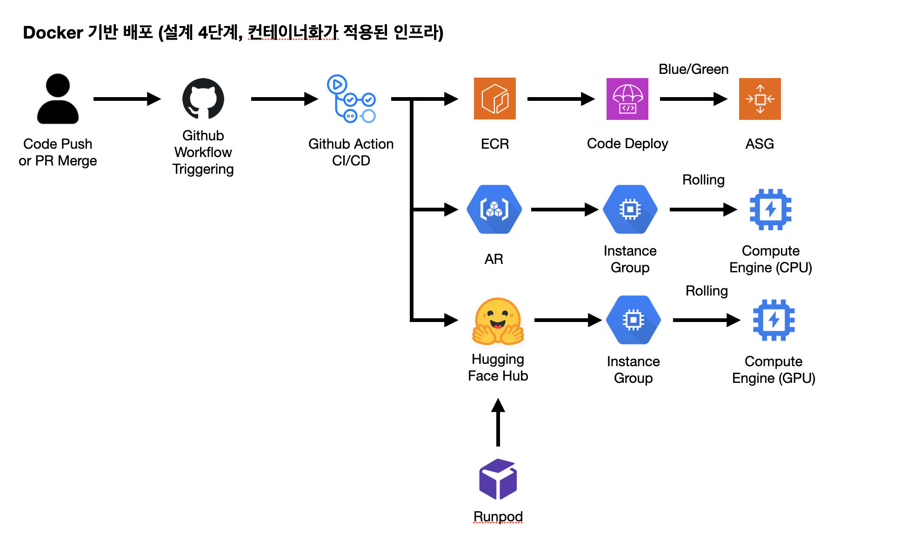

# 4단계: Docker 컨테이너화 배포
- 작성일: 2026-01-12
- 최종수정일: 2026-01-15

## 개요

**도장콕**은 임차인의 부동산 임대 계약 과정(계약 전·계약 중)을 지원하는 서비스입니다. <br>
핵심 기능: 쉬운 계약서(해설+리스크 검증) | 집노트(답사/비교/체크리스트) | 임대 매물 커뮤니티

**본 문서**: Docker 컨테이너화 및 멀티클라우드(AWS+GCP) 인프라 설계를 다룹니다. 애플리케이션 계층(Frontend/Backend/AI)을 컨테이너화해 배포 표준화와 환경 일관성을 확보하고, AWS(Blue/Green)·GCP(Rolling)를 통한 애플리케이션 레이어 무중단 배포를 설계합니다.

본 문서 범위: MVP 4단계 컨테이너화(Docker) 설계·구축이며, 이전 단계의 CI/CD는 전제합니다.

## 목차
  1. [현재 서비스에 컨테이너화가 필요한 이유](#1-현재-서비스에-컨테이너화가-필요한-이유)
  2. [모든 서비스를 대상으로 컨테이너화를 적용한 이유](#2-모든-서비스를-대상으로-컨테이너화를-적용한-이유)
  3. [기타 기술적 의사결정 내용 및 근거](#3-기타-기술적-의사결정-내용-및-근거)
  4. [컨테이너화(Docker 도입)로 인한 개선 효과 및 영향](#4-컨테이너화docker-도입로-인한-개선-효과-및-영향)
  5. [컨테이너 이미지 관리 방안](#5-컨테이너-이미지-관리-방안)
  6. [배포 절차의 변화](#6-배포-절차의-변화)
  7. [컨테이너 구성](#7-컨테이너-구성)
  8. [리소스 할당](#8-리소스-할당)
  9. [단일 인스턴스 환경 부하테스트](#9-단일-인스턴스-환경-부하테스트)
  10. [확장 전략](#10-확장-전략)
  11. [미검증 항목 및 향후 과제](#11-미검증-항목-및-향후-과제)
  12. [부록](#부록)

---

## 인프라 설계 다이어그램

### [DEV 환경]


### [PRD 환경]


## 1. 현재 서비스에 컨테이너화가 필요한 이유

#### 1. 도장콕에게 지속적인 LLM 품질 개선과 운영 안정성 확보가 필요함
1. 도장콕의 "쉬운 계약서" 기능은 **사용자의 의사결정**을 지원하므로, 잘못된 정보 제공으로 인한 혼선은 **향후 수개월 ~ 수년간의 금전적/정신적 피해**로 이어질 수 있음.
2. 따라서 도장콕은 **AI 모델, 프롬프트, RAG 파이프라인 및 검증 로직을 끊임없이 개선**하여 서비스 정확도를 높이고, 변화하는 시장 상황(신종 사기 등)에 대응하기 위해 **지속적인 개선, 향상 사이클**을 가져가야 함.
3. 하지만 AI 기술의 특성상 모델/라이브러리 업데이트 주기가 매우 짧아, 해당 사이클마다 **실행 환경(CUDA, Python Libs 등)의 충돌 및 불일치 문제**가 발생할 가능성이 높음.
4. 이는 인프라 운영의 복잡도를 높이고 해당 사이클을 지연시키는 요인이 되므로, **AI 인스턴스에 컨테이너 환경을 도입**하여 실행 환경 종속성 문제를 원천 제거하고 **안정적인 품질 개선 사이클**을 단축할 수 있음.


#### 2. 도장콕에게는 특히 09 ~ 21시의 서비스 안정성이 매우 중요함
1. 집 보기 및 임대차 계약은 대부분 **부동산 영업시간인 09 ~ 21시에 집중적**으로 이루어짐.
2. 도장콕의 핵심기능 "쉬운 계약서", "집노트"는 **현장에서 사용자의 의사결정을 지원**하므로, **해당 시간대의 장애는 사용자에게 혼선**을 초래하고, **잘못된 의사결정**으로 이어질 수 있음.
3. 그리고 이 **잘못된 의사결정은 사용자에게 향후 수개월 ~ 수년간의 금전적/정신적 피해로 이어질 수 있어**, 서비스 관점에서 해당 시간대 발생하는 **요청 하나하나가 대단히 중요함**.
4. **FE/BE 서비스는 AI 기능의 진입점**이 되므로 장애가 발생하는 경우 마찬가지로 서비스 기능을 이용할 수 없으므로 **안정성을 확보**해야함.
5. 따라서 FE/BE 인스턴스에도 컨테이너를 도입하여 **실행환경 문제발생 가능성, 롤백시간(MTTR) 등을 최소화**하고 **컨테이너가 제공하는 자동회복, 멱등성으로 운영 안정성을 확보**하고자 함.

## 2. DB는 컨테이너화 하지 않은 이유

#### 1. Stateful 애플리케이션의 운영 리스크 회피
1. 컨테이너는 본질적으로 언제든 사라질 수 있는 Stateless 환경에 최적화되어 있음.
2. 반면 DB는 영구적인 데이터 보존이 생명인 Stateful 애플리케이션임. 컨테이너 환경에서 Volume 마운트 실수나 컨테이너 재시작 시 데이터 정합성 문제가 발생할 운영 리스크가 존재함.
3. 도장콕의 핵심 자산인 사용자 계약 요약 정보를 다루는 DB 운영에 있어, 굳이 불필요한 컨테이너 추상화 계층을 두어 리스크를 감수할 이유가 없음.

#### 2. 단일 인스턴스 환경 운영
1. 현재 도장콕은 단일 인스턴스로 DB를 운영 중이며, Stateful 하므로 컨테이너의 확장성 장점을 온전히 누리기 어려움.
2. 오히려 컨테이너 레이어를 거치며 발생하는 미세한 I/O 성능 저하와 네트워크 설정의 복잡성만 가중됨.
3. 따라서 현재 규모에서는 OS에 직접 설치(Native)하여 I/O 성능을 최대로 확보하고, 운영 구조를 단순화하는 것이 합리적이라 판단함.

<details>
<summary>기술적 관점의 이야기</summary>

#### 1. 복잡한 의존성 관리문제 해결 및 배포 재현성 보장
1. **도장콕의 핵심기능**인 "쉬운 계약서", "입주 전 체크리스트", "대화형 챗봇"은 **AI 의존도가 높음**
2. **AI 실행환경**은 OS 커널, NVIDIA Driver, CUDA 버전 간의 **버전 호환성이 엄격**하고 이를 **수동으로 통제하기 까다로워 AI, 인프라 관리 담당자의 워크로드를 크게 증가**시킴
3. AI의 경우 서비스 품질향상을 위해 **모델 교체가 FE,BE에 비해 빈번하게 발생**할 수 있고, 이때 **각 모델이 요구하는 실행환경이 다를 수 있어** 이를 서빙하는 **인프라 담당자의 워크로드가 크게 증가**할 수 있음
4. 컨테이너화를 통해 **AI Model과 실행환경을 패키징**함으로써, **복잡한 의존성 문제를 해결**하고, 언제든 **재현 가능한 배포 환경을 구축**할 수 있어 **서비스 운영 관점에서 큰 이익**이됨

#### 2. 서비스 안정성 향상
1. 도장콕은 **성장단계에 진입한 서비스**로서 **사용자 신뢰도를 확보하는 것이 중요한 단계**
2. 그리고 그 신뢰도 확보에는 서비스에서 제공하는 정보의 품질 뿐만 아니라 **안정성**이 포함된다고 봄
3. 특히 GPU 인스턴스에서 AI Model을 서빙할 때 **많은 시스템 자원이 사용**되며, 만약 많은 동시 요청으로 AI 워크로드가 **시스템 한도를 초과하여 리소스를 요구하여 인스턴스 전체 장애**로 이어지는 경우 **장애대응 속도가 느려질 수 있음**(VM을 새로 띄우거나 재부팅되길 기다려야 하므로).
4. 이때 컨테이너화를 통해 특정 서비스에 **요청이 급증하거나 프로세스 오류가 발생**하더라도 해당 **장애가 Host 전체로 전파되지 않고** 컨테이너 내부로 격리되어 **인스턴스 자체가 다운되는 상황을 막을 수 있음**.
5. 즉, 컨테이너화를 통해 **안정적인 장애 대응 및 시스템 가용성을 확보**할 수 있어 **서비스 관점에서 이는 큰 이익**이 될 수 있음


#### 3. 배포 프로세스 표준화
1. 도장콕은 성장단계에 진입한 서비스로 **서비스 품질 향상과 빠른 고객 피드백 반영**이 중요
2. 컨테이너화를 도입하지 않은 경우 **인스턴스 다중화 환경에서 각각의 실행환경을 인프라 담당자가 직접 관리**해야하므로 **배포나 롤백 과정이 복잡하고 번거로워짐** (빌드파일 SCP 전송, 실행환경 구성 문제 발생 시 대응 문제 등).
3. **컨테이너화**를 통해 **실행환경의 불일치로 발생하던 문제들을 제거**
4. **배포 프로세스**를 **Container Image 빌드 -> Registry Push -> Registry Pull -> Container 실행으로 표준화**할 수 있어 **CI/CD 구성이 심플**해지고, **롤백 또한 Image Tag만 변경하면 되므로 더 빠르게 수행**할 수 있음
5. 즉 컨테이너화를 통해 저희 **팀의 배포/운영 공수를 절감**하고 **서비스 중단 시간을 최소화**할 수 있어 **서비스 관점에서 큰 이익**이 될 수 있음

#### 4. VM Image 관리 복잡도 경감
1. 도장콕은 본격적인 성장 단계에 진입한 서비스로서 트래픽 증가에 따른 대비를 위해 **인스턴스 다중화**를 도입한 단계
2. 도장콕은 FE, BE, MySQL, MongoDB, Redis, Fast API, ChromaDB, AI Model 등 **다양한 서비스로 구성**
3. 각각의 서비스가 실행되는 인스턴스들은 **DB를 제외하면 Auto Scale을 통해 확장을 대비**하고 있으므로 **인스턴스의 빠른 준비가 필요**
4. 이를 위해서는 매번 새롭게 인스턴스에 환경을 수동이나 스크립트로 구성하는 것이 아니라 **미리 실행환경을 세팅하여 준비해둔 VM Image를 구성하고 관리하는 것이 필요**
5. AI의 경우 서비스 품질향상을 위해 더 **성능 좋은 모델로의 교체가 FE,BE에 비해 빈번하게 발생할 수 있고**, 이때 **각 모델이 요구하는 실행환경이 다를 수 있어** 모델 교체가 발생할 때마다 **매번 VM Image를 새롭게 생성해야함**
6. 이는 관리해야할 VM Image 수의 증가로 **버전관리가 어려워짐**을 의미하며, 클라우드 비용 관점에서 **EBS 비용이 지속적으로 부과**되므로 다수의 VM Image를 유지로 **발생하는 추가지출이 존재**
7. 컨테이너화를 통해 **VM Image를 하나의 Gold Image (Docker가 설치된 버전)만 관리**하고 나머지는 Dockerfile로 관리함으로써 **버전관리, EBS 비용 문제를 모두 해결**할 수 있어 **인프라 담당자 워크로드 절감, 비용 절감으로 서비스 관점에서 큰 이익**


## 2. 모든 서비스를 대상으로 컨테이너화를 적용한 이유

도장콕의 경우 모든 서비스를 대상으로 컨테이너화를 적용하였음

#### 1. 운영 프로세스의 단일화
1. 모든 인프라 구성 서비스의 배포 방식을 **컨테이너 기반으로 통일**
2. 만약 컨테이너화를 부분적으로 적용할 경우, **서비스 종류에 따라 배포 방식, 필요한 명령어, 전송할 파일 등 방식이 다양화**되며 **인프라 담당자의 관리 포인트 및 워크로드가 증가**
3. 인프라 엔지니어 관점에서 **운영 복잡도를 낮추고 관리 효율성을 극대화할 수 있는 전략이라 판단**

#### 2. 로컬 개발환경 구축의 용이성
1. 도장콕은 급격한 성장을 겪는 초기 스타트업 단계로, **향후 개발팀 규모 확장에 다른 빈번한 신규 개발자 채용이 예상**
2. 만약 **모든 서비스가 컨테이너화 되어 있지 않다면** 신규 입사자는 처음 자신의 PC에 프로젝트 실행을 위한 **세팅에만 많은 시간을 할애해야 함**
3. 이는 **신규 입사자가 회사의 주요 비즈니스 로직을 이해하고 업무에 적응하는 시간을 빼앗는 원인**이 됨
4. 또한 **기존 개발 인력들도 프로젝트 개발 환경을 로컬에 세팅하는 과정을 문서로 작성하는 데 더 많은 시간을 사용**해야하며, 지속적인 업데이트도 해야하므로 이는 **팀의 개발 생산성에도 큰 영향**을 줌
5. 모든 서비스를 컨테이너화 함으로써, 신규 개발자는 **docker compose 명령 만으로 로컬에 바로 모든 개발에 필요한 환경을 간편하게 구축**할 수 있고, **문서화 부담도 경감**하여 **개발팀 전체의 생산성을 높이고 비즈니스에 집중할 수 있도록 하는 이익**을 얻을 수 있음


#### 3. 기술적 변경에 대한 유연성 확보
1. 도장콕은 **성장 단계의 서비스**로서, **서비스의 성장과 함께 기술적 고도화를 위해 새로운 언어나 프레임워크(예: Java -> Go, Python)를 도입해야 할 가능성 있음**
2. 만약 **서비스별로 실행 환경이 종속되어 있다면**, 새로운 기술 도입 시마다 **인프라 환경을 재구성해야 하는 부담이 발생**
3. 모든 서비스를 컨테이너로 추상화함으로써, 인프라 팀은 **내부 기술 스택의 변경과 무관**하게 **Container Image라는 표준 인터페이스**만 제공받으면 됨
4. 이러한 유연성은 **개발팀이 비즈니스 요구사항에 맞는 최적의 기술 도구를 자유롭게 선택할 수 있도록 지원하며**, 결과적으로 **더 우수한 품질의 서비스를 지속적으로 만들어낼 수 있는 기술적 토대**를 마련할 수 있다는 점에서 팀에 큰 이익이 됨

#### 추가 : 이에 대해 필요한 추가 설명들
> Q1: MySQL, MongoDB, Redis, ChormaDB와 같은 stateful 한 성격의 DB까지도 컨테이너화 해서 얻으려는 이익은 무엇인가요? 또한 컨테이너의 휘발성 문제는 어떻게 해결하실건가요?
1. 가장 큰 이유는 **로컬 개발환경 구축의 용이성** 때문
2. DB를 컨테이너화 하지않고 **네이티브로 설치하여 운영**할 경우 결국 **로컬 환경에서 DB는 새로 세팅**해야하기 때문에 앞에서 이야기했던 **로컬 개발환경 구축의 용이성 이라는 장점이 희석**됨
3. 개발자들이 각자 **로컬 OS에 DB를 직접 설치할 경우 버전 파편화 문제가 발생하기 쉬움**
4. 반대로 **공용 개발 서버 DB를 공유**할 경우엔 **테스트 데이터 충돌이나 스키마 변경 시 병목 현상이 발생하여 개발 생산성을 저해**할 수 있음.
5. DB까지 컨테이너화 함으로써 **각 개발자에게 독립적이고 깨끗한 DB 환경을 즉시 제공**할 수 있음
6. 컨테이너 **휘발성** 문제의 경우 **Volume을 사용하여 영속성이 필요한 데이터들을 컨테이너 내부가 아닌 외부에 저장**하고, **주기적인 스냅샷과 Binary Log 같은 추가적인 수단**을 통해 데이터에 대한 **영속성과 유실 리스크를 관리**할 계획

> Q2: 모든 서비스를 컨테이너화 한다는 게 장점만 있는 건가요? 이로 인한 단점은 없나요?

컨테이너화를 통해 발생하는 추가적인 비용이 존재합니다. 크게 정리하면 다음 두 가지 단점이 있음

**1. 네트워크 복잡도 증가**
- 모든 서비스가 컨테이너화 되면서 **컨테이너 간 통신, 호스트 포트 포워딩, 브릿지 네트워크 등 새롭게 학습 및 고려해야할 개념들이 등장**함. 특히 컨테이너 간의 통신이나 포트 포워딩을 잘못 설계할 경우 **원인을 발견하기 어려운 통신 장애가 발생할 수 있어** 운영 관점에서 컨테이너화가 네트워크 복잡도를 높일 수 있음

**2. Container Image 관리라는 새로운 관리 포인트 발생**
- 단순히 코드를 잘 작성하는 것 외에도 **컨테이너 이미지를 생성하는 Dockerfile 최적화(컨테이너 이미지의 최종 용량을 결정하므로 중요한 작업), 베이스 이미지 보안패치, Container Registry 관리 등 Container Image 파이프라인에 대한 관리**가 **개발팀의 워크로드를 증가시킬 수 있음**

하지만 **컨테이너화를 통해 개발팀, 서비스 관점에서 얻는 이익**이 위 **두 가지 리스크를 상회**한다고 판단했음
</details>

## 3. 기타 기술적 의사결정 내용 및 근거
#### 1. Private / Public Subnet 분리

1. 도장콕의 경우 쉬운 계약서 기능을 위해 사용자의 주택 임대차 계약에 대한 요약 정보라는 **예민한 정보를 저장**하게 되므로 **보안이 중요**
2. 중요한 정보를 저장하는 데이터베이스까지 Public Subnet에 두어 공격 포인트로 노출시키는 것은 **보안상 취약점**이 될 수 있음
3. **직접적인 인터넷 연결이 필요한 리소스**(ALB, Bastion & NAT Instance)**만 Public Subnet에 배치**
4. **비즈니스 로직을 처리하는 애플리케이션 및 데이터베이스 인스턴스**는 모두 **Private Subnet에 격리 배치**하여, 외부에서 **직접 접근 가능한 경로를 차단**함
5. 이로써 **외부로부터의 악의적인 공격 위험을 근본적으로 줄이고자 분리함**

#### 2. Private Subnet 다중화
도장콕의 아래와 같이 총 5개의 Private Subnet을 Role Base로 구분하고 있음
1. (FE) Next.js 애플리케이션
2. (BE) Spring Boot 애플리케이션
3. (RDB) MySQL
4. (NoSQL) MongoDB
5. (In-memory) Redis

- 만약 **하나의 큰 Private Subnet에 WS, WAS, DB를 모두 넣고 사용**한다면 해당 서브넷으로 **외부에서 침투했을 때 모든 구성 요소에 대한 접근이 가능해져 피해가 심화**
- 하지만 서브넷을 역할 기반으로 분리해 구성할 경우 DB 서브넷은 BE 서브넷에서 오는 트래픽만 허용하고, FE 서버에서 오는 트래픽은 허용하지 않는 **NACL 기반 접근제어 계층을 추가**하여 **시스템 전반의 보안을 향상**시킬 수 있음

#### 3. Bastion & NAT Instance 구성
1. 현재 도장콕의 MAU 5만을 감안하여 **비용 효율성을 우선순위**에 두었음
2. 그래서 **AWS NAT Gateway 같은 완전 관리형 서비스** 대신 **해당 기능을 수행하는 인스턴스를 직접 구축**하여 운영하는 방식을 택함
3. 도장콕에서 **아웃바운드 트래픽은 OAuth 2.0 인증 요청, 외부 API 호출 정도로 구성되며**이고 그 빈도가 비교적 적은 편이기에 **고성능의 게이트웨이는 불필요하다고 판단**함
4. NAT Instance의 단점인 **단일 장애점 문제는 리소스 모니터링(CPU, Network In/Out) 및 경보체계로 리스크 관리가 가능하다고 판단함**

#### 4. FE / BE를 서로 다른 인스턴스로 분리
1. 현재 단계에서 도장콕은 **본격적인 성장 단계에 돌입**했고, 이에 따라 **마케팅 이벤트나 신규 기능 출시에 따라 예측하기 힘든 다양한 트래픽 패턴이 발생할 수 있음을 가정**하고 있음
2. Frontend(Next.js)와 Backend(Spring Boot)의 **상이한 리소스(CPU/Memory) 점유 특성을 고려하여 물리적 인스턴스를 분리**함으로써, **특정 레이어의 부하가 전체 시스템 장애로 전파되는 것을 막고** 각자의 필요에 따라 **독립적으로 유연하게 확장(Scale-out)할 수 있도록 설계함**

#### 5. Auto Scaling 적용 (FE, BE, AI(Server, Model))
1. 도장콕은 사용자 신뢰도 확보를 위해 24/365 **중단 없는 서비스를 제공하면서도, 인프라 관점에서 운영 비용도 절감**해야하는 **어려운 기술적 과제**를 가지고 있음
2. 이를 위한 대안으로 초기 마케팅 단계에서 발생할 수 있는 급격한 사용자 유입이나, 반대로 트래픽이 저조한 새벽 시간대의 비용 낭비를 막기 위한 **유동적 Scaling 조치에 대한 인프라 담당자의 워크로드를 경감할 수 있도록 Auto Scaling(ASG, MIG)을 도입함**
3. 이를 통해 트래픽에 맞춰 **자동으로 리소스를 조절하고, 인스턴스 장애 시 즉시 새 인스턴스로 대체하는 자가 치유(Self-Healing) 메커니즘**을 통해 **서비스 안정성을 높이면서도 인프라 운영 비용도 최적화 하는 기술적 과제를 달성하고자 함**

#### 6. 완전 관리형 서비스 미사용 (RDS, DocumentDB, ElastiCache 등)
1. 초기 스타트업의 서비스 도장콕은 **한정된 예산 내에서 최대의 효율**을 내야 함
2. **AWS RDS 등의 완전 관리형 서비스**는 운영 편의성을 제공하지만, **EC2 직접 구축 대비 비용이 상당히 높음**. 이에 **관리형 서비스 비용을 절감**하여 **서비스 성장과 비즈니스 확장에 우선 투자**하는 것이 현 단계에서 **더 합리적이라고 판단함**
3. **데이터 안전성 및 운영 리스크**는 **주기적인 EBS 스냅샷 자동화와 Binary Log 백업 정책**을 통해 관리. 향후 서비스 규모가 커져 **Multi-AZ 기반의 고가용성(HA)과 자동화된 Failover가 필수적인 단계에 도달하면, 그때 관리형 서비스로의 마이그레이션을 진행할 계획**입니다.

#### 7. Container Registry 이원화 (AWS ECR, GCP AR)
1. 현재 도장콕은**AWS와 GCP를 모두 활용하는 멀티 클라우드 전략**을 취함
2. **초기엔 Docker Hub와 같은 통합 외부 레지스트리를 고려**했으나, 이는 클라우드 벤더 외부로 트래픽이 나가야 하므로 **보안 리스크와 데이터 전송 비용 문제가 발생**
3. 따라서 **각 클라우드 환경에 최적화된 네이티브 레지스트리(AWS ECR, GCP Artifact Registry)를 이원화**하여 사용하기로 결정함
4. 이를 통해 **대용량의 컨테이너 이미지를 클라우드 내부망(Private Network)으로 고속 전송하여 통신 효율성을 높이고, IAM 기반의 정교한 접근 제어로 보안성을 강화함** 
5. 또한, 외부망을 타지 않음으로써 **불필요한 네트워크 대역폭 비용을 절감하는 이점을 확보**

#### 8. GCP 인스턴스 다중화
1. **도장콕 서비스의 핵심 기능**은 "쉬운 계약서", "입주 전 체크리스트", "대화형 챗봇"과 같이 **AI 모델 의존도가 높음**
2. 따라서 **서비스의 사용자 증가**는 단순히 애플리케이션 서버나 DB로의 트래픽 증가만이 아닌 **AI Server와 AI Model로의 트래픽 증가로 이어짐**
3. 이에 대응할 수 있도록 **AI Server와 Model도 Auto Scaling**을 해야하지만, 기존 구조에서는 GPU 인스턴스에 웹 서버(FastAPI)와 벡터 DB, AI Model까지 모두 올라가 있어 **확장이 어려운 구조**
4. 따라서 **GPU 인스턴스에는 순수 모델 추론만** 맡기고, **가벼운 API 로직은 저렴한 CPU 인스턴스로 분리**하고 **Auto Scaling이 가능하도록 구성**했음
5. 결과적으로 AI 모델에 대한 동시 요청이 증가해도 서버 중단 없이 **유연한 확장을 가능하게하여 도장콕 핵심 기능의 신뢰성을 높이는 데 기여**할 수 있음

#### 9. Grafana & Prometheus 모니터링 환경
1. 현재 도장콕은 **AWS와 GCP를 모두 활용하는 멀티 클라우드 전략을 취하고 있음**
2. 하지만 **클라우드 벤더별로 파편화된 모니터링 도구**(CloudWatch, Stackdriver)를 사용할 경우, 전체 시스템의 상태를 한눈에 파악하기 어렵고 장애 발생 시 상황 인지가 늦어지는 **운영 비효율이 발생**
3. 이에 CSP(Cloud Service Provider)에 종속되지 않는 오픈소스 솔루션인 **Prometheus와 Grafana를 도입함**
4. 이를 통해 **분산된 모든 클라우드 리소스를 하나의 통합 대시보드로 시각화**함으로써, 모니터링의 사각지대를 없애고 **개발팀의 운영 워크로드를 경감할 수 있음**


## 4. 컨테이너화(Docker 도입)로 인한 개선 효과 및 영향
> 해당 파트에서 다루는 개선 효과 및 영향에 대한 내용은 Step1 ~ 3 (빅뱅배포 및 CI/CD가 적용된 인프라)와 비교한 기준으로 작성하였음

### 정량적 개선 지표 (예상)

| 항목 | Before (VM 직접 배포 / 개별 AMI) | After (Docker 컨테이너 / 통합 AMI) | 개선 효과 |
| :--- | :--- | :--- | :--- |
| **Code Deploy 기준 배포 스크립트 복잡도** | **200라인 이상** (언어별 설치/실행 스크립트 개별 관리) | **30라인 이하** (표준화된 Docker 명령어로 통합 관리) | **유지보수 코드 85% 감소** |
| **개발 환경 온보딩** | **약 2시간** (언어/DB/로컬 설정 가이드 의존) | **약 10분** (`docker-compose up` 단일 명령) | **준비 시간 90% 단축** |
| **AMI 스토리지 비용** | **90GB+** (FE/BE/AI 각 30GB AMI 별도 관리) | **30GB** (Docker만 설치된 공통 Base AMI 1개) | **스토리지 66% 절감** |

### 시스템 영향
| 영향 분야 | 주요 내용 |
| :--- | :--- |
| **AWS 운영 효율성 증대** | ASG 및 CodeDeploy 연동 시, 복잡한 설치 스크립트 대신 단순한 이미지 교체(docker run) 방식을 사용하여 배포 프로세스를 단순화하고 휴먼 에러 가능성을 최소화 |
| **GCP AI 운영 안정성** | AI 모델 실행에 필수적인 복잡한 Python 라이브러리 및 GPU 드라이버 의존성을 컨테이너 이미지로 패키징하여 배포 실패율 감소 |
| **전체적인 시스템 안정성 향상** | 미들웨어(DB, Cache)와 애플리케이션(FE, BE, AI)을 모두 격리된 컨테이너 단위로 관리함으로써, 자원 간섭을 방지하고 시스템 전체의 안정성 향상 |


## 5. 컨테이너 이미지 관리 방안

### 5.1 이미지 태깅 및 배포 전략 (Dual Tagging)
빌드된 단일 이미지에 대해 **두 가지 태그를 동시에 부여**하여 레지스트리에 Push 하는 전략을 사용함
1.  **Unique Tag (버전 식별용)**: **이미지의 고유 버전을 식별하고 보존**하기 위한 용도. 장애 발생 시 **롤백하거나 특정 시점의 이미지를 추적**할 때 사용
2.  **Latest Tag (배포용)**: 항상 **최신 빌드본을 가리키는 태그**. 모든 인스턴스와 배포 스크립트(CodeDeploy 등)에서는 `latest` 태그만을 Pull 하도록 설정하여, 버전별로 스크립트를 수정할 필요 없이 **배포 명령어를 단순화하고 통일**합니다.

### 5.2 태깅 패턴 상세 (Unique Tag 규칙)
*   **dev 환경**: `dev-{branch}-{timestamp}` (예: `dev-feat-login-202601121400`)
    - 개발 및 스테이징 환경 배포용으로 실시간 변경 사항을 추적합니다.
*   **prod 환경**: `prod-{version}-{commit}` (예: `prod-v1.0.2-a1b2c3d`)
    - 운영 환경용으로 명확한 버전 관리 및 장애 시 즉각적인 롤백 포인트를 제공합니다.

### 5.3 이미지 레지스트리 활용 계획
각 클라우드의 지역(Region) 내 통신 속도와 보안을 고려하여 레지스트리를 분리 운영합니다.
*   **AWS ECR**: 서비스 전반(FE, BE)의 이미지를 관리하며 AWS CodeDeploy와 연동하여 사용
*   **GCP Artifact Registry**: AI Server 이미지를 관리하여 GCP 인프라 내 배포 가속화


## 6. 배포 절차의 변화

### 기존 배포 (설계 1 ~ 3단계, 빅뱅배포 및 CI/CD가 적용된 인프라)

| 순서 | 이벤트 | 설명 |
| :--- | :--- | :-- |
| 1 | Push or PR Merge | 코드 작성자가 특정 Branch에 Push 또는 PR Merge를 수행  |
| 2 | Github Workflow Triggering | 사전에 정의된 CI/CD Workflow가 Triggering |
| 3 | Run Github CI/CD Workflow | CI/CD Workflow 실행. 현재 코드를 빌드하고, 그 결과를 Github Artifacts에 업로드한 뒤, 이를 다운 받아 EC2 인스턴스에 SCP로 전송 |
| 4 | Run Application | 전달받은 빌드 파일을 실행. 이때 기존 애플리케이션을 종료하고 새로운 버전을 준비 및 실행하는 중에 일시적인 다운타임 발생 |

### 컨테니어화된 인프라 환경의 배포

####  AWS 영역 (FE, BE)
| 순서 | 이벤트 | 설명 |
| :--- | :--- | :-- |
| 1 | Push or PR Merge | 개발자가 특정 브랜치에 코드를 Push하거나 PR Merge를 수행하여 변경 사항 반영 |
| 2 | GitHub Workflow Triggering | 사전에 정의된 GitHub Actions CI/CD 워크플로우가 자동으로 트리거됨 |
| 3 | Run GitHub CI/CD Workflow | CI/CD 파이프라인이 실행되어 최신 코드를 기반으로 Docker 이미지 빌드 수행 |
| 4 | Docker Image Push to Registry | 빌드 완료된 Docker 이미지를 AWS ECR(Elastic Container Registry)로 Push |
| 5 | Code Deploy 배포 시작 | GitHub Actions가 AWS CodeDeploy에 새로운 배포 요청을 전송하여 배포 프로세스 시작 |
| 6 | ASG 복제본 생성 | CodeDeploy가 Blue/Green 배포 전략에 따라 새로운 Auto Scaling Group(Green 그룹) 생성 |
| 7 | 트래픽 전환 및 배포 마무리 | 새 그룹(Green)의 정상 가동이 확인되면 로드밸런서 트래픽을 전환하고, 기존 그룹(Blue)을 종료하여 배포 완료 |

#### GCP 영역 (AI Server Fast API)
| 순서 | 이벤트 | 설명 |
| :--- | :--- | :-- |
| 1 | Push or PR Merge | 개발자가 특정 브랜치에 코드를 Push하거나 PR Merge를 수행하여 변경 사항 반영 |
| 2 | GitHub Workflow Triggering | 사전에 정의된 GitHub Actions CI/CD 워크플로우가 자동으로 트리거됨 |
| 3 | Run GitHub CI/CD Workflow | CI/CD 파이프라인이 실행되어 AI 모델 코드를 포함한 Docker 이미지 빌드 수행 |
| 4 | Docker Image Push to Registry | 빌드 완료된 이미지를 GCP Artifact Registry로 Push(업로드) |
| 5 | Update Instance Template | 새로운 Docker 이미지 태그를 참조하도록 MIG(Managed Instance Group)의 인스턴스 템플릿 버전을 갱신 |
| 6 | Trigger Rolling Update | MIG에 롤링 업데이트(Rolling Update)를 요청하여 구버전 인스턴스를 신버전으로 순차 교체 시작 |
| 7 | Health Check 및 배포 마무리 | 서비스 무중단을 위해 여유 인스턴스를 추가 생성하여 순차 교체하고, 헬스 체크 통과 시 배포 완료 |

### 기존 배포방식과의 차이점

표면적으로는 배포 단계(Build → Push → Deploy)가 세분화되어 복잡도가 증가한 것처럼 보일 수 있지만 이는 **복잡한 배포 로직을 이미지 단위로 추상화하고 격리시킨 결과임**. 실제 운영 관점에서는 다음과 같은 명확한 이점을 통해 **관리의 단순화와 시스템의 안정성을 동시에 확보**

#### 1. 배포 스크립트의 획기적 단순화
언어 및 환경별로 파편화되어 관리하기 어렵던 수백 라인의 설치 스크립트가 표준화된 Docker 명령어 몇 줄로 대체되어 유지보수성이 크게 향상됨

#### 2. 휴먼 에러 원천 차단
수동 개입 가능성이 높았던 복잡한 절차를 자동화된 파이프라인으로 전환함으로써, 운영자의 실수로 인한 장애 가능성을 사전에 방지함

#### 3. 검증된 무중단 배포
ASG/MIG와 연동된 정교한 트래픽 제어를 통한 무중단 배포로, 배포 중에도 사용자에게 끊김 없는 안정적인 서비스를 제공할 수 있음


### 무중단 배포를 도입한 이유
아래와 같은 이유로 도장콕의 비즈니스 특성상 무중단 배포는 필요한 요소라고 판단하여 적용함.

#### 1. 서비스 신뢰성
1. 도장콕의 핵심기능은 사용자가 실제로 **현장에서 집을 알아보거나 계약하는 중에 사용할 수 있는 서비스**
2. 현장에서 서비스의 기능이 필요한 순간 "배포 중 점검" 화면이 뜬다면, 이는 단순 불편을 넘어 **서비스 신뢰를 추락시킬 수 있음**

#### 2. 빠른 피드백 루프
1. 초기 스타트업의 서비스 도장콕은 **시장과 사용자 니즈를 빠른 템포로 반영하고 개선하기 위해 매일 수십 번의 크고 작은 배포가 필요함**
2. **배포가 곧 서비스 중단(Downtime)을 의미한다면 배포 횟수는 제한되고 제품의 개선은 지체됨**
3. **사용자 피드백을 빠르게 반영할 수 있는 사이클**을 가져가야하므로 무중단 배포가 필요함

#### 3. 비즈니스 기회 손실 방지
1. **이사, 신학기 시즌이나 마케팅 프로모션**으로 **트래픽이 급증하는 시기**에 오히려 **긴급 배포가 필요할 가능성이 높음**
2. 가장 많은 사용자가 유입되는 기회의 순간에 **배포로 인해 서비스가 멈춘다면**, 투입된 마케팅 **예산은 낭비**되고 신규 고객은 **경쟁사로 이탈**할 수 있음


### 무중단 배포전략
현재 설계에서는 무중단 배포전략을 **Blue/Green과 Rolling을 하이브리드로 사용**함. AWS 인프라의 경우 Blue/Green, GCP는 Rolling 방식을 적용함.
#### 1. 데이터 정합성 보장을 위한 선택
1. 도장콕의 핵심 기능인 쉬운 계약서, 집노트 기능은 버전 간 로직 차이가 발생할 경우 데이터 정합성 문제를 일으킬 수 있음.
2. 따라서 구버전과 신버전이 공존하는 시간이 긴 Rolling 배포 대신, 트래픽을 일시에 신버전으로 전환하는 Blue/Green 방식을 채택하여 사용자에게 **항상 동일한 버전의 로직으로 일관된 계약 분석 결과를 제공**하고 서비스 신뢰도를 확보하기 위해 Blue/Green 방식을 선택함
#### 2. GCP 설계 철학 및 효율성
1. **GCP는 VM 단위의 Blue/Green 배포를 네이티브하게 지원하지 않아(컨테이너 중심 철학)**, 적용 시 **Blue/Green Pool을 별도로 사전 구성하고 관리**해야해서 **시스템 복잡도가 과도하게 증가함**
2. 이에 반해 강력하게 지원되는 **MIG Rolling Update**를 사용함으로써 추가적인 인프라 관리 부담 없이 비용 **효율적으로 무중단 배포를 구현함**

<br>

## 7. 컨테이너 구성

도장콕은 사용자 트래픽을 처리하는 메인 서비스와 AI 핵심 기능을 담당하는 추론 서비스를 분리 배치함.
- **AWS**: 매물 조회, 집노트, 커뮤니티 등 사용자 요청 처리 (FE, BE, DB)
- **GCP**: 쉬운 계약서 해설, 체크리스트 생성 등 AI 추론 (vLLM, ChromaDB) - GPU 크레딧 활용

### 7.1 서비스별 컨테이너 구성

| 서비스명 | 베이스 이미지 | 아키텍처 | 포트 | 역할 |
|---------|-------------|----------|------|------|
| `frontend` | `node:20-alpine` | ARM64 | 3000 | SSR 렌더링 |
| `backend` | `amazoncorretto:21-alpine` | ARM64 | 8080 | REST API, 비즈니스 로직 |
| `ai-server` | `python:3.11-slim` | ARM64 | 8100 | AI 오케스트레이션 |
| `chromadb` | `chromadb/chroma:1.0` | ARM64 | 8000 | RAG 벡터 검색 |
| `vllm` | `vllm/vllm-openai:v0.4.0` | x86_64 | 8001 | LLM 추론 (GPU) |
| `mysql` | `mysql:8.0` | ARM64 | 3306 | 주 데이터베이스 |
| `mongodb` | `mongo:7.0` | ARM64 | 27017 | AI 대화 이력, 채팅 |
| `redis` | `redis:7-alpine` | ARM64 | 6379 | 캐시, 세션, Pub/Sub |

### 7.2 서비스별 클라우드 배치

| 클라우드 | 서비스 | 이유 |
|----------|--------|------|
| **AWS** | frontend, backend, mysql, mongodb, redis | 메인 서비스, 사용자 트래픽 처리 |
| **GCP** | ai-server, chromadb, vllm | AI 특화, GPU 크레딧 활용 |

### 7.3 베이스 이미지 선정 근거

> 이미지 크기: Docker Hub 조회 기준 (2026-01-14), linux/arm64 compressed size

#### Frontend: `node:20-alpine`

| 항목 | 내용 |
|------|------|
| ARM 지원 | linux/arm64 공식 빌드 |
| 이미지 크기 | **~45MB** ([Docker Hub](https://hub.docker.com/_/node/tags?name=20-alpine)) |
| 선정 이유 | Next.js SSR을 위한 Node.js 런타임 필수 |

#### Backend: `amazoncorretto:21-alpine`

| 항목 | 내용 |
|------|------|
| ARM 지원 | Graviton 최적화 포함 |
| 이미지 크기 | **~153MB** ([Docker Hub](https://hub.docker.com/_/amazoncorretto/tags?name=21-alpine)) |
| 선정 이유 | AWS Graviton(ARM64) 인스턴스에서 최적 성능 |

**Corretto 선택 이유:**
- Graviton 전용 최적화 (Atomic operation, AES/GCM 하드웨어 가속)

#### AI Server: `python:3.11-slim`

| 항목 | 내용 |
|------|------|
| ARM 지원 | Debian 기반 ARM64 네이티브 |
| 이미지 크기 | **~45MB** ([Docker Hub](https://hub.docker.com/_/python/tags?name=3.11-slim)) |
| 선정 이유 | AI 라이브러리(numpy, LangChain) glibc 의존성 |

**Alpine 미사용 이유:**
- AI 라이브러리 wheel이 glibc 기반
- Alpine(musl)에서는 컴파일 필요 → 빌드 시간 증가

#### vLLM: `vllm/vllm-openai:v0.4.0`

| 항목 | 내용 |
|------|------|
| 아키텍처 | x86_64 + CUDA 전용 |
| GPU | T4 16GB |
| 모델 | [AI 팀 확인 필요] |

**vLLM 선택 이유:**
- 요청별 LoRA 어댑터 선택 가능
- 기능별(체크리스트, 계약서 해설) 특화 응답 필요

#### 데이터베이스/캐시

| 이미지 | ARM 지원 | 크기 | 선정 이유 | 출처 |
|--------|---------|------|----------|------|
| `mysql:8.0` | linux/arm64 | **~175MB** | 주 데이터베이스 | [Docker Hub](https://hub.docker.com/_/mysql/tags?name=8.0) |
| `mongo:7.0` | linux/arm64 | **~1GB** | 비정형 데이터(대화 이력, 채팅) | [Docker Hub](https://hub.docker.com/_/mongo/tags?name=7.0) |
| `redis:7-alpine` | linux/arm64 | **~17MB** | 캐시, Pub/Sub | [Docker Hub](https://hub.docker.com/_/redis/tags?name=7-alpine) |
| `chromadb/chroma` | linux/arm64 | **~150MB** | RAG 벡터 검색 | [Docker Hub](https://hub.docker.com/r/chromadb/chroma/tags) |

### 7.4 Dockerfile 예시

#### Frontend (Next.js SSR)

```dockerfile
FROM --platform=linux/arm64 node:20-alpine AS builder
WORKDIR /app
COPY package*.json ./
RUN npm ci
COPY . .
RUN npm run build

FROM --platform=linux/arm64 node:20-alpine
WORKDIR /app
COPY --from=builder /app/.next ./.next
COPY --from=builder /app/node_modules ./node_modules
COPY --from=builder /app/package.json ./
COPY --from=builder /app/public ./public
EXPOSE 3000
CMD ["npm", "start"]
```

#### Backend (Spring Boot)

```dockerfile
FROM --platform=linux/arm64 gradle:8.5-jdk21 AS builder
WORKDIR /app
COPY . .
RUN gradle build -x test

FROM --platform=linux/arm64 amazoncorretto:21-alpine
WORKDIR /app
COPY --from=builder /app/build/libs/*.jar app.jar
EXPOSE 8080
ENTRYPOINT ["java", "-Xms512m", "-Xmx512m", "-XX:+UseContainerSupport", "-jar", "app.jar"]
```

#### AI Server (FastAPI)

```dockerfile
FROM --platform=linux/arm64 python:3.11-slim
WORKDIR /app
RUN apt-get update && apt-get install -y build-essential && rm -rf /var/lib/apt/lists/*
COPY requirements.txt .
RUN pip install --no-cache-dir -r requirements.txt
COPY . .
EXPOSE 8100
CMD ["uvicorn", "main:app", "--host", "0.0.0.0", "--port", "8100"]
```

**빌드 전략:**
- Frontend, Backend: Multi-stage 빌드로 최종 이미지 최소화
- AI Server: Single-stage (Python 의존성 빌드 필요)

<br>

## 8. 리소스 할당

### 8.1 산정 기준

#### 비즈니스 목표 (팀 설정)

**MAU 5만** (부동산 앱 시장 400만 중 1.25% 점유)


#### 리소스 산정 기준

| 번호 | 기준 | 내용 |
|------|------|------|
| 1 | 비즈니스 목표 | **MAU 5만** (팀 설정) |
| 2 | 부하테스트 실측 | 혼합 시나리오(읽기 80%) CCU 200 안정 (9절 참조) |

### 8.2 컨테이너별 리소스 할당

| 서비스 | Memory | vCPU | 인스턴스 | 산정 근거 |
|--------|--------|------|----------|----------|
| `frontend` | 1GB | 1 | m7g.medium | SSR 렌더링 (모니터링 후 조정) |
| `backend` | 2GB | 1 | m7g.medium | JVM RSS ~1.3GB + 여유 |
| `ai-server` | 1GB | 2 | n2d-standard-2 | 오케스트레이션 (모델 미로딩) |
| `mysql` | 2GB | 1 | m7g.medium | Buffer Pool 1GB |
| `mongodb` | 1GB | 1 | m7g.medium | WiredTiger 캐시 (초기값, 모니터링 후 조정) |
| `redis` | 512MB | 1 | m7g.medium | 캐시 + Pub/Sub (초기값, 모니터링 후 조정) |
| `chromadb` | 4GB | 2 | n2d-standard-2 | 벡터 인덱스 + 쿼리 버퍼 |
| `vllm` | 16GB | 4 | g2-standard-4 + T4 | 모델 + KV cache |

### 8.3 주요 서비스 산정 상세

#### Backend (2GB)

```
JVM RSS 구성:
- Heap: 512MB
- Metaspace: ~150MB
- 스레드 스택: ~50MB (50 스레드)
- NIO/기타: ~100MB
- GC 오버헤드: ~500MB
───────────────────
합계: ~1.3GB → 컨테이너 2GB (여유 포함)
```

#### MySQL (Buffer Pool 1GB)

```
예상 워킹셋:
- 일 저장량: 200~400건 (CCU 100 기준)
- 30일 누적: ~12,000건 × 100KB = ~1.2GB
- Buffer Pool 1GB로 최근 7일 + 인덱스 캐시 가능
```

#### vLLM (T4 16GB)

```
메모리 구성 (모델 미확정, 5.8B 가정):
- 모델 가중치 (float16): ~12GB
- KV cache: ~2GB
───────────────────
합계: ~14GB (T4 16GB 중 87%)
```

> 모델 확정 후 재산정 필요

<br>

## 9. 단일 인스턴스 환경 부하테스트

8절 리소스 할당의 근거가 되는 부하테스트 결과. 컨테이너화 후에도 동일하거나 더 나은 성능이 기대되므로, 이 실측값을 **확장 시점 기준**으로 활용함.

### 9.1 부하테스트 환경 및 결과

동일한 기술 스택(Spring Boot, MySQL)을 사용하고 도장콕 내 매물 커뮤니티와 유사한 구조를 가진 커뮤니티 프로젝트에서 k6 부하테스트를 수행하여 단일 인스턴스의 처리 능력을 측정함. (AI 기능 미포함)

**테스트 환경:**
- App: EC2 t4g.medium (2 vCPU, 4GB) - 단일
- DB: EC2 t4g.small (2 vCPU, 2GB) - 단일
- AI 기능: 미포함

**실측 결과 (2026-01-14):**

| 시나리오 | CCU | avg | p95 | 에러율 | 상태 |
|----------|-----|-----|-----|--------|------|
| 혼합 (읽기 80%) | 200 | 25ms | 80ms | 4.4% | 안정 |
| 읽기 집중 | 300 | 115ms | 265ms | ~0% | 안정 |
| 쓰기 집중 | 50 | 42ms | 127ms | 7.6% | 안정 |
| **쓰기 집중** | **100** | **303ms** | **1,578ms** | **17.4%** | **병목** |
| 스파이크 (급증) | 200 | 146ms | 625ms | 0% | 안정 |


### 9.2 예상 병목 지점


| 병목 지점 | 발생 조건 | 증상 | 근거 |
|----------|----------|------|------|
| **DB Connection Pool** (가설) | 쓰기 집중 + CCU 100+ | p95 > 1초 | 쓰기 집중 테스트에서 에러 급증, Pool 포화 추정 |
| **GPU 큐잉** | AI 요청 집중 | 응답 지연 | 미검증 (AI 부하테스트 미수행) |
| **MySQL 단일 인스턴스** | CCU 200+ | 전체 병목 | 혼합 시나리오 실측 기반 추정 |

> **병목 원인 확정 방법**: APM 도입 후 HikariCP 메트릭(커넥션 대기 시간, 획득 실패 수) 확인 필요

**병목 판단 기준:**

| 지표 | 임계값 | 상태 |
|------|--------|------|
| API p95 latency(메인 서비스 기준) | 500ms 초과 | 병목 의심 |
| 에러율 | 10% 초과 | 병목 확정 |
| DB CPU 사용률 | 80% 지속 | 확장 검토 |


### 9.3 실측 기반 DB 구성 결정

부하테스트 결과와 도장콕의 현재 목표(MAU 5만)를 고려하여, DB는 단일 인스턴스로 유지하기로 결정함.

| 번호 | 항목 | 근거 |
|------|------|------|
| 1 | 현재 규모 충분 | 혼합 시나리오에서 CCU 200까지 안정 |
| 2 | 복잡도 감소 | Replica 구성 시 복제 지연, 쓰기/읽기 분리 로직 필요 |

<br>

## 10. 확장 전략

### 10.1 수평 확장 가능 여부

| 서비스 | 확장 방식 | 확장 트리거 |
|--------|----------|------------|
| frontend | ASG 수평 확장 | CCU 300+ (모니터링 후 조정 필요) |
| backend | ASG 수평 확장 | CCU 200+ (모니터링 후 조정 필요) |
| ai-server | 수평 확장 | AI 요청 큐잉 발생 시 |
| vllm | GPU 추가 & Spot 인스턴스 병행 | 동시 AI 요청 병목 시 |
| mysql | Read Replica 추가 | CCU 300+ 또는 쓰기 집중 (모니터링 후 조정 필요) |
| mongodb | Replica Set 전환 | 채팅 MAU 1만+ |
| redis | Cluster 전환 | Pub/Sub 채널 100+ |


### 10.2 병목별 대응 전략

#### MySQL 병목 (Connection Pool + 단일 인스턴스)

**상황 예시**: 매물 커뮤니티 활성화 + 집노트 기능 이용 급증으로 동시 쓰기 요청 증가

**실측 결과**: CCU 100 쓰기 집중 시 p95 1.6초, 에러율 17%

| CCU 구간 | 증상 | 대응 |
|----------|------|------|
| 100~200 | 쓰기 집중 시 p95 > 1초 | HikariCP Pool 증가 (30→50), Redis 캐싱 강화 |
| 200~300 | 읽기/쓰기 모두 지연 | 수직 확장 (m7g.medium → m7g.large) |
| 300+ | 전체 응답 지연 | Read Replica 추가 (읽기 분산) |
| 500+ | 구조적 한계 | DB 샤딩 검토 |

#### GPU 큐잉 병목

**상황 예시**: 이사철(2~3월)에 30명 이상의 사용자가 동시에 계약서 분석 또는 체크리스트 생성을 요청하는 경우

| 번호 | 증상 | 대응 |
|------|------|------|
| 1 | AI 요청 대기 시간 증가 | 비동기 큐 처리 (사용자에게 "분석 중" 표시) |
| 2 | 지속적 큐잉 | GPU 인스턴스 추가 (Spot VM 활용) |
| 3 | 비용 초과 | 사용자당 AI 요청 제한 (일 N회) |

### 10.3 확장 트리거 (모니터링 기준)

| 지표 | 임계값 | 액션 |
|------|--------|------|
| CPU 사용률 | 70% (1시간 지속) | BE 수평 확장 |
| Memory 사용률 | 80% 도달 | 원인 분석 후 확장 |
| DB 커넥션 사용률 | 80% Pool 사용 | BE 추가 또는 Pool 증가 |
| API p95 latency | 500ms 초과 | 병목 구간 분석 |
| AI 큐 대기 | 10건 초과 | GPU 추가 검토 |

---

## 11. 미검증 항목 및 향후 과제

### 11.1 AI 처리량 검증

현재 부하테스트는 AI 기능을 제외하고 검증함.
AI 서버(GCP)의 실제 처리 능력은 미검증 상태.

**검증 필요 항목:**
- vLLM 동시 추론 처리량 (max_num_seqs 설정)
- 기능별 GPU 처리 시간 (체크리스트 생성, 계약서 해설)
- GPU 큐잉 발생 지점 및 대기 시간

**검증 후 조정:**
- AI 동시 요청 한계값 확정
- 사용자당 AI 요청 제한 정책 수립 (필요 시)

### 11.2 AI 팀 확인 필요 항목

| 항목 | 현재 상태 | 영향 |
|------|----------|------|
| LLM 모델 확정 | 미정 (5.8B 가정) | GPU 사양, 비용 |
| 요청당 GPU 점유 시간 | 미측정 | CCU 산정 |
| ChromaDB 벡터 규모 | 10만 건 가정 | 메모리 할당 |
| 기능별 SLA | 가정 (계약서 5분, 체크리스트 30초) | 큐잉 전략 |

## 부록

<details>
<summary><b>A. vLLM + LoRA 멀티 어댑터 구성</b></summary>

### A.1 LoRA 어댑터 목록 (예정)

| 어댑터 이름 | 용도 | 파일 경로 |
|------------|------|----------|
| `checklist-lora` | 체크리스트 생성 | `/lora/checklist` |
| `contract-lora` | 계약서 해설 | `/lora/contract` |
| `risk-lora` | 리스크 검증 | `/lora/risk` |

### A.2 서버 시작 옵션

```bash
docker run vllm/vllm-openai:v0.4.0 \
  --model EleutherAI/polyglot-ko-5.8b \
  --enable-lora \
  --max-loras 2 \
  --lora-modules checklist-lora=/lora/checklist \
  --lora-modules contract-lora=/lora/contract \
  --lora-modules risk-lora=/lora/risk
```

| 옵션 | 설명 |
|------|------|
| `--enable-lora` | LoRA 기능을 활성화합니다 |
| `--max-loras` | 동시 로드 가능한 어댑터 수입니다 |
| `--lora-modules` | 어댑터 이름=경로 매핑입니다 |

### A.3 요청별 어댑터 선택

```python
from langchain_openai import ChatOpenAI

# 체크리스트 생성용 어댑터
checklist_llm = ChatOpenAI(
    base_url="http://vllm-server:8001/v1",
    api_key="not-needed",
    model="checklist-lora"  # ← 어댑터 이름으로 선택
)

# 계약서 해설용 어댑터
contract_llm = ChatOpenAI(
    base_url="http://vllm-server:8001/v1",
    api_key="not-needed",
    model="contract-lora"
)
```

### A.4 동적 어댑터 로딩

서버 재시작 없이 어댑터를 추가/제거할 수 있음

```bash
# 환경변수 설정
VLLM_ALLOW_RUNTIME_LORA_UPDATING=True
```

API 엔드포인트:
- `POST /v1/load_lora_adapter` - 어댑터를 추가합니다
- `POST /v1/unload_lora_adapter` - 어댑터를 제거합니다

### A.5 LoRA 적용 시 추가 리소스

| 항목 | 증가량 |
|------|--------|
| GPU 메모리 | +10~20% (어댑터 수/크기에 따라 다릅니다) |
| 디스크 | + 수십~수백 MB (어댑터당) |
| 시작 시간 | 약간 증가합니다 |

**출처:** [vLLM LoRA Adapters](https://docs.vllm.ai/en/stable/features/lora/)

</details>

