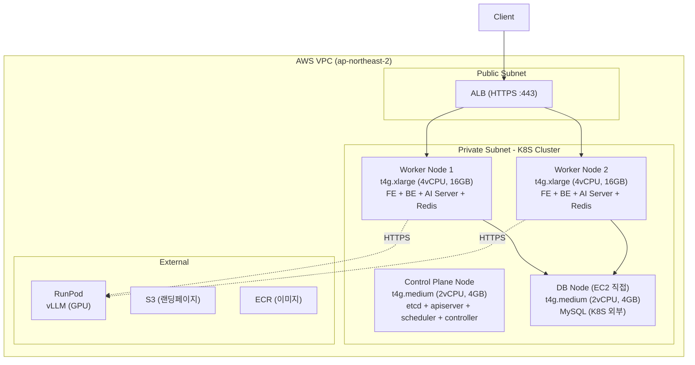
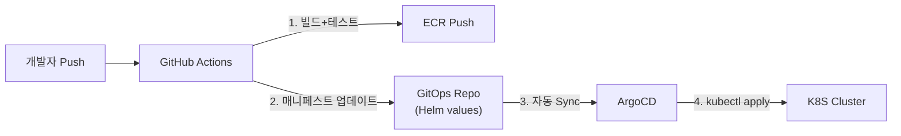

# 5단계: Kubeadm 오케스트레이션

- 작성일: 2026-03-02
- 최종수정일: 2026-03-02

## 개요

**도장콕**은 임차인의 부동산 임대 계약 과정(계약 전·계약 중)을 지원하는 서비스입니다.
핵심 기능: 쉬운 계약서(해설+리스크 검증) | 집노트(답사/비교/체크리스트) | 임대 매물 커뮤니티

**본 문서**: 4단계(Docker 컨테이너화)까지 구축된 멀티 클라우드(AWS+GCP) 인프라를 **AWS 단일 클라우드 + kubeadm 기반 Kubernetes 클러스터**로 전환하는 오케스트레이션 설계를 다룹니다. 컨테이너 단위로 격리된 서비스를 Kubernetes 워크로드로 전환하여, 선언적 배포 관리·자동 복구·수평 확장을 확보하고 운영 복잡도를 줄이는 것이 목표입니다.

## 목차

1. [K8S 전환 필요성](#1-k8s-전환-필요성)
2. [대안 비교 및 kubeadm 선택 근거](#2-대안-비교-및-kubeadm-선택-근거)
3. [클러스터 아키텍처 설계](#3-클러스터-아키텍처-설계)
4. [네트워크 설계](#4-네트워크-설계)
5. [서비스별 워크로드 배치 전략](#5-서비스별-워크로드-배치-전략)
6. [스토리지 설계](#6-스토리지-설계)
7. [스케일링 및 자원 관리 전략](#7-스케일링-및-자원-관리-전략)
8. [배포 전략](#8-배포-전략)
9. [시크릿 및 설정 관리](#9-시크릿-및-설정-관리)
10. [모니터링 전환](#10-모니터링-전환)
11. [장애 대응 및 운영 시나리오](#11-장애-대응-및-운영-시나리오)
12. [제약사항 및 전제조건](#12-제약사항-및-전제조건)
13. [부록: 핵심 설정 명세](#부록-핵심-설정-명세)

---

## 1. k8s 전환 필요성

### 현재 인프라의 한계 (서비스 관점)

4단계 Docker 컨테이너화를 통해 배포 표준화와 환경 일관성은 확보했지만, 서비스가 성장하면서 **운영 복잡도가 한계에 도달**하고 있습니다.

#### 1. 멀티 클라우드 아키텍처로 인한 인적 리소스 한계 및 운영 표준화 필요성 대두
- 초기 인프라 비용 최적화를 위해 서비스 영역(AWS)과 AI 워크로드 영역(GCP)을 이원화했으나, 스프린트를 거듭하며 각 클라우드의 운영이 고도화되면서 **팀원 간 상대 클라우드에 대한 이해도 격차**가 벌어졌습니다.
- 실제로 상대편이 구성한 Terraform 모듈이나 배포 설정의 의도를 충분히 이해하지 못한 상태에서 IaC 작업을 진행하다 **설정 오류가 발생**하거나, GCP 담당자 부재 시 **Spot 인스턴스 선점에 즉각 대응하지 못하는** 상황이 반복되었습니다.
- AWS CodeDeploy와 GCP MIG라는 **두 개의 배포 파이프라인**, IAM/WIF 권한 체계, Terraform State가 모두 이원화되어 있어, 한쪽 담당자가 빠지면 **장애 복구나 인프라 변경이 지연**되는 구조적 문제가 고착되었습니다.
- 이를 AWS 기반의 단일 K8S 클러스터로 통합하면 모든 워크로드의 배포 명세가 **K8S 매니페스트라는 단일 배포 형식으로 통일**됩니다. 파편화된 CI/CD 파이프라인이 하나로 합쳐지고, 모든 팀원이 동일한 도구와 방식으로 배포·운영할 수 있어 **누구든 전체 인프라를 동일하게 다룰 수 있는 체계**를 확보할 수 있습니다.

#### 2. VM 기반 장애 복구 지연이 야기하는 비즈니스 리스크 및 신뢰성 한계
- 현재 컨테이너가 비정상 종료되면 docker-compose의 `restart: unless-stopped` 정책에 의존하지만, EC2/VM 인스턴스 자체 장애 시 ASG/MIG가 이를 감지하고 새 인스턴스를 프로비저닝하여 서비스에 투입하기까지 **수 분의 공백**이 발생합니다.
- 도장콕의 핵심 가치는 부동산 계약 현장에서 **사용자의 안전한 의사결정을 실시간으로 지원**하는 것입니다. 특히 부동산 거래가 활발한 **주간(09~21시)에 수 분간의 서비스 장애가 발생할 경우**, 사용자가 AI의 검토 없이 치명적인 계약 리스크를 떠안게 되는 **금전적·정신적 피해로 직결**될 수 있습니다.
- K8S의 자동 복구(Self-Healing) 체계는 인스턴스 장애 시 이미 확보된 유휴 노드 자원에 즉각적으로 Pod를 재스케줄링하여 **복구 시간을 초 단위로 단축**함으로써 이 비즈니스 리스크를 근본적으로 해소합니다.

#### 3. 인스턴스 파편화로 인한 구조적 오버헤드 및 네트워크 고정 비용 비효율
- 현재 FE, BE, AI-Server가 각각 별도의 VM에 1대씩 할당되어 있습니다. 이로 인해 각 서비스마다 개별 OS와 백그라운드 에이전트(모니터링, 로그 수집 등)가 중복으로 구동되어야 하는 **구조적 리소스 오버헤드**가 발생하고 있습니다.
- 여기에 트래픽 증감과 무관하게 매월 지출되는 **네트워크 고정비(AWS ALB·NLB 약 $36, GCP 크로스 클라우드 NAT 게이트웨이 등)**가 인프라 유지의 기저 비용(Base Cost)을 비효율적으로 높이고 있습니다.
- K8S를 도입하면 다수의 서비스를 소수의 워커 노드에 고집적하여 배치함으로써 **OS 단위의 오버헤드를 최소화**하고, 단일 Ingress 컨트롤러를 통해 **불필요한 크로스 클라우드 및 NLB 고정 비용을 완전히 제거**할 수 있습니다.

---

## 2. 대안 비교 및 kubeadm 선택 근거

### 오케스트레이션 도구 비교

| 항목 | EKS (관리형) | kOps | k3s | kubeadm |
|------|------------|------|-----|---------|
| **월 비용** | 컨트롤 플레인 $73 + 노드 | 노드 비용만 | 노드 비용만 | 노드 비용만 |
| **운영 난이도** | 낮음 | 중간 | 낮음 | 높음 |
| **학습 가치** | K8S API 사용 수준 | AWS 통합 자동화 | 경량 K8S | **K8S 전체 아키텍처** |
| **커스터마이징** | 제한적 (AWS 종속) | 높음 | 제한적 (경량 제거) | **완전 제어** |
| **etcd 관리** | AWS 관리 | kOps 관리 | 내장 SQLite/etcd | **직접 관리** |
| **인증서 관리** | AWS 관리 | kOps 관리 | 자동 | **직접 관리** |
| **CNI 자유도** | VPC CNI 권장 | 자유 | Flannel 기본 | **자유 (Calico, Cilium 등)** |
| **클러스터 업그레이드** | 콘솔/CLI 원클릭 | kOps 명령어 | 바이너리 교체 | **수동 (kubeadm upgrade)** |
| **AWS 통합** | 네이티브 (IAM, ALB 등) | 높음 (ASG 연동) | 수동 | 수동 |
| **커뮤니티/문서** | AWS 공식 | 성숙 | 성장 중 | **K8S 공식 (가장 방대)** |

### kubeadm 선택 이유

#### 1. 비용
1. 도장콕은 **초기 스타트업으로 한정된 예산** 내에서 최대의 효율을 내야 합니다.
2. EKS 컨트롤 플레인 비용만 **월 $73**이 고정 지출되며, 이는 현재 AWS 컴퓨트 전체 비용($99)의 74%에 해당합니다.
3. kubeadm은 컨트롤 플레인을 Worker 노드와 동일한 EC2에서 운영할 수 있어 **추가 고정비 없이** 클러스터를 구성할 수 있습니다.

#### 2. 학습
1. 도장콕 팀의 K8S 경험은 **학습/실습 수준**입니다.
2. EKS 같은 관리형 서비스는 컨트롤 플레인을 추상화하여 **"블랙박스"로 만들어**, 장애 발생 시 내부 동작을 이해하지 못한 채 AWS 지원에 의존해야 합니다.
3. kubeadm으로 직접 클러스터를 구축하면 etcd, kube-apiserver, kube-scheduler, controller-manager의 **동작 원리와 인증서 체계를 체득**할 수 있어, 향후 EKS/GKE 전환 시에도 **트러블슈팅 역량의 기반**이 됩니다.

#### 3. 커스터마이징
1. CNI, Ingress Controller, 스토리지 프로비저너를 팀의 요구에 맞춰 **자유롭게 선택**할 수 있습니다.
2. k3s는 경량화를 위해 일부 컴포넌트를 제거/대체하여 **표준 K8S와 동작이 다른 부분**이 존재합니다.
3. kubeadm은 **K8S 공식 부트스트랩 도구**로, 공식 문서와 커뮤니티 리소스가 가장 풍부합니다.

<details>
<summary>kubeadm의 명확한 단점과 감수 근거</summary>

**단점 1: 운영 부담**
- 컨트롤 플레인 컴포넌트(etcd, apiserver 등) 장애 시 직접 복구해야 합니다.
- **감수 근거**: 초기 단일 Control Plane 구성으로 시작하되, etcd 스냅샷 백업을 자동화하여 복구 시간을 최소화합니다.

**단점 2: 클러스터 업그레이드**
- `kubeadm upgrade` 명령으로 수동 업그레이드해야 하며, 마이너 버전 스킵이 불가합니다.
- **감수 근거**: 현재 규모(노드 3~5대)에서는 업그레이드 작업 시간이 30분 내외로 관리 가능합니다.

**단점 3: AWS 서비스 통합**
- ALB Ingress Controller, IAM for Service Accounts 등 AWS 네이티브 통합을 직접 구성해야 합니다.
- **감수 근거**: 초기에는 NodePort + 외부 ALB 조합으로 단순하게 시작하고, 필요 시 AWS Load Balancer Controller를 추가합니다.

</details>

---

## 3. 클러스터 아키텍처 설계

### 아키텍처 다이어그램



### 노드 구성

| 역할 | 인스턴스 | vCPU | RAM | 디스크 | 수량 | 용도 |
|------|---------|------|-----|--------|------|------|
| **Control Plane** | t4g.medium | 2 | 4GB | 50GB gp3 | 1 | etcd, apiserver, scheduler, controller-manager |
| **Worker** | t4g.xlarge | 4 | 16GB | 80GB gp3 | 2 | Stateless 앱 (FE, BE, AI Server) + Redis + RabbitMQ |
| **DB (K8S 외부)** | t4g.medium | 2 | 4GB | 100GB gp3 | 1 | MySQL (Native 설치 유지) |

**총 4대**: Control Plane 1 + Worker 2 + DB 1

> **MySQL을 K8S 외부에 두는 이유**: 4단계 설계에서 결정한 "DB는 컨테이너화하지 않는 원칙"을 유지합니다. MySQL은 영구적인 데이터 보존이 생명인 Stateful 애플리케이션이며, K8S Pod의 재스케줄링 특성과 충돌합니다. 도장콕의 핵심 자산인 사용자 계약 요약 정보를 다루는 DB에 불필요한 오케스트레이션 추상화 계층을 추가할 이유가 없습니다.

### 노드 사양 산정 근거

#### Control Plane: t4g.medium (2vCPU, 4GB)

```
리소스 산정:
- etcd: ~500MB RAM, 0.5 vCPU (워크로드 규모 소)
- kube-apiserver: ~500MB RAM, 0.5 vCPU
- kube-scheduler: ~100MB RAM
- kube-controller-manager: ~200MB RAM
- kubelet + OS: ~500MB RAM
──────────────────────────
합계: ~1.8GB → 4GB 인스턴스 (여유 포함)
```

- kubeadm 최소 요구: 2 vCPU, 2GB RAM — t4g.medium이 충족
- etcd는 SSD 권장이나, gp3(3000 IOPS 기본) 수준이면 현재 규모에서 충분

#### Worker: t4g.xlarge (4vCPU, 16GB)

```
노드당 워크로드 배치 (requests 기준):
- FE Pod: 512MB, 0.5 vCPU
- BE Pod: 2GB, 1 vCPU
- AI Server Pod: 1GB, 1 vCPU
- Redis Pod: 512MB, 0.25 vCPU
- RabbitMQ Pod: 512MB, 0.25 vCPU
- 시스템 예약 (kubelet, kube-proxy, CNI): ~1.5GB, 0.5 vCPU
──────────────────────────
합계: ~6GB, ~3.5 vCPU → 16GB, 4 vCPU (여유 포함)
```

- Worker 2대로 구성하여 Pod 분산 배치 + 노드 1대 장애 시에도 서비스 유지
- Stateless Pod(FE, BE, AI Server)는 양 Worker에 분산, Stateful Pod(Redis, RabbitMQ)는 한 노드에 고정

### kubeadm init 핵심 파라미터

```yaml
# kubeadm-config.yaml
apiVersion: kubeadm.k8s.io/v1beta4
kind: ClusterConfiguration
kubernetesVersion: "v1.31.0"
controlPlaneEndpoint: "10.1.10.10:6443"   # Control Plane Private IP
networking:
  podSubnet: "192.168.0.0/16"             # Calico 기본 CIDR
  serviceSubnet: "10.96.0.0/12"           # 기본값 유지
apiServer:
  certSANs:
    - "10.1.10.10"
    - "k8s.dojangkok.internal"
etcd:
  local:
    dataDir: "/var/lib/etcd"
---
apiVersion: kubeadm.k8s.io/v1beta4
kind: InitConfiguration
nodeRegistration:
  kubeletExtraArgs:
    - name: cloud-provider
      value: external
```

---

## 4. 네트워크 설계

### CNI 선택: Calico

| 항목 | Calico | Flannel | Cilium |
|------|--------|---------|--------|
| **NetworkPolicy** | 네이티브 지원 | 미지원 | eBPF 기반 지원 |
| **성능** | 우수 (IP-in-IP/VXLAN) | 보통 (VXLAN) | 최상 (eBPF) |
| **운영 난이도** | 중간 | 낮음 | 높음 |
| **커뮤니티** | 가장 성숙 | 성숙 | 빠르게 성장 |
| **ARM64 지원** | 공식 | 공식 | 공식 |

**Calico 선택 이유**:
1. **NetworkPolicy 필수**: 도장콕은 예민한 사용자 계약 정보를 다루므로, Pod 간 네트워크 격리(예: DB Pod에 BE Pod만 접근)가 보안상 필수
2. **학습 곡선 적정**: Cilium의 eBPF는 강력하지만 팀 K8S 경험 수준에서는 과도한 복잡도. Calico는 표준 iptables 기반으로 디버깅이 용이
3. **문서·사례 풍부**: kubeadm + Calico 조합은 K8S 공식 문서에서 가장 많이 다루는 구성

### Ingress Controller: NGINX Ingress Controller

| 항목 | NGINX Ingress | AWS ALB Ingress | Traefik |
|------|--------------|----------------|---------|
| **ALB 연동** | NodePort + 외부 ALB | 네이티브 ALB 생성 | NodePort + 외부 ALB |
| **설정 유연성** | 높음 (annotations) | AWS 종속 | 높음 |
| **TLS 종료** | Ingress 내부 | ALB 레벨 | Ingress 내부 |
| **운영 난이도** | 낮음 | 중간 (IAM 설정 필요) | 낮음 |

**구성 방식**: NGINX Ingress Controller (NodePort) + 외부 ALB

```
Client → Route53 → ALB(HTTPS, ACM) → NodePort(30080/30443) → NGINX Ingress → Service → Pod
```

- TLS 종료는 **ALB에서 수행** (기존 ACM 인증서 재사용)
- ALB → NodePort로 HTTP 전달 → NGINX Ingress가 Host/Path 기반 라우팅
- 기존 ALB 라우팅 규칙(`/api/*` → BE, `/*` → FE)을 Ingress 리소스로 이관

### Service 타입별 사용 계획

| Service 타입 | 사용 대상 | 이유 |
|-------------|----------|------|
| **ClusterIP** | FE, BE, AI Server, Redis, RabbitMQ | 클러스터 내부 통신 전용 |
| **NodePort** | NGINX Ingress Controller | ALB 타겟으로 노출 |
| **ExternalName** | MySQL | K8S 외부 DB를 서비스로 추상화 |
| **LoadBalancer** | 사용하지 않음 | ALB를 직접 사용하므로 불필요 |

---

## 5. 서비스별 워크로드 배치 전략

### Deployment / StatefulSet 배분

| 서비스 | K8S 리소스 | 복제본 수 | 노드 배치 | 이유 |
|--------|----------|----------|----------|------|
| **FE (Next.js)** | Deployment | 2 | Worker 1, 2 분산 | Stateless, 고가용성 |
| **BE (Spring Boot)** | Deployment | 2 | Worker 1, 2 분산 | Stateless, 고가용성 |
| **AI Server (FastAPI)** | Deployment | 2 | Worker 1, 2 분산 | Stateless, 고가용성 |
| **Redis** | StatefulSet | 1 | Worker 고정 | Stateful, 세션/캐시 |
| **RabbitMQ** | StatefulSet | 1 | Worker 고정 | Stateful, 메시지 큐 |
| **MySQL** | **K8S 외부** (EC2) | 1 | DB 전용 노드 | 데이터 안전성 최우선 |
| **ChromaDB** | StatefulSet | 1 | Worker 고정 | Stateful, 벡터 DB |
| **vLLM** | **외부 서비스** (RunPod) | - | - | GPU 워크로드 분리 |

### 복제본 수 산정 근거

**Stateless 서비스 (FE, BE, AI Server): 각 2 복제본**
1. Worker 노드 2대에 1 Pod씩 분산 배치 (Pod Anti-Affinity)
2. 한 노드가 다운되어도 나머지 노드의 Pod가 서비스를 유지하여 **무중단 보장**
3. 부하테스트 결과 단일 인스턴스에서 CCU 200까지 안정 (4단계 9절 기준) — 2 Pod면 CCU 400 수준 대응 가능
4. MAU 5만 목표 기준 충분하며, 초과 시 HPA로 자동 확장

**Stateful 서비스 (Redis, RabbitMQ, ChromaDB): 각 1 복제본**
1. 현재 단일 인스턴스로 운영 중이며, HA 미구성 상태 — K8S 전환 시에도 복제본 1로 시작
2. Persistent Volume으로 데이터 보존, Pod 재시작 시에도 데이터 유지
3. 향후 Redis Cluster, RabbitMQ 미러링이 필요해지면 복제본 수 증가

### 리소스 요청/제한

| 서비스 | Requests (CPU/RAM) | Limits (CPU/RAM) | 산정 근거 |
|--------|-------------------|-----------------|----------|
| FE | 500m / 512MB | 1000m / 1GB | SSR 렌더링, 4단계 할당 기준 |
| BE | 1000m / 1.5GB | 2000m / 2.5GB | JVM RSS ~1.3GB (4단계 산정) |
| AI Server | 1000m / 768MB | 2000m / 1.5GB | 오케스트레이션 (모델 미로딩) |
| Redis | 250m / 256MB | 500m / 512MB | 캐시 + Pub/Sub (4단계 기준) |
| RabbitMQ | 250m / 256MB | 500m / 512MB | 메시지 큐 (현재 저트래픽) |
| ChromaDB | 500m / 1GB | 1000m / 2GB | 벡터 인덱스 + 쿼리 버퍼 |
| NGINX Ingress | 200m / 256MB | 500m / 512MB | L7 프록시 |

---

## 6. 스토리지 설계

### PV/PVC 구성

| 서비스 | StorageClass | 크기 | AccessMode | 용도 |
|--------|-------------|------|------------|------|
| Redis | gp3-retain | 10GB | ReadWriteOnce | RDB/AOF 스냅샷 |
| RabbitMQ | gp3-retain | 20GB | ReadWriteOnce | 메시지 저장소 + mnesia |
| ChromaDB | gp3-retain | 30GB | ReadWriteOnce | 벡터 인덱스 |
| Prometheus | gp3-retain | 50GB | ReadWriteOnce | 메트릭 데이터 (15일 보존) |
| Loki | gp3-retain | 30GB | ReadWriteOnce | 로그 데이터 |
| etcd (백업) | gp3-retain | 10GB | ReadWriteOnce | etcd 스냅샷 저장 |

### StorageClass 정의

```yaml
apiVersion: storage.k8s.io/v1
kind: StorageClass
metadata:
  name: gp3-retain
provisioner: ebs.csi.aws.com
parameters:
  type: gp3
  fsType: ext4
reclaimPolicy: Retain        # PVC 삭제 시에도 데이터 보존
volumeBindingMode: WaitForFirstConsumer  # Pod 스케줄링 후 AZ에 맞게 생성
allowVolumeExpansion: true   # 온라인 볼륨 확장 허용
```

> **reclaimPolicy: Retain**: Stateful 서비스의 PVC를 실수로 삭제해도 EBS 볼륨이 보존됩니다. 도장콕의 핵심 자산인 사용자 데이터가 관련된 볼륨이므로 Retain 정책을 기본으로 적용합니다.

### Stateful 서비스 볼륨 전략

**MySQL (K8S 외부)**:
- 기존 EC2 + 100GB EBS gp3 그대로 유지
- K8S에서는 ExternalName Service로 접근
- 백업: EBS 스냅샷 자동화 유지

**Redis (StatefulSet)**:
- PVC 10GB (gp3)
- AOF + 주기적 RDB 스냅샷
- Pod 재시작 시 PV에서 데이터 복원

**RabbitMQ (StatefulSet)**:
- PVC 20GB (gp3)
- Mnesia DB + 메시지 저장소
- Pod 재시작 시 큐 상태 복원

---

## 7. 스케일링 및 자원 관리 전략

### HPA 설정

| 서비스 | 지표 | 목표값 | min | max | 스케일 간격 |
|--------|------|--------|-----|-----|-----------|
| FE | CPU 사용률 | 70% | 2 | 6 | 30초 |
| BE | CPU 사용률 | 70% | 2 | 6 | 30초 |
| AI Server | CPU 사용률 | 60% | 2 | 4 | 60초 |

**HPA 미적용 서비스**: Redis, RabbitMQ, ChromaDB (StatefulSet, 단일 복제본 운영)

```yaml
apiVersion: autoscaling/v2
kind: HorizontalPodAutoscaler
metadata:
  name: backend-hpa
spec:
  scaleTargetRef:
    apiVersion: apps/v1
    kind: Deployment
    name: backend
  minReplicas: 2
  maxReplicas: 6
  metrics:
    - type: Resource
      resource:
        name: cpu
        target:
          type: Utilization
          averageUtilization: 70
  behavior:
    scaleDown:
      stabilizationWindowSeconds: 300   # 5분 안정화 후 축소
      policies:
        - type: Pods
          value: 1
          periodSeconds: 60
    scaleUp:
      stabilizationWindowSeconds: 0     # 즉시 확장
      policies:
        - type: Pods
          value: 2
          periodSeconds: 60
```

### Metrics Server

- Kubernetes Metrics Server를 클러스터에 배포하여 HPA가 Pod CPU/Memory 메트릭을 수집
- 설치: `kubectl apply -f https://github.com/kubernetes-sigs/metrics-server/releases/latest/download/components.yaml`
- ARM64 호환 확인 필요

### 리소스 Requests / Limits 정책

| 원칙 | 설명 |
|------|------|
| **Requests 필수** | 모든 Pod에 CPU/Memory requests를 지정하여 스케줄러의 정확한 배치 보장 |
| **Limits 선택적** | CPU limits는 throttling을 유발할 수 있으므로, Memory limits만 강제 설정 |
| **QoS 클래스** | 핵심 서비스(BE, FE)는 Guaranteed, 보조 서비스(모니터링)는 Burstable |
| **LimitRange** | 네임스페이스별 기본 리소스 제한 설정으로 무제한 Pod 방지 |

```yaml
apiVersion: v1
kind: LimitRange
metadata:
  name: default-limits
  namespace: dojangkok
spec:
  limits:
    - default:
        memory: "512Mi"
        cpu: "500m"
      defaultRequest:
        memory: "256Mi"
        cpu: "250m"
      type: Container
```

---

## 8. 배포 전략

### ArgoCD GitOps 파이프라인



**파이프라인 흐름**:
1. 개발자가 애플리케이션 레포에 Push
2. GitHub Actions가 Docker 이미지 빌드 → ECR Push (기존 파이프라인 재활용)
3. GitHub Actions가 GitOps 레포의 Helm values 파일에서 이미지 태그를 새 SHA로 업데이트
4. ArgoCD가 GitOps 레포 변경 감지 → 클러스터에 자동 배포

**ArgoCD 선택 이유**:
- **선언적 GitOps**: Git 레포가 클러스터 상태의 Single Source of Truth
- **자동 Sync**: 수동 `kubectl apply` 불필요
- **롤백**: Git revert로 이전 상태 즉시 복원
- **Web UI**: 배포 상태 시각화 (팀원 모두 확인 가능)

### Helm Chart 구조

```
helm/dojangkok/
├── Chart.yaml
├── values.yaml              # 공통 설정
├── values-dev.yaml          # Dev 환경 오버라이드
├── values-prod.yaml         # Prod 환경 오버라이드
└── templates/
    ├── _helpers.tpl
    ├── namespace.yaml
    ├── frontend/
    │   ├── deployment.yaml
    │   ├── service.yaml
    │   └── hpa.yaml
    ├── backend/
    │   ├── deployment.yaml
    │   ├── service.yaml
    │   └── hpa.yaml
    ├── ai-server/
    │   ├── deployment.yaml
    │   ├── service.yaml
    │   └── hpa.yaml
    ├── redis/
    │   ├── statefulset.yaml
    │   ├── service.yaml
    │   └── pvc.yaml
    ├── rabbitmq/
    │   ├── statefulset.yaml
    │   ├── service.yaml
    │   └── pvc.yaml
    ├── chromadb/
    │   ├── statefulset.yaml
    │   ├── service.yaml
    │   └── pvc.yaml
    ├── ingress.yaml
    ├── mysql-external.yaml   # ExternalName Service
    ├── configmaps.yaml
    └── secrets.yaml
```

### 롤링 업데이트 설정

모든 Deployment에 적용되는 롤링 업데이트 전략:

```yaml
spec:
  strategy:
    type: RollingUpdate
    rollingUpdate:
      maxSurge: 1          # 최대 1개 추가 Pod 허용
      maxUnavailable: 0    # 기존 Pod 0개까지만 중단 허용 (무중단)
```

- **maxUnavailable: 0**: 도장콕은 09~21시 무중단이 필수이므로, 배포 중에도 항상 원래 복제본 수를 유지
- **maxSurge: 1**: 새 Pod 1개를 먼저 기동 → readinessProbe 통과 → 구 Pod 종료 순서로 교체
- BE(Spring Boot)는 기동 시간이 길 수 있으므로 `initialDelaySeconds: 60` 설정

---

## 9. 시크릿 및 설정 관리

### K8S Secret / ConfigMap 분리

| 유형 | 리소스 | 내용 |
|------|--------|------|
| **ConfigMap** | `dojangkok-config` | APP_ENV, VLLM_BASE_URL, VLLM_MODEL, HTTP_TIMEOUT_SEC, RabbitMQ 큐 이름 등 |
| **Secret** | `dojangkok-secrets` | DB 비밀번호, VLLM API Key, OCR API Key, RabbitMQ URL, Backend Internal Token |

**현재 시크릿 현황** (마이그레이션 대상):

| 시크릿 | 현재 관리 방식 | K8S 전환 |
|--------|-------------|---------|
| vllm-api-key | GCP Secret Manager | K8S Secret |
| backend-internal-token | GCP Secret Manager | K8S Secret |
| ocr-api | GCP Secret Manager | K8S Secret |
| rabbitmq-url | GCP Secret Manager | K8S Secret |
| MySQL 접속 정보 | EC2 환경변수/SSM | K8S Secret |

### 외부 시크릿 통합 (향후)

초기에는 K8S Secret을 직접 사용하되, 팀 규모 확장 시 External Secrets Operator 도입을 검토합니다.

```
[현재] kubectl create secret → K8S etcd에 저장 (base64 인코딩)
[향후] AWS Secrets Manager → External Secrets Operator → K8S Secret 자동 동기화
```

**초기 K8S Secret 사용의 이유**:
1. 추가 컴포넌트 설치 없이 바로 사용 가능
2. 현재 시크릿 수가 5개 내외로 관리 부담 적음
3. etcd 암호화 설정(`EncryptionConfiguration`)으로 저장 시 암호화 적용

```yaml
apiVersion: v1
kind: Secret
metadata:
  name: dojangkok-secrets
  namespace: dojangkok
type: Opaque
stringData:
  VLLM_API_KEY: "${VLLM_API_KEY}"
  OCR_API_KEY: "${OCR_API_KEY}"
  RABBITMQ_URL: "${RABBITMQ_URL}"
  BACKEND_INTERNAL_TOKEN: "${BACKEND_INTERNAL_TOKEN}"
  MYSQL_PASSWORD: "${MYSQL_PASSWORD}"
```

---

## 10. 모니터링 전환

### 현재 → K8S 전환 계획

| 항목 | 현재 (VM 기반) | K8S 전환 후 |
|------|-------------|------------|
| **메트릭 수집** | Alloy (각 VM에 설치) | Prometheus Operator (ServiceMonitor 자동 수집) |
| **로그 수집** | Promtail (각 VM에 설치) | Promtail DaemonSet (노드별 자동 배포) |
| **트레이스** | Alloy OTLP Push | Tempo (기존 유지) |
| **대시보드** | Grafana (외부 서버) | Grafana (K8S 내부 또는 외부 유지) |
| **수집 대상** | 개별 VM IP:port 지정 | ServiceMonitor 라벨 기반 자동 발견 |
| **에이전트 설정** | VM별 config.alloy 수동 배포 | Helm values로 일괄 관리 |

### Prometheus Operator 구성

```
kube-prometheus-stack (Helm Chart):
├── Prometheus Server       — 메트릭 수집/저장
├── Alertmanager           — 알림 관리
├── Grafana                — 대시보드
├── node-exporter          — DaemonSet (노드 메트릭)
├── kube-state-metrics     — K8S 오브젝트 메트릭
└── ServiceMonitor CRDs    — 수집 대상 자동 등록
```

**수집 대상**:

| 서비스 | 메트릭 엔드포인트 | ServiceMonitor |
|--------|-----------------|---------------|
| BE (Spring) | :8080/actuator/prometheus | `app: backend` 라벨 매칭 |
| AI Server | :8000/metrics | `app: ai-server` 라벨 매칭 |
| Redis | redis-exporter :9121 | Sidecar 패턴 |
| RabbitMQ | :15692/metrics | 내장 Prometheus 플러그인 |
| Node | :9100/metrics | DaemonSet 자동 |
| K8S 내부 | kube-state-metrics | 자동 |

### 기존 대시보드 마이그레이션

기존 Grafana 대시보드(ai-server.json, vllm.json, node-exporter.json, rabbitmq.json)를 Helm values의 `dashboardProviders`로 이관하여, 클러스터 재구축 시에도 대시보드가 자동 프로비저닝되도록 합니다.

---

## 11. 장애 대응 및 운영 시나리오

### 시나리오 1: 워커 노드 다운

**상황**: Worker Node 1이 하드웨어/네트워크 장애로 NotReady 상태

| 시간 | 이벤트 | 동작 |
|------|--------|------|
| T+0 | 노드 NotReady | kubelet heartbeat 중단 감지 |
| T+40s | node-controller 확인 | `--node-monitor-grace-period=40s` (기본) |
| T+5m | Taint 추가 | `node.kubernetes.io/unreachable:NoExecute` |
| T+5m | Pod 축출 | Deployment Pod → Worker 2로 재스케줄링 |
| T+5m10s | 서비스 복구 | Worker 2의 Pod가 트래픽 수신 |

**서비스 영향**:
- FE, BE, AI Server: Worker 2에 이미 1 Pod씩 존재 → **사용자 영향 없음**
- Redis/RabbitMQ가 해당 노드에 있었다면: Pod 재스케줄링 후 PV 재마운트 → **~5분 일시 중단**

**대응**:
1. Redis/RabbitMQ는 nodeAffinity로 특정 노드 고정 + 해당 노드에 Taint 설정하여 일반 Pod 배치 방지
2. 장애 노드 복구 또는 새 Worker 프로비저닝 후 `kubeadm join` 재실행

### 시나리오 2: Pod 장애 및 자동 복구

**상황**: BE Pod가 OOM 또는 Application 오류로 CrashLoopBackOff

| 시간 | 이벤트 | 동작 |
|------|--------|------|
| T+0 | 컨테이너 종료 | Exit Code 137(OOM) 또는 1(에러) |
| T+0 | kubelet 재시작 | `restartPolicy: Always` |
| T+10s | readinessProbe 실패 | Service 엔드포인트에서 제거 → 트래픽 차단 |
| T+30s~2m | CrashLoopBackOff | 백오프 간격으로 재시도 (10s, 20s, 40s...) |

**서비스 영향**: 복제본 2 중 1이 장애 → 나머지 1 Pod가 전체 트래픽 처리 → **사용자 영향 최소화**

**대응**:
- OOM 반복 시: Memory limits 상향 조정
- Application 오류 반복 시: 로그 확인 후 이미지 롤백 (`kubectl rollout undo`)

### 시나리오 3: 롤링 업데이트 중 장애

**상황**: 새 버전 BE Pod가 readinessProbe를 통과하지 못함

| 시간 | 이벤트 | 동작 |
|------|--------|------|
| T+0 | 신규 Pod 생성 | `maxSurge: 1`로 추가 Pod 기동 |
| T+60s | readinessProbe 시작 | `initialDelaySeconds: 60` (Spring Boot 기동) |
| T+120s | Probe 실패 반복 | `failureThreshold: 3` → Pod READY 불가 |
| T+120s | 롤아웃 중단 | 기존 Pod 유지, 신규 Pod 대기 |

**서비스 영향**: `maxUnavailable: 0` 설정으로 **기존 Pod는 절대 종료되지 않음** → **사용자 영향 없음**

**대응**:
1. `kubectl rollout status` 확인 → 실패 감지
2. `kubectl rollout undo deployment/backend` → 이전 버전으로 자동 복원
3. ArgoCD 사용 시: Git revert → 자동 Sync로 롤백

### 시나리오 4: Control Plane 장애

**상황**: 단일 Control Plane 노드 다운

| 영향 | 상태 |
|------|------|
| 기존 Pod | **정상 동작 유지** (kubelet은 독립적으로 Pod 관리) |
| 새 Pod 스케줄링 | **불가** (kube-scheduler 다운) |
| kubectl 명령 | **불가** (kube-apiserver 다운) |
| HPA 스케일링 | **불가** |
| Service 라우팅 | **정상** (kube-proxy 규칙은 캐시됨) |

**대응**:
1. Control Plane 노드 EC2 재기동 → kubeadm 컴포넌트 자동 시작 (static Pod)
2. 복구 불가 시: etcd 스냅샷에서 새 Control Plane 복원

**etcd 백업 자동화** (CronJob 또는 systemd timer):

```bash
# 매 6시간마다 etcd 스냅샷
ETCDCTL_API=3 etcdctl snapshot save /backup/etcd-$(date +%Y%m%d-%H%M).db \
  --endpoints=https://127.0.0.1:2379 \
  --cacert=/etc/kubernetes/pki/etcd/ca.crt \
  --cert=/etc/kubernetes/pki/etcd/server.crt \
  --key=/etc/kubernetes/pki/etcd/server.key
```

---

## 12. 제약사항 및 전제조건

### 전제조건

| 항목 | 내용 |
|------|------|
| AWS 계정 | 기존 계정 사용 (ap-northeast-2) |
| 도메인 | dojangkok.cloud (Route53 관리 유지) |
| SSL 인증서 | ACM 무료 인증서 재사용 |
| GPU | RunPod 외부 서비스 확정 |
| Docker 이미지 | 4단계에서 구축한 이미지 + ECR 레지스트리 재사용 |
| Kubernetes 버전 | v1.31.x (LTS 지원) |
| OS | Ubuntu 24.04 LTS ARM64 |

### 제약사항

| 항목 | 제약 | 대응 |
|------|------|------|
| **Control Plane 단일 장애점** | 1대 구성으로 HA 미확보 | etcd 백업 자동화 + EC2 재기동 절차 문서화 |
| **Worker 노드 수** | 2대로 시작 (비용 제약) | 노드 1대 다운 시 서비스 저하 (복제본 1로 운영) |
| **etcd 디스크** | gp3 3000 IOPS가 워크로드 초과 시 성능 저하 | 모니터링 후 gp3 IOPS 프로비저닝 상향 |
| **ARM64 호환** | 일부 K8S 애드온이 ARM64 미지원 가능 | 설치 전 이미지 아키텍처 확인 필수 |
| **팀 K8S 경험** | 학습 수준 → 운영 장애 대응 리스크 | 런북 작성 + 정기 장애 훈련 |
| **kubeadm 업그레이드** | 마이너 버전 순차 업그레이드만 가능 | 분기별 업그레이드 일정 수립 |
| **AWS 네이티브 통합** | ALB Ingress, IAM for SA 등 수동 설정 필요 | NodePort + 외부 ALB로 단순화 |

### 비용 예상 (K8S 전환 후)

| 항목 | 인스턴스 | 수량 | 월간 비용 |
|------|---------|------|----------|
| Control Plane | t4g.medium | 1 | $30.37 |
| Worker | t4g.xlarge | 2 | $121.18 × 2 = $242.36 |
| DB (MySQL) | t4g.medium | 1 | $30.37 |
| EBS (합계) | gp3 | - | ~$40.00 |
| ALB | - | 1 | ~$23.40 |
| ECR + Route53 + S3 | - | - | ~$3.50 |
| **AWS 합계** | | **4대** | **~$370/월** |
| RunPod (vLLM) | - | 1 | ~$140/월 (A40 Spot 추정) |
| **총 합계** | | | **~$510/월** |

**기존 대비 비용 비교** (Dev 기준):

| 항목 | 현재 (V2) | K8S 전환 후 | 변화 |
|------|----------|-----------|------|
| AWS | ~$171 | ~$370 | +$199 (Worker 스펙 상향) |
| GCP | ~$268 | $0 | -$268 (폐기) |
| RunPod | $0 | ~$140 | +$140 (GPU 외부화) |
| **합계** | **~$439** | **~$510** | **+$71 (+16%)** |

> 월 $71 증가이지만, **K8S가 제공하는 자동 복구·자동 확장·선언적 관리로 인한 운영 공수 절감**과 **단일 클라우드 통합으로 인한 관리 포인트 절반 축소**를 고려하면 합리적인 투자입니다.

---

## 부록: 핵심 설정 명세

### A. Deployment 예시 (Backend)

```yaml
apiVersion: apps/v1
kind: Deployment
metadata:
  name: backend
  namespace: dojangkok
  labels:
    app: backend
spec:
  replicas: 2
  selector:
    matchLabels:
      app: backend
  strategy:
    type: RollingUpdate
    rollingUpdate:
      maxSurge: 1
      maxUnavailable: 0
  template:
    metadata:
      labels:
        app: backend
    spec:
      affinity:
        podAntiAffinity:
          requiredDuringSchedulingIgnoredDuringExecution:
            - labelSelector:
                matchExpressions:
                  - key: app
                    operator: In
                    values: ["backend"]
              topologyKey: kubernetes.io/hostname
      containers:
        - name: backend
          image: <account-id>.dkr.ecr.ap-northeast-2.amazonaws.com/dojangkok-be:latest
          ports:
            - containerPort: 8080
          envFrom:
            - configMapRef:
                name: dojangkok-config
            - secretRef:
                name: dojangkok-secrets
          resources:
            requests:
              cpu: "1000m"
              memory: "1536Mi"
            limits:
              cpu: "2000m"
              memory: "2560Mi"
          readinessProbe:
            httpGet:
              path: /actuator/health
              port: 8080
            initialDelaySeconds: 60
            periodSeconds: 10
            failureThreshold: 3
          livenessProbe:
            httpGet:
              path: /actuator/health
              port: 8080
            initialDelaySeconds: 90
            periodSeconds: 30
            failureThreshold: 3
          lifecycle:
            preStop:
              exec:
                command: ["sh", "-c", "sleep 15"]
      terminationGracePeriodSeconds: 30
```

### B. StatefulSet 예시 (Redis)

```yaml
apiVersion: apps/v1
kind: StatefulSet
metadata:
  name: redis
  namespace: dojangkok
spec:
  serviceName: redis
  replicas: 1
  selector:
    matchLabels:
      app: redis
  template:
    metadata:
      labels:
        app: redis
    spec:
      containers:
        - name: redis
          image: redis:7-alpine
          ports:
            - containerPort: 6379
          command: ["redis-server", "--appendonly", "yes"]
          resources:
            requests:
              cpu: "250m"
              memory: "256Mi"
            limits:
              cpu: "500m"
              memory: "512Mi"
          volumeMounts:
            - name: redis-data
              mountPath: /data
          readinessProbe:
            exec:
              command: ["redis-cli", "ping"]
            initialDelaySeconds: 5
            periodSeconds: 10
  volumeClaimTemplates:
    - metadata:
        name: redis-data
      spec:
        accessModes: ["ReadWriteOnce"]
        storageClassName: gp3-retain
        resources:
          requests:
            storage: 10Gi
```

### C. Ingress 예시

```yaml
apiVersion: networking.k8s.io/v1
kind: Ingress
metadata:
  name: dojangkok-ingress
  namespace: dojangkok
  annotations:
    nginx.ingress.kubernetes.io/proxy-body-size: "50m"
    nginx.ingress.kubernetes.io/proxy-read-timeout: "300"
spec:
  ingressClassName: nginx
  rules:
    - host: dojangkok.cloud
      http:
        paths:
          - path: /api
            pathType: Prefix
            backend:
              service:
                name: backend
                port:
                  number: 8080
          - path: /actuator
            pathType: Prefix
            backend:
              service:
                name: backend
                port:
                  number: 8080
          - path: /login
            pathType: Prefix
            backend:
              service:
                name: backend
                port:
                  number: 8080
          - path: /oauth2
            pathType: Prefix
            backend:
              service:
                name: backend
                port:
                  number: 8080
          - path: /
            pathType: Prefix
            backend:
              service:
                name: frontend
                port:
                  number: 3000
```

### D. MySQL ExternalName Service

```yaml
apiVersion: v1
kind: Service
metadata:
  name: mysql
  namespace: dojangkok
spec:
  type: ExternalName
  externalName: mysql.dojangkok.internal   # Route53 Private Hosted Zone
```

### E. HPA 예시 (Backend)

```yaml
apiVersion: autoscaling/v2
kind: HorizontalPodAutoscaler
metadata:
  name: backend-hpa
  namespace: dojangkok
spec:
  scaleTargetRef:
    apiVersion: apps/v1
    kind: Deployment
    name: backend
  minReplicas: 2
  maxReplicas: 6
  metrics:
    - type: Resource
      resource:
        name: cpu
        target:
          type: Utilization
          averageUtilization: 70
  behavior:
    scaleDown:
      stabilizationWindowSeconds: 300
      policies:
        - type: Pods
          value: 1
          periodSeconds: 60
    scaleUp:
      stabilizationWindowSeconds: 0
      policies:
        - type: Pods
          value: 2
          periodSeconds: 60
```

### F. kubeadm init 설정 파일

```yaml
apiVersion: kubeadm.k8s.io/v1beta4
kind: ClusterConfiguration
kubernetesVersion: "v1.31.0"
controlPlaneEndpoint: "10.1.10.10:6443"
clusterName: dojangkok-cluster
networking:
  podSubnet: "192.168.0.0/16"
  serviceSubnet: "10.96.0.0/12"
  dnsDomain: "cluster.local"
apiServer:
  certSANs:
    - "10.1.10.10"
    - "k8s.dojangkok.internal"
  extraArgs:
    - name: enable-admission-plugins
      value: "NodeRestriction,ResourceQuota,LimitRanger"
    - name: audit-log-path
      value: "/var/log/kubernetes/audit.log"
    - name: audit-log-maxage
      value: "30"
controllerManager:
  extraArgs:
    - name: bind-address
      value: "0.0.0.0"
scheduler:
  extraArgs:
    - name: bind-address
      value: "0.0.0.0"
etcd:
  local:
    dataDir: "/var/lib/etcd"
---
apiVersion: kubeadm.k8s.io/v1beta4
kind: InitConfiguration
nodeRegistration:
  kubeletExtraArgs:
    - name: cloud-provider
      value: external
  criSocket: unix:///var/run/containerd/containerd.sock
localAPIEndpoint:
  advertiseAddress: "10.1.10.10"
  bindPort: 6443
```

### G. NetworkPolicy 예시 (DB 접근 제한)

```yaml
apiVersion: networking.k8s.io/v1
kind: NetworkPolicy
metadata:
  name: mysql-external-access
  namespace: dojangkok
spec:
  podSelector:
    matchLabels:
      app: backend
  policyTypes:
    - Egress
  egress:
    - to:
        - ipBlock:
            cidr: 10.1.0.0/18     # AWS VPC CIDR (MySQL이 위치한 네트워크)
      ports:
        - protocol: TCP
          port: 3306
```
