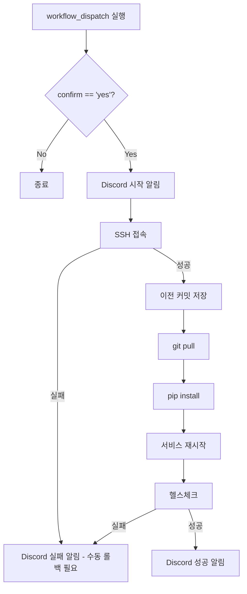

# AI Server CD 설정 가이드

- 작성일: 2026-01-08
- 최종수정일: 2026-01-08

## 목차

1. [개요](#개요)
   - [기술 스택](#기술-스택)
   - [배포 방식 요약](#배포-방식-요약)
2. [CD 워크플로우 파일](#cd-워크플로우-파일)
   - [파일 위치](#파일-위치)
   - [전체 yml 파일](#전체-yml-파일)
3. [GitHub Secrets 설정](#github-secrets-설정)
4. [CD 흐름](#cd-흐름)
5. [예상 소요 시간](#예상-소요-시간)
   - [pip install 시간 변동성](#pip-install-시간-변동성)
6. [systemd 서비스 설정](#systemd-서비스-설정)
   - [서비스 파일 예시](#서비스-파일-예시)
   - [systemd 명령어](#systemd-명령어)
7. [롤백 절차](#롤백-절차)
   - [수동 롤백 방법](#수동-롤백-방법)
   - [특정 버전으로 롤백](#특정-버전으로-롤백)
8. [실패 시 대응](#실패-시-대응)
9. [환경 변수 관리](#환경-변수-관리)
10. [향후 계획](#향후-계획)

<br>

## 개요

### 이 문서의 범위

이 문서는 **FastAPI(AI Server) 프로젝트**의 GitHub Actions CD 설정을 다룬다.

### 기술 스택

| 항목 | 내용 |
|------|------|
| 프레임워크 | FastAPI |
| 런타임 | Python 3.11 |
| 프로세스 관리 | systemd |
| 인프라 |  GPU Instance |


### 배포 방식 요약

| 항목 | 내용 |
|------|------|
| 아티팩트 | 없음 (인터프리터 언어) |
| 배포 방식 | git pull → pip install → 서비스 재시작 |
| 다운타임 | ~30초 (서비스 재시작 시간) |
| 롤백 방식 | git checkout (이전 커밋 복원) |

<br>

## CD 워크플로우 파일

### 파일 위치
```
.github/workflows/cd.yml
```

### 전체 yml 파일

```yaml
# =============================================================================
# AI Server CD Workflow
# =============================================================================
# 목적: main 브랜치의 코드를 EC2 서버에 배포
# 트리거: 수동 실행 (workflow_dispatch)
# 특이사항: Python은 빌드 아티팩트 없이 git pull로 배포
# =============================================================================

name: AI Server CD

# -----------------------------------------------------------------------------
# 트리거 설정 - 수동 실행만 허용
# -----------------------------------------------------------------------------
on:
  workflow_dispatch:
    inputs:
      confirm:
        description: '배포를 진행하시겠습니까? (yes 입력)'
        required: true
        type: string

# -----------------------------------------------------------------------------
# 환경 변수
# -----------------------------------------------------------------------------
env:
  APP_PATH: /app/ai-server
  SERVICE_NAME: dojangkok-ai
  VENV_PATH: /app/ai-server/venv

# -----------------------------------------------------------------------------
# Jobs 정의
# -----------------------------------------------------------------------------
jobs:
  deploy:
    name: Deploy to Production
    runs-on: ubuntu-latest
    if: github.event.inputs.confirm == 'yes'

    steps:
      # -----------------------------------------------------------------------
      # Step 1: 배포 시작 알림
      # -----------------------------------------------------------------------
      - name: Discord - Deploy Started
        uses: sarisia/actions-status-discord@v1
        with:
          webhook: ${{ secrets.DISCORD_WEBHOOK }}
          title: "AI Server 배포 시작"
          description: |
            **Branch**: ${{ github.ref_name }}
            **Triggered by**: ${{ github.actor }}
            ⚠️ AI 기능이 잠시 중단됩니다.
          color: 0xffaa00

      # -----------------------------------------------------------------------
      # Step 2: EC2에서 배포 실행
      # -----------------------------------------------------------------------
      - name: Deploy on EC2
        uses: appleboy/ssh-action@v1.0.3
        with:
          host: ${{ secrets.AI_EC2_HOST }}
          username: ${{ secrets.SSH_USERNAME }}
          key: ${{ secrets.SSH_PRIVATE_KEY }}
          script: |
            set -e

            echo "=== AI Server 배포 시작 ==="

            cd ${{ env.APP_PATH }}

            # 1. 현재 커밋 해시 저장 (롤백용)
            PREVIOUS_COMMIT=$(git rev-parse HEAD)
            echo "현재 버전: $PREVIOUS_COMMIT"
            echo "$PREVIOUS_COMMIT" > /tmp/ai-server-previous-commit

            # 2. 최신 코드 가져오기
            echo "최신 코드 가져오는 중..."
            git fetch origin main
            git reset --hard origin/main

            NEW_COMMIT=$(git rev-parse HEAD)
            echo "새 버전: $NEW_COMMIT"

            # 3. 가상환경 활성화
            source ${{ env.VENV_PATH }}/bin/activate

            # 4. 의존성 설치
            echo "의존성 설치 중..."
            pip install -r requirements.txt --quiet

            # 5. 서비스 재시작
            echo "서비스 재시작 중..."
            sudo systemctl restart ${{ env.SERVICE_NAME }}

            # 6. 서비스 시작 대기
            echo "서비스 시작 대기 중... (15초)"
            sleep 15

            echo "=== AI Server 배포 완료 ==="

      # -----------------------------------------------------------------------
      # Step 3: 헬스체크
      # -----------------------------------------------------------------------
      - name: Health check
        id: healthcheck
        continue-on-error: true
        uses: appleboy/ssh-action@v1.0.3
        with:
          host: ${{ secrets.AI_EC2_HOST }}
          username: ${{ secrets.SSH_USERNAME }}
          key: ${{ secrets.SSH_PRIVATE_KEY }}
          script: |
            echo "헬스체크 실행 중..."

            # 최대 5번 재시도
            for i in {1..5}; do
              HTTP_STATUS=$(curl -s -o /dev/null -w "%{http_code}" http://localhost:8000/health 2>/dev/null || echo "000")

              if [ "$HTTP_STATUS" -eq 200 ]; then
                echo "✅ 헬스체크 성공 (HTTP $HTTP_STATUS)"
                exit 0
              fi

              echo "대기 중... ($i/5) - HTTP $HTTP_STATUS"
              sleep 5
            done

            echo "❌ 헬스체크 실패"
            exit 1

      # -----------------------------------------------------------------------
      # Step 4: 서비스 상태 확인 (헬스체크 성공 시에만)
      # -----------------------------------------------------------------------
      - name: Check service status
        if: steps.healthcheck.outcome == 'success'
        uses: appleboy/ssh-action@v1.0.3
        with:
          host: ${{ secrets.AI_EC2_HOST }}
          username: ${{ secrets.SSH_USERNAME }}
          key: ${{ secrets.SSH_PRIVATE_KEY }}
          script: |
            echo "=== 서비스 상태 ==="
            sudo systemctl status ${{ env.SERVICE_NAME }} --no-pager | head -15

            echo ""
            echo "=== 배포된 버전 ==="
            cd ${{ env.APP_PATH }}
            git log -1 --oneline

      # -----------------------------------------------------------------------
      # Step 5: Discord 성공 알림
      # -----------------------------------------------------------------------
      - name: Discord - Deploy Success
        if: steps.healthcheck.outcome == 'success'
        uses: sarisia/actions-status-discord@v1
        with:
          webhook: ${{ secrets.DISCORD_WEBHOOK }}
          title: "AI Server 배포 성공"
          description: |
            **Branch**: ${{ github.ref_name }}
            **Deployed by**: ${{ github.actor }}
            ✅ AI 기능이 정상 동작 중입니다.
          color: 0x00ff00

      # -----------------------------------------------------------------------
      # Step 6: Discord 실패 알림
      # -----------------------------------------------------------------------
      - name: Discord - Deploy Failed
        if: steps.healthcheck.outcome == 'failure'
        uses: sarisia/actions-status-discord@v1
        with:
          webhook: ${{ secrets.DISCORD_WEBHOOK }}
          title: "AI Server 배포 실패 - 수동 롤백 필요"
          description: |
            **Branch**: ${{ github.ref_name }}
            **Triggered by**: ${{ github.actor }}
            헬스체크 실패. 수동 롤백이 필요합니다.
          color: 0xff0000

      # -----------------------------------------------------------------------
      # Step 7: 헬스체크 실패 시 워크플로우 실패 처리
      # -----------------------------------------------------------------------
      - name: Fail workflow on health check failure
        if: steps.healthcheck.outcome == 'failure'
        run: exit 1
```

<br>

## GitHub Secrets 설정

| Secret 이름 | 설명 | 예시 |
|------------|------|------|
| `AI_EC2_HOST` | AI 서버 EC2 IP (CPU 인스턴스와 다를 수 있음) | `3.36.xxx.xxx` |
| `SSH_USERNAME` | SSH 접속 사용자명 | `ubuntu` |
| `SSH_PRIVATE_KEY` | SSH 프라이빗 키 (전체 내용) | `-----BEGIN OPENSSH...` |
| `DISCORD_WEBHOOK` | Discord 웹훅 URL | `https://discord.com/api/webhooks/...` |

---

## CD 흐름



<br>

## 예상 소요 시간

**측정 기준**: 초기 추정치 (운영 후 실제 배포 로그 기반으로 업데이트 예정)

| 단계 | 예상 시간 | 산정 근거 |
|------|----------|----------|
| git pull | ~10초 | 코드 변경량에 따라 변동 |
| pip install | ~1-2분 | 의존성 변경 시 더 소요 (캐시 활용 시 ~30초) |
| 서비스 재시작 | ~5초 | systemctl restart 명령 |
| 서비스 시작 대기 | ~15초 | FastAPI 서버 부팅 |
| 헬스체크 | ~5초 | 최대 25초 (5회 × 5초 대기) |
| **총합** | **~2-3분** | 다운타임 ~30초 |

### pip install 시간 변동성

| 상황 | 예상 시간 |
|------|----------|
| 의존성 변경 없음 | ~10초 |
| 마이너 패키지 추가 | ~30초 |
| 대형 패키지 추가 (torch 등) | ~2-5분 |

<br>

## systemd 서비스 설정

### 서비스 파일 위치
```
/etc/systemd/system/dojangkok-ai.service
```

### 서비스 파일 예시

```ini
[Unit]
Description=Dojangkok AI Server (FastAPI)
After=network.target

[Service]
User=ubuntu
Group=ubuntu
WorkingDirectory=/app/ai-server
Environment="PATH=/app/ai-server/venv/bin"
ExecStart=/app/ai-server/venv/bin/uvicorn main:app --host 0.0.0.0 --port 8000
Restart=on-failure
RestartSec=5

# 환경 변수 파일
EnvironmentFile=/app/ai-server/.env

# 로그 설정
StandardOutput=append:/var/log/dojangkok/ai-server.log
StandardError=append:/var/log/dojangkok/ai-server-error.log

[Install]
WantedBy=multi-user.target
```

### systemd 명령어

```bash
# 서비스 시작
sudo systemctl start dojangkok-ai

# 서비스 중단
sudo systemctl stop dojangkok-ai

# 서비스 재시작
sudo systemctl restart dojangkok-ai

# 서비스 상태 확인
sudo systemctl status dojangkok-ai

# 로그 확인
sudo journalctl -u dojangkok-ai -f
```

<br>

## 롤백 절차

### 수동 롤백 방법

```bash
# 1. SSH 접속
ssh -i key.pem ubuntu@<AI_EC2_HOST>

# 2. 이전 커밋 해시 확인 (배포 시 저장됨)
cat /tmp/ai-server-previous-commit

# 3. 또는 Git 로그에서 확인
cd /app/ai-server
git log --oneline -10

# 4. 이전 버전으로 롤백
git checkout <previous-commit-hash>

# 5. 의존성 재설치 (필요 시)
source venv/bin/activate
pip install -r requirements.txt

# 6. 서비스 재시작
sudo systemctl restart dojangkok-ai

# 7. 상태 확인
curl http://localhost:8000/health
```

### 특정 버전으로 롤백

```bash
# 특정 태그나 커밋으로 롤백
git fetch origin
git checkout v1.2.0  # 태그 사용
# 또는
git checkout abc1234  # 커밋 해시 사용

source venv/bin/activate
pip install -r requirements.txt
sudo systemctl restart dojangkok-ai
```

<br>

## 실패 시 대응

### SSH 접속 실패
- **원인**: 보안 그룹 설정, 인스턴스 중단
- **해결**:
  ```bash
  # AWS 콘솔에서 인스턴스 상태 확인
  # 보안 그룹에서 SSH (22번 포트) 허용 확인
  ```

### pip install 실패
- **원인**: 패키지 버전 충돌, 디스크 공간 부족
- **해결**:
  ```bash
  # 디스크 공간 확인
  df -h

  # 캐시 삭제 후 재시도
  pip cache purge
  pip install -r requirements.txt

  # 특정 패키지 문제 시
  pip install <패키지명> --force-reinstall
  ```

### 서비스 시작 실패
- **원인**: 포트 충돌, 환경 변수 누락, 문법 오류
- **해결**:
  ```bash
  # 로그 확인
  sudo journalctl -u dojangkok-ai -n 50 --no-pager

  # 포트 확인
  sudo lsof -i :8000

  # 수동으로 실행해서 오류 확인
  cd /app/ai-server
  source venv/bin/activate
  uvicorn main:app --host 0.0.0.0 --port 8000
  ```

### 헬스체크 실패
- **확인사항**: Discord 실패 알림 확인
- **원인 분석**:
  ```bash
  # 로그 확인 (배포했던 새 버전 시점)
  sudo journalctl -u dojangkok-ai --since "10 minutes ago"
  ```
- **수동 롤백**: 롤백 절차 섹션 참조

<br>

## 환경 변수 관리

### .env 파일 위치
```
/app/ai-server/.env
```

### .env 예시
```bash
# API Keys
OPENAI_API_KEY=sk-xxx
FIREWORKS_API_KEY=fw-xxx

# Database
CHROMA_PERSIST_DIRECTORY=/app/ai-server/chroma_db

# Service
LOG_LEVEL=INFO
ENVIRONMENT=production
```

> **주의**: .env 파일은 Git에 포함하지 않습니다. 서버에서 직접 관리합니다.


<br>

## 향후 계획

- [ ] 인스턴스 타입 결정 (On-Demand / Spot)
- [ ] requirements.txt 해시 비교 (변경 시에만 pip install)
- [ ] 모델 파일 버전 관리
- [ ] Graceful shutdown (요청 처리 완료 후 종료)