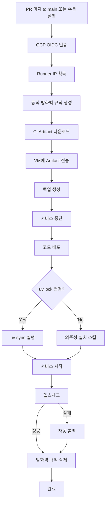

# AI Server CD 설정 가이드

- 작성일: 2026-01-08
- 최종수정일: 2026-01-25

## 목차

1. [개요](#개요)
   - [기술 스택](#기술-스택)
   - [배포 방식 요약](#배포-방식-요약)
2. [CD 워크플로우 파일](#cd-워크플로우-파일)
   - [파일 위치](#파일-위치)
   - [전체 yml 파일](#전체-yml-파일)
3. [GitHub Secrets 설정](#github-secrets-설정)
4. [CD 흐름](#cd-흐름)
5. [주요 특징](#주요-특징)
   - [Workload Identity Federation (OIDC)](#workload-identity-federation-oidc)
   - [동적 방화벽 규칙](#동적-방화벽-규칙)
   - [자동 롤백](#자동-롤백)
   - [uv 패키지 관리](#uv-패키지-관리)
6. [systemd 서비스 설정](#systemd-서비스-설정)
7. [롤백 절차](#롤백-절차)
8. [실패 시 대응](#실패-시-대응)
9. [환경 변수 관리](#환경-변수-관리)
10. [향후 계획](#향후-계획)

<br>

## 개요

### 이 문서의 범위

이 문서는 **FastAPI(AI Server) 프로젝트**의 GitHub Actions CD 설정을 다룬다.

### 기술 스택

| 항목 | 내용 |
|------|------|
| 프레임워크 | FastAPI |
| 런타임 | Python 3.10 |
| 패키지 관리 | uv (uv.lock) |
| 프로세스 관리 | systemd |
| 인프라 | GCP Compute Engine (GPU Instance) |
| 인증 | Workload Identity Federation (OIDC) |


### 배포 방식 요약

| 항목 | 내용 |
|------|------|
| 아티팩트 | CI에서 생성된 tar.gz |
| 배포 방식 | Artifact 다운로드 → uv sync → 서비스 재시작 |
| 다운타임 | 서비스 재시작 시간 |
| 롤백 방식 | 자동 (헬스체크 실패 시) + 수동 (backup 폴더 복원) |

<br>

## CD 워크플로우 파일

### 파일 위치
```
.github/workflows/ai-cd.yml
```

### 전체 yml 파일

```yaml
# AI Server CD Pipeline
# 위치: .github/workflows/ai-cd.yml
#
# 트리거: main 브랜치 PR 머지 (자동), 수동 (workflow_dispatch)
# 인증: GCP Workload Identity Federation (OIDC)
# 배포: In-place 배포 (VM 직접 업데이트)
# 패키지 관리: uv (pyproject.toml + uv.lock)

name: AI Server CD

on:
  pull_request:
    types: [closed]
    branches: [main]
  workflow_dispatch:

env:
  GCP_PROJECT_ID: ${{ secrets.GCP_PROJECT_ID }}
  GCP_ZONE: ${{ secrets.GCP_ZONE }}
  GCP_INSTANCE: ${{ secrets.GCP_INSTANCE }}
  WORKLOAD_IDENTITY_PROVIDER: ${{ secrets.WORKLOAD_IDENTITY_PROVIDER }}
  SERVICE_ACCOUNT: ${{ secrets.GCP_SERVICE_ACCOUNT }}

jobs:
  deploy:
    name: Deploy to GCP
    runs-on: ubuntu-22.04
    environment: 1-bigbang
    if: github.event.pull_request.merged == true || github.event_name == 'workflow_dispatch'
    permissions:
      contents: read
      id-token: write
      actions: read
    steps:
      - name: Authenticate to GCP (OIDC)
        uses: google-github-actions/auth@v2
        with:
          workload_identity_provider: ${{ env.WORKLOAD_IDENTITY_PROVIDER }}
          service_account: ${{ env.SERVICE_ACCOUNT }}

      - name: Setup gcloud CLI
        uses: google-github-actions/setup-gcloud@v2
        with:
          project_id: ${{ env.GCP_PROJECT_ID }}

      - name: Get Runner IP
        id: ip
        run: echo "ip=$(curl -s ifconfig.me)" >> $GITHUB_OUTPUT

      - name: Add Firewall Rule
        run: |
          gcloud compute firewall-rules create github-actions-temp-${{ github.run_id }} \
            --allow=tcp:22 \
            --source-ranges=${{ steps.ip.outputs.ip }}/32 \
            --target-tags=ai-server \
            --project=${{ env.GCP_PROJECT_ID }} \
            --description="Temporary rule for GitHub Actions CD"
          echo "Firewall rule created for IP: ${{ steps.ip.outputs.ip }}"

      - name: Download Artifact
        id: artifact
        env:
          GH_TOKEN: ${{ secrets.GITHUB_TOKEN }}
        run: |
          mkdir -p ./artifact

          RUN_ID=$(gh run list \
            --repo ${{ github.repository }} \
            --workflow="AI Server CI" \
            --branch=main \
            --status=success \
            --limit=1 \
            --json databaseId \
            --jq '.[0].databaseId')

          if [ -z "$RUN_ID" ]; then
            echo "No successful CI run found"
            exit 1
          fi

          echo "Downloading artifact from run: $RUN_ID"
          gh run download "$RUN_ID" --repo ${{ github.repository }} --dir ./artifact

          ARTIFACT_FILE=$(find ./artifact -name "*.tar.gz" | head -1)
          if [ -z "$ARTIFACT_FILE" ]; then
            echo "Artifact not found"
            exit 1
          fi
          echo "file=$ARTIFACT_FILE" >> $GITHUB_OUTPUT

      - name: Deploy to VM
        run: |
          # Artifact 전송
          gcloud compute scp ${{ steps.artifact.outputs.file }} \
            ${{ env.GCP_INSTANCE }}:/tmp/ai-server-deploy.tar.gz \
            --zone=${{ env.GCP_ZONE }}

          # VM에서 배포 실행
          gcloud compute ssh ${{ env.GCP_INSTANCE }} \
            --zone=${{ env.GCP_ZONE }} \
            --command='
              set -e

              # uv 설치 (없는 경우)
              if ! command -v uv &> /dev/null; then
                echo "Installing uv..."
                curl -LsSf https://astral.sh/uv/install.sh | sh
              fi
              export PATH="$HOME/.local/bin:$PATH"

              # 백업 생성 (최근 3개만 유지, venv 제외)
              BACKUP_DIR="/app/ai-server-backup-$(date +%Y%m%d%H%M%S)"
              if [ -d "/app/ai-server" ]; then
                sudo rsync -a --exclude="venv" --exclude=".venv" /app/ai-server/ "$BACKUP_DIR/"
                echo "Backup created: $BACKUP_DIR"
                # 오래된 백업 정리
                ls -dt /app/ai-server-backup-* 2>/dev/null | tail -n +4 | xargs -r sudo rm -rf
              fi

              # 서비스 중단
              sudo systemctl stop ai-server || true

              # 배포
              sudo mkdir -p /app/ai-server
              sudo tar -xzf /tmp/ai-server-deploy.tar.gz -C /app/ai-server

              # 권한 설정 (uv sync 전에 먼저 설정)
              sudo chown -R $(whoami):$(whoami) /app/ai-server

              # uv sync (uv.lock 변경 시에만 재설치)
              cd /app/ai-server
              NEW_HASH=$(md5sum uv.lock | cut -d" " -f1)
              OLD_HASH=""
              if [ -f ".venv/.uv_lock_hash" ]; then
                OLD_HASH=$(cat .venv/.uv_lock_hash)
              fi

              if [ "$NEW_HASH" != "$OLD_HASH" ] || [ ! -d ".venv" ]; then
                echo "uv.lock changed or .venv missing, installing..."
                rm -rf .venv
                $HOME/.local/bin/uv sync --frozen
                echo "$NEW_HASH" > .venv/.uv_lock_hash
                echo "Dependencies installed"
              else
                echo "uv.lock unchanged, skipping dependency install"
              fi

              # 서비스 시작
              sudo systemctl start ai-server

              # 정리
              rm -f /tmp/ai-server-deploy.tar.gz
            '

      - name: Health Check
        id: healthcheck
        run: |
          EXTERNAL_IP=$(gcloud compute instances describe ${{ env.GCP_INSTANCE }} \
            --zone=${{ env.GCP_ZONE }} \
            --format='get(networkInterfaces[0].accessConfigs[0].natIP)')

          echo "Health check: http://$EXTERNAL_IP:8000/health"

          for i in {1..12}; do
            if curl -s -f "http://$EXTERNAL_IP:8000/health" > /dev/null; then
              echo "Health check passed"
              echo "status=success" >> $GITHUB_OUTPUT
              exit 0
            fi
            echo "Attempt $i/12 - Waiting..."
            sleep 5
          done

          echo "Health check failed"
          echo "status=failed" >> $GITHUB_OUTPUT
          exit 1

      - name: Rollback on Failure
        if: failure() && steps.healthcheck.outputs.status == 'failed'
        run: |
          gcloud compute ssh ${{ env.GCP_INSTANCE }} \
            --zone=${{ env.GCP_ZONE }} \
            --command='
              set -e
              LATEST_BACKUP=$(ls -td /app/ai-server-backup-* 2>/dev/null | head -1)

              if [ -n "$LATEST_BACKUP" ]; then
                echo "Rolling back to: $LATEST_BACKUP"
                sudo systemctl stop ai-server || true
                sudo rm -rf /app/ai-server
                sudo mv "$LATEST_BACKUP" /app/ai-server
                sudo systemctl start ai-server
                echo "Rollback completed"
              else
                echo "No backup found"
                exit 1
              fi
            '

      - name: Remove Firewall Rule
        if: always()
        run: |
          gcloud compute firewall-rules delete github-actions-temp-${{ github.run_id }} \
            --project=${{ env.GCP_PROJECT_ID }} \
            --quiet || true
          echo "Firewall rule removed"
```

<br>

## GitHub Secrets 설정

| Secret 이름 | 설명 | 예시 |
|------------|------|------|
| `GCP_PROJECT_ID` | GCP 프로젝트 ID | `dojangkok-ai` |
| `GCP_ZONE` | VM 인스턴스 Zone | `asia-northeast3-a` |
| `GCP_INSTANCE` | VM 인스턴스 이름 | `ai-server-prod` |
| `WORKLOAD_IDENTITY_PROVIDER` | WIF Provider 전체 경로 | `projects/123/locations/global/workloadIdentityPools/github-pool/providers/github-provider` |
| `GCP_SERVICE_ACCOUNT` | 서비스 계정 이메일 | `github-actions@project.iam.gserviceaccount.com` |

---

## CD 흐름



<br>

## 주요 특징

### Workload Identity Federation (OIDC)

SSH 키 없이 GCP에 인증하는 방식.

**장점:**
- 키 관리 불필요 (유출 위험 없음)
- 자동 토큰 만료 (15분)
- GitHub 워크플로우에서만 사용 가능

**설정 요구사항:**
- GCP Workload Identity Pool 생성
- GitHub Provider 연결
- Service Account에 적절한 IAM 역할 부여

### 동적 방화벽 규칙

GitHub Actions Runner의 IP에 대해서만 SSH 허용.

```bash
# 배포 시작 시 생성
gcloud compute firewall-rules create github-actions-temp-${{ github.run_id }} \
  --allow=tcp:22 \
  --source-ranges=${{ steps.ip.outputs.ip }}/32 \
  --target-tags=ai-server

# 배포 완료 후 삭제 (always)
gcloud compute firewall-rules delete github-actions-temp-${{ github.run_id }}
```

### 자동 롤백

헬스체크 실패 시 자동으로 이전 버전으로 복원.

**백업 정책:**
- 배포 전 현재 버전 백업
- 최근 3개 백업만 유지
- venv 디렉토리는 백업에서 제외

**롤백 트리거:**
- 헬스체크 12회 시도 (60초) 실패 시

### uv 패키지 관리

**최적화:**
- uv.lock 해시 비교로 변경 시에만 재설치
- .venv/.uv_lock_hash 파일로 상태 추적
- 의존성 변경 없으면 설치 스킵

<br>

## systemd 서비스 설정

### 서비스 파일 위치
```
/etc/systemd/system/ai-server.service
```

### 서비스 파일 예시

```ini
[Unit]
Description=Dojangkok AI Server (FastAPI)
After=network.target

[Service]
User=ubuntu
Group=ubuntu
WorkingDirectory=/app/ai-server
ExecStart=/app/ai-server/.venv/bin/uvicorn main:app --host 0.0.0.0 --port 8000
Restart=on-failure
RestartSec=5

# 환경 변수 파일
EnvironmentFile=/app/ai-server/.env

# 로그 설정
StandardOutput=append:/var/log/dojangkok/ai-server.log
StandardError=append:/var/log/dojangkok/ai-server-error.log

[Install]
WantedBy=multi-user.target
```

### systemd 명령어

```bash
# 서비스 시작
sudo systemctl start ai-server

# 서비스 중단
sudo systemctl stop ai-server

# 서비스 재시작
sudo systemctl restart ai-server

# 서비스 상태 확인
sudo systemctl status ai-server

# 로그 확인
sudo journalctl -u ai-server -f
```

<br>

## 롤백 절차

### 자동 롤백 (CD 워크플로우)

헬스체크 실패 시 자동으로 실행됨. 수동 개입 불필요.

### 수동 롤백 방법

```bash
# 1. GCP Console 또는 gcloud로 VM 접속
gcloud compute ssh ai-server-prod --zone=asia-northeast3-a

# 2. 백업 목록 확인
ls -lt /app/ai-server-backup-*

# 3. 롤백 실행
LATEST_BACKUP=$(ls -td /app/ai-server-backup-* | head -1)
sudo systemctl stop ai-server
sudo rm -rf /app/ai-server
sudo mv "$LATEST_BACKUP" /app/ai-server
sudo systemctl start ai-server

# 4. 상태 확인
curl http://localhost:8000/health
```

<br>

## 실패 시 대응

### OIDC 인증 실패
- **원인**: Workload Identity 설정 오류
- **해결**:
  - GCP Console에서 Workload Identity Pool 확인
  - Service Account 권한 확인
  - Secrets 값 재확인

### 방화벽 규칙 생성 실패
- **원인**: Service Account 권한 부족
- **해결**:
  ```bash
  # 필요한 역할 확인
  gcloud projects get-iam-policy $PROJECT_ID \
    --filter="bindings.members:github-actions@"
  ```

### Artifact 다운로드 실패
- **원인**: CI 워크플로우 실패, Artifact 만료
- **해결**:
  - CI 워크플로우 상태 확인
  - Artifact retention-days 확인 (기본 7일)

### 헬스체크 실패
- **확인사항**:
  ```bash
  # VM 접속 후 로그 확인
  sudo journalctl -u ai-server -n 100

  # 수동 실행으로 오류 확인
  cd /app/ai-server
  source .venv/bin/activate
  uvicorn main:app --host 0.0.0.0 --port 8000
  ```
- **자동 롤백**: CD 워크플로우가 자동으로 이전 버전으로 복원

<br>

## 환경 변수 관리

### .env 파일 위치
```
/app/ai-server/.env
```

### .env 예시
```bash
# API Keys
OPENAI_API_KEY=sk-xxx
FIREWORKS_API_KEY=fw-xxx

# Database
CHROMA_PERSIST_DIRECTORY=/app/ai-server/chroma_db

# Service
LOG_LEVEL=INFO
ENVIRONMENT=production
```

> **주의**: .env 파일은 Git에 포함하지 않습니다. 서버에서 직접 관리합니다.


<br>

## 향후 계획

- [ ] Blue-Green 또는 Canary 배포 검토
- [ ] 모델 파일 버전 관리
- [ ] Graceful shutdown (요청 처리 완료 후 종료)
- [ ] 배포 알림 (Slack/Discord)
