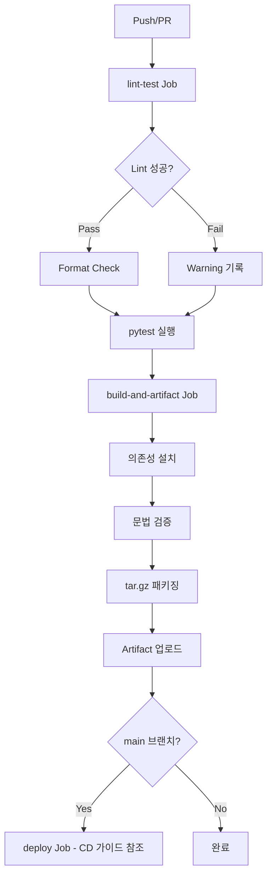

# AI Server CI 설정 가이드

- 작성일: 2026-01-07
- 최종수정일: 2026-01-26

<br>

## 목차

1. [개요](#1-개요)
2. [CI 워크플로우](#2-ci-워크플로우)
   - [파일 위치](#21-파일-위치)
   - [CI Jobs](#22-ci-jobs)
   - [파이프라인 단계 설명](#23-파이프라인-단계-설명)
3. [린트/테스트 설정](#3-린트테스트-설정)
4. [환경 설정](#4-환경-설정)
   - [uv 패키지 관리](#41-uv-패키지-관리)
5. [CI 흐름 다이어그램](#5-ci-흐름-다이어그램)
6. [실패 시 대응](#6-실패-시-대응)
7. [향후 추가 예정](#7-향후-추가-예정)

<br>

## 1. 개요

이 문서는 **FastAPI(AI Server) 프로젝트**의 GitHub Actions CI 설정을 다룬다.

> **참고**: CI/CD가 하나의 워크플로우(`ai-cicd.yml`)로 통합되어 있음. 이 문서는 CI 부분(lint-test, build-and-artifact)만 다룸. CD 부분은 [[ai-server-cd-guide]] 참조.

**기술 스택:**
- FastAPI
- Python 3.10
- uv + uv.lock (패키지 관리)
- LangChain, ChromaDB 등 AI 관련 패키지

**적용 상태:**
- 린트: Ruff (빠르고 손쉬운 Python 린터)
- 포맷터: Ruff format
- 테스트: pytest (단위 테스트 + 커버리지)

> CI 도구 선택 이유, 브랜치 전략 등 공통 내용은 [[2단계 : CI 파이프라인 구축]] 참조

<br>

## 2. CI 워크플로우

### 2.1 파일 위치

```
.github/workflows/ai-cicd.yml
```

> CI/CD 통합 워크플로우. deploy job은 `if: github.ref == 'refs/heads/main'` 조건으로 main 브랜치에서만 실행됨.

### 2.2 CI Jobs

```yaml
# AI Server CI/CD Pipeline (CI 부분)
# 위치: .github/workflows/ai-cicd.yml

name: AI Server CI/CD

concurrency:
  group: ai-server-cicd-${{ github.ref }}
  cancel-in-progress: true

on:
  push:
    branches: [dev, main]
    paths-ignore:
      - '.github/workflows/**'
      - '**.md'
      - 'docs/**'
  pull_request:
    branches: [main, dev]
    paths-ignore:
      - '.github/workflows/**'
      - '**.md'
      - 'docs/**'
  workflow_dispatch:

env:
  PYTHON_VERSION: "3.10"

jobs:
  # ============================================
  # CI: Lint & Test
  # ============================================
  lint-test:
    name: Lint & Test
    runs-on: ubuntu-22.04
    continue-on-error: true
    steps:
      - name: Checkout
        uses: actions/checkout@v4

      - name: Setup uv
        uses: astral-sh/setup-uv@v5
        with:
          enable-cache: true
          cache-dependency-glob: "uv.lock"

      - name: Install Python
        run: uv python install ${{ env.PYTHON_VERSION }}

      - name: Install dependencies
        run: uv sync --frozen

      - name: Run Ruff Linter
        run: ruff check . || echo "::warning::Lint errors found (non-blocking)"

      - name: Run Ruff Formatter Check
        run: ruff format --check . || echo "::warning::Format issues found (non-blocking)"

      - name: Run Tests
        run: |
          if [ -d "tests" ]; then
            uv run pytest tests/ -v --cov=. --cov-report=xml
          else
            echo "No tests directory found, skipping tests"
          fi

  # ============================================
  # CI: Build & Artifact
  # ============================================
  build-and-artifact:
    name: Build & Artifact
    runs-on: ubuntu-22.04
    needs: lint-test
    steps:
      - name: Checkout
        uses: actions/checkout@v4

      - name: Setup uv
        uses: astral-sh/setup-uv@v5
        with:
          enable-cache: true
          cache-dependency-glob: "uv.lock"

      - name: Install Python
        run: uv python install ${{ env.PYTHON_VERSION }}

      - name: Install dependencies
        run: uv sync --frozen --no-dev

      - name: Verify Build
        run: |
          uv run python -m py_compile $(find . -name "*.py" -not -path "./.venv/*" -not -path "./venv/*" 2>/dev/null || echo "")
          echo "Build verification completed"

      - name: Create Artifact
        run: |
          mkdir -p dist
          tar -czvf dist/ai-server-${{ github.sha }}.tar.gz \
            --exclude='.git' \
            --exclude='.github' \
            --exclude='__pycache__' \
            --exclude='.pytest_cache' \
            --exclude='.ruff_cache' \
            --exclude='*.pyc' \
            --exclude='venv' \
            --exclude='.venv' \
            .

      - name: Upload Artifact
        uses: actions/upload-artifact@v4
        with:
          name: ai-server-${{ github.sha }}
          path: dist/
          retention-days: 7

  # deploy job은 ai-server-cd-guide.md 참조
```

### 2.3 파이프라인 단계 설명

#### Jobs 구성

| Job | 실행 조건 | 설명 |
|-----|----------|------|
| lint-test | 항상 | 린트, 포맷 체크, 테스트 (continue-on-error) |
| build-and-artifact | lint-test 완료 후 | 빌드 검증 + Artifact 생성/업로드 |
| deploy | main 브랜치만 | CD 가이드 참조 |

#### 동작 시나리오

| 이벤트 | lint-test | build-artifact | deploy |
|--------|:---------:|:--------------:|:------:|
| PR 생성/업데이트 | O | O | X |
| PR 머지 (main push) | O | O | O |
| dev push | O | O | X |

#### lint-test 단계

| 단계 | 설명 | 비고 |
|------|------|------|
| Checkout | 코드 체크아웃 | actions/checkout@v4 |
| Setup uv | uv 설치 | astral-sh/setup-uv@v5 + 캐시 |
| Install Python | Python 3.10 설치 | uv python install |
| Install dependencies | 의존성 설치 | `uv sync --frozen` |
| Ruff Linter | 코드 검사 | 실패해도 warning |
| Ruff Formatter | 포맷 체크 | 실패해도 warning |
| Tests | pytest 실행 | 커버리지 포함 |

#### build-and-artifact 단계

| 단계 | 설명 | 비고 |
|------|------|------|
| Verify Build | Python 문법 검증 | py_compile |
| Create Artifact | tar.gz 패키징 | 소스코드만 (venv 제외) |
| Upload Artifact | GitHub에 업로드 | retention 7일 |

<br>

## 3. 린트/테스트 설정

### 린트/테스트 도구

| 도구 | 역할 |
|------|------|
| **Ruff** | Python 린터 + 포맷터 (빠르고 손쉬운 코드 스타일 검사) |
| **pytest** | Python 테스트 프레임워크 (테스트 실행, assertion, fixture) |
| **pytest-cov** | 테스트 커버리지 측정 |

### lint-test 실패 정책

`continue-on-error: true` 설정으로 **lint/format 실패해도 CI는 통과**함.
- 목적: 개발 초기 단계에서 린트 오류로 인한 병목 방지
- Warning으로 기록되어 PR에서 확인 가능
- 향후 코드 안정화 후 `continue-on-error: false`로 변경 권장

> 린트 도구 상세 비교는 [[Step2 : CI 파이프라인 구축]] #부록-a-lint-심화 참조

<br>

## 4. 환경 설정

### 4.1 uv 패키지 관리

#### uv란?
Rust로 작성된 빠른 Python 패키지 관리 도구. pip보다 10-100배 빠름.

#### 주요 파일

| 파일 | 용도 |
|------|------|
| `pyproject.toml` | 의존성 정의 |
| `uv.lock` | 잠금 파일 (버전 고정) |

#### 로컬 개발 환경 설정

```bash
# uv 설치 (macOS/Linux)
curl -LsSf https://astral.sh/uv/install.sh | sh

# 의존성 설치
uv sync

# 개발 의존성 포함
uv sync --dev
```

#### 의존성 추가/관리

```bash
# 패키지 추가
uv add fastapi uvicorn

# 개발 의존성 추가
uv add --dev ruff pytest pytest-cov

# 의존성 업데이트
uv lock --upgrade
```

<br>

## 5. CI 흐름 다이어그램



<br>

## 6. 실패 시 대응

### 의존성 설치 실패

```bash
# 로컬에서 재현
uv sync

# 잠금 파일 재생성
uv lock

# 캐시 정리 후 재시도
rm -rf .venv
uv sync
```

### Import 오류

```bash
# 문제 모듈 개별 확인
uv run python -c "import 문제모듈"

# 의존성 확인
uv tree
```

### 린트 오류 수정

```bash
# 린트 오류 확인
ruff check .

# 자동 수정
ruff check --fix .

# 포맷 적용
ruff format .
```

> 상세 실패 대응 프로세스는 [[Step2 : CI 파이프라인 구축]] #6-실패-시-대응-방안 참조

<br>

## 7. 향후 추가 예정

- [ ] `continue-on-error: false`로 엄격한 린트 적용
- [ ] pre-commit hook 설정
- [ ] API 문서 자동 생성 검증
- [ ] 타입 체크 (mypy)
