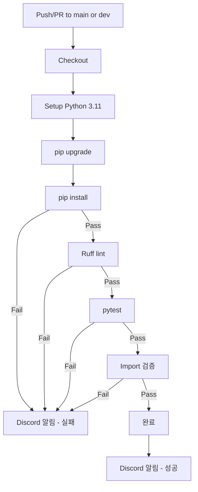

# AI Server CI 설정 가이드

- 작성일: 2026-01-07
- 최종수정일: 2026-01-08


<br>

## 목차

1. [개요](#1-개요)
2. [CI 워크플로우](#2-ci-워크플로우)
   - [파일 위치](#21-파일-위치)
   - [워크플로우 파일](#22-워크플로우-파일)
   - [파이프라인 단계 설명](#23-파이프라인-단계-설명)
3. [린트/테스트 설정](#3-린트테스트-설정)
4. [환경 설정](#4-환경-설정)
   - [GitHub Secrets](#41-github-secrets)
   - [requirements.txt 관리](#42-requirementstxt-관리)
5. [CI 흐름 다이어그램](#5-ci-흐름-다이어그램)
6. [예상 소요 시간](#6-예상-소요-시간)
7. [실패 시 대응](#7-실패-시-대응)
8. [향후 추가 예정](#8-향후-추가-예정)

<br>

## 1. 개요

이 문서는 **FastAPI(AI Server) 프로젝트**의 GitHub Actions CI 설정을 다룬다.

**기술 스택:**
- FastAPI
- Python 3.11
- pip + requirements.txt
- LangChain, ChromaDB 등 AI 관련 패키지

**적용 상태:**
- 린트: Ruff (가장 손쉬운 Python 린터)
- 테스트: pytest (단위 테스트)

> CI 도구 선택 이유, 브랜치 전략 등 공통 내용은 [[Step2 : CI 파이프라인 구축]] 참조

<br>

## 2. CI 워크플로우

### 2.1 파일 위치

```
.github/workflows/ci.yml
```

### 2.2 워크플로우 파일

```yaml
# =============================================================================
# AI Server CI Workflow
# =============================================================================
# 목적: PR 및 push 시 린트, 테스트, 의존성 설치 검증
# 트리거: main/dev 브랜치 push 또는 PR
# =============================================================================

name: AI Server CI

# -----------------------------------------------------------------------------
# 트리거 설정
# -----------------------------------------------------------------------------
on:
  push:
    branches: [main, dev]
  pull_request:
    branches: [main, dev]

# -----------------------------------------------------------------------------
# 환경 변수
# -----------------------------------------------------------------------------
env:
  PYTHON_VERSION: '3.11'

# -----------------------------------------------------------------------------
# Jobs 정의
# -----------------------------------------------------------------------------
jobs:
  ci:
    name: Lint, Test & Install
    runs-on: ubuntu-latest

    steps:
      # -----------------------------------------------------------------------
      # Step 1: 코드 체크아웃
      # -----------------------------------------------------------------------
      - name: Checkout repository
        uses: actions/checkout@v4

      # -----------------------------------------------------------------------
      # Step 2: Python 설치
      # -----------------------------------------------------------------------
      - name: Setup Python
        uses: actions/setup-python@v5
        with:
          python-version: ${{ env.PYTHON_VERSION }}
          cache: 'pip'
          # cache: pip → pip 캐싱으로 설치 시간 단축

      # -----------------------------------------------------------------------
      # Step 3: pip 업그레이드
      # -----------------------------------------------------------------------
      - name: Upgrade pip
        run: python -m pip install --upgrade pip

      # -----------------------------------------------------------------------
      # Step 4: 의존성 설치
      # -----------------------------------------------------------------------
      # requirements.txt 기반 패키지 설치
      # 실패 시: 패키지 버전 충돌, 의존성 누락 등 발견
      - name: Install dependencies
        run: pip install -r requirements.txt

      # -----------------------------------------------------------------------
      # Step 5: Ruff 린트 검사
      # -----------------------------------------------------------------------
      # Python 코드 스타일 및 잠재적 오류 검사
      - name: Run Ruff (lint)
        run: ruff check .

      # -----------------------------------------------------------------------
      # Step 6: 테스트 실행
      # -----------------------------------------------------------------------
      # pytest로 단위 테스트 실행
      - name: Run tests
        run: pytest tests/ -v

      # -----------------------------------------------------------------------
      # Step 7: 기본 import 검증
      # -----------------------------------------------------------------------
      # 주요 모듈이 정상적으로 import 되는지 확인
      - name: Verify imports
        run: |
          python -c "from fastapi import FastAPI; print('FastAPI OK')"
          python -c "import uvicorn; print('Uvicorn OK')"

      # -----------------------------------------------------------------------
      # Step 8: Discord 알림
      # -----------------------------------------------------------------------
      - name: Discord Notification
        if: always()
        uses: sarisia/actions-status-discord@v1
        with:
          webhook: ${{ secrets.DISCORD_WEBHOOK }}
          title: "AI Server CI"
          description: |
            **Branch**: ${{ github.ref_name }}
            **Commit**: ${{ github.event.head_commit.message || github.event.pull_request.title }}
            **Status**: ${{ job.status }}
          color: ${{ job.status == 'success' && '0x00ff00' || '0xff0000' }}
```

### 2.3 파이프라인 단계 설명

| 단계 | 설명 | 비고 |
|------|------|------|
| Checkout | 코드 체크아웃 | actions/checkout@v4 |
| Setup | Python 3.11 설치 | actions/setup-python@v5 + pip 캐시 |
| Upgrade | pip 업그레이드 | 최신 pip 사용 |
| Install | 의존성 설치 | `pip install -r requirements.txt` |
| Lint | Ruff 코드 검사 | `ruff check .` |
| Test | pytest 실행 | `pytest tests/ -v` |
| Verify | Import 검증 | FastAPI, Uvicorn 모듈 확인 |
| Notify | Discord 알림 | 성공/실패 모두 알림 |

<br>

## 3. 린트/테스트 설정

### 린트/테스트 도구

| 도구 | 역할 |
|------|------|
| **Ruff** | Python 린터 (빠르고 손쉬운 코드 스타일 검사) |
| **pytest** | Python 테스트 프레임워크 (테스트 실행, assertion, fixture) |

> 린트 도구 상세 비교는 [[Step2 : CI 파이프라인 구축]] #부록-a-lint-심화 참조

<br>

## 4. 환경 설정

### 4.1 GitHub Secrets

CI가 Discord 알림을 보내려면 아래 Secret 설정 필요:

```
Repository → Settings → Secrets and variables → Actions
→ New repository secret
→ Name: DISCORD_WEBHOOK
→ Value: https://discord.com/api/webhooks/xxxxx/yyyyy
```

### 4.2 requirements.txt 관리

#### 버전 고정 권장

```txt
# 주요 패키지는 버전 고정
fastapi==0.109.0
uvicorn==0.27.0
langchain==0.1.0
chromadb==0.4.22
openai==1.10.0

# 개발 의존성 (별도 파일 권장)
# requirements-dev.txt
# ruff
# pytest
# pytest-asyncio
```

#### 의존성 업데이트 체크

```bash
# 구버전 패키지 확인
pip list --outdated

# requirements.txt 재생성
pip freeze > requirements.txt
```

<br>

## 5. CI 흐름 다이어그램



<br>

## 6. 예상 소요 시간

| 단계 | 예상 시간 | 비고 |
|------|----------|------|
| Checkout | ~10초 | |
| Setup Python | ~20초 | 캐시 활용 시 |
| pip install | ~2분 | AI 패키지 많음 |
| Ruff lint | ~10초 | |
| pytest | ~30초 | 테스트 수에 따라 |
| Import 검증 | ~10초 | |
| **총합** | **~4분** | |

<br>

## 7. 실패 시 대응

### 의존성 설치 실패

```bash
# 로컬에서 재현
pip install -r requirements.txt

# 충돌하는 패키지 확인
pip check
```

### Import 오류

```bash
# 문제 모듈 개별 확인
python -c "import 문제모듈"

# 의존성 트리 확인
pip show 문제모듈
```

> 상세 실패 대응 프로세스는 [[Step2 : CI 파이프라인 구축]] #6-실패-시-대응-방안 참조

<br>

## 8. 향후 추가 예정

- [ ] 테스트 커버리지 측정 (pytest-cov)
- [ ] pre-commit hook 설정
- [ ] API 문서 자동 생성 검증
