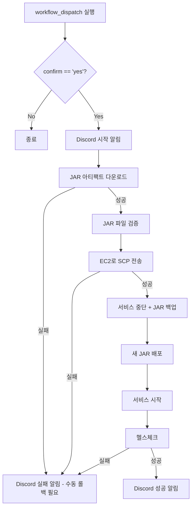

# Backend CD 설정 가이드

- 작성일: 2026-01-08
- 최종수정일: 2026-01-08

<br>

## 목차

1. [개요](#개요)
   - [기술 스택](#기술-스택)
   - [배포 방식 요약](#배포-방식-요약)
2. [CD 워크플로우 파일](#cd-워크플로우-파일)
   - [파일 위치](#파일-위치)
   - [전체 yml 파일](#전체-yml-파일)
3. [GitHub Secrets 설정](#github-secrets-설정)
4. [CD 흐름](#cd-흐름)
5. [예상 소요 시간](#예상-소요-시간)
   - [다운타임 상세](#다운타임-상세)
6. [systemd 서비스 설정](#systemd-서비스-설정)
   - [서비스 파일 예시](#서비스-파일-예시)
   - [systemd 명령어](#systemd-명령어)
7. [롤백 절차](#롤백-절차)
   - [백업 위치](#백업-위치)
   - [수동 롤백 방법](#수동-롤백-방법)
8. [실패 시 대응](#실패-시-대응)
9. [향후 계획](#향후-계획)

<br>

## 개요

### 이 문서의 범위

이 문서는 **Spring Boot(Backend) 프로젝트**의 GitHub Actions CD 설정을 다룬다.

### 기술 스택

| 항목 | 내용 |
|------|------|
| 프레임워크 | Spring Boot 3.x |
| 런타임 | Java 17 (Temurin) |
| 프로세스 관리 | systemd |
| 인프라 | EC2 CPU Instance |

### 배포 방식 요약

| 항목 | 내용 |
|------|------|
| 아티팩트 | CI에서 빌드한 JAR 파일 |
| 배포 방식 | 서비스 중단 → JAR 교체 → 서비스 시작 |
| 다운타임 | ~30초 (Spring Boot 부팅 시간) |
| 롤백 방식 | 백업 JAR 파일 복원 |

<br>

## CD 워크플로우 파일

### 파일 위치
```
.github/workflows/cd.yml
```

### 전체 yml 파일

```yaml
# =============================================================================
# Backend CD Workflow
# =============================================================================
# 목적: main 브랜치의 JAR 아티팩트를 EC2 서버에 배포
# 트리거: 수동 실행 (workflow_dispatch)
# 전제조건: CI에서 JAR 아티팩트가 업로드되어 있어야 함
# =============================================================================

name: Backend CD

# -----------------------------------------------------------------------------
# 트리거 설정 - 수동 실행만 허용
# -----------------------------------------------------------------------------
on:
  workflow_dispatch:
    inputs:
      confirm:
        description: '배포를 진행하시겠습니까? (yes 입력)'
        required: true
        type: string

# -----------------------------------------------------------------------------
# 환경 변수
# -----------------------------------------------------------------------------
env:
  APP_NAME: dojangkok-backend
  DEPLOY_PATH: /app/backend
  JAR_NAME: app.jar
  SERVICE_NAME: dojangkok-backend
  BACKUP_PATH: /app/backup/backend

# -----------------------------------------------------------------------------
# Jobs 정의
# -----------------------------------------------------------------------------
jobs:
  deploy:
    name: Deploy to Production
    runs-on: ubuntu-latest
    if: github.event.inputs.confirm == 'yes'

    steps:
      # -----------------------------------------------------------------------
      # Step 1: 배포 시작 알림
      # -----------------------------------------------------------------------
      - name: Discord - Deploy Started
        uses: sarisia/actions-status-discord@v1
        with:
          webhook: ${{ secrets.DISCORD_WEBHOOK }}
          title: "Backend 배포 시작"
          description: |
            **Branch**: ${{ github.ref_name }}
            **Triggered by**: ${{ github.actor }}
            ⚠️ 서비스가 잠시 중단됩니다.
          color: 0xffaa00

      # -----------------------------------------------------------------------
      # Step 2: CI 빌드 아티팩트 다운로드
      # -----------------------------------------------------------------------
      - name: Download JAR artifact
        uses: dawidd6/action-download-artifact@v3
        with:
          workflow: ci.yml
          branch: main
          name: backend-jar-${{ github.sha }}
          path: ./artifact
          # 같은 커밋의 CI 아티팩트 다운로드

      # -----------------------------------------------------------------------
      # Step 4: JAR 파일 확인
      # -----------------------------------------------------------------------
      - name: Verify JAR file
        run: |
          echo "다운로드된 파일 목록:"
          ls -la ./artifact/

          # plain JAR 제외하고 실행 가능한 JAR 찾기
          JAR_FILE=$(find ./artifact -name "*.jar" ! -name "*-plain.jar" | head -1)

          if [ -z "$JAR_FILE" ]; then
            echo "❌ JAR 파일을 찾을 수 없습니다."
            exit 1
          fi

          echo "배포할 JAR: $JAR_FILE"
          cp "$JAR_FILE" ./app.jar
          ls -la ./app.jar

      # -----------------------------------------------------------------------
      # Step 5: EC2로 JAR 전송
      # -----------------------------------------------------------------------
      - name: Copy JAR to EC2
        uses: appleboy/scp-action@v0.1.7
        with:
          host: ${{ secrets.EC2_HOST }}
          username: ${{ secrets.SSH_USERNAME }}
          key: ${{ secrets.SSH_PRIVATE_KEY }}
          source: "app.jar"
          target: "/tmp/"

      # -----------------------------------------------------------------------
      # Step 6: EC2에서 배포 실행
      # -----------------------------------------------------------------------
      - name: Deploy on EC2
        uses: appleboy/ssh-action@v1.0.3
        with:
          host: ${{ secrets.EC2_HOST }}
          username: ${{ secrets.SSH_USERNAME }}
          key: ${{ secrets.SSH_PRIVATE_KEY }}
          script: |
            set -e

            echo "=== Backend 배포 시작 ==="

            # 1. 백업 디렉토리 생성 (타임스탬프 포함)
            BACKUP_DIR="${{ env.BACKUP_PATH }}/$(date +%Y%m%d_%H%M%S)"
            sudo mkdir -p "$BACKUP_DIR"

            # 2. 현재 JAR 백업 (롤백용)
            if [ -f "${{ env.DEPLOY_PATH }}/${{ env.JAR_NAME }}" ]; then
              echo "기존 JAR 백업 중..."
              sudo cp ${{ env.DEPLOY_PATH }}/${{ env.JAR_NAME }} "$BACKUP_DIR/"
              # 최신 백업 경로 저장 (롤백 시 사용)
              echo "$BACKUP_DIR" | sudo tee /tmp/backend-latest-backup > /dev/null
            fi

            # 3. 서비스 중단
            echo "서비스 중단 중..."
            sudo systemctl stop ${{ env.SERVICE_NAME }} || true

            # 4. 새 JAR 배포
            echo "새 JAR 배포 중..."
            sudo cp /tmp/app.jar ${{ env.DEPLOY_PATH }}/${{ env.JAR_NAME }}
            sudo chown ubuntu:ubuntu ${{ env.DEPLOY_PATH }}/${{ env.JAR_NAME }}
            sudo chmod 755 ${{ env.DEPLOY_PATH }}/${{ env.JAR_NAME }}

            # 5. 서비스 시작
            echo "서비스 시작 중..."
            sudo systemctl start ${{ env.SERVICE_NAME }}

            # 6. 서비스 시작 대기
            echo "서비스 시작 대기 중... (30초)"
            sleep 30

            # 7. 정리
            rm -f /tmp/app.jar

            # 8. 오래된 백업 정리 (최근 5개만 유지)
            cd ${{ env.BACKUP_PATH }}
            ls -dt */ 2>/dev/null | tail -n +6 | xargs -r sudo rm -rf

            echo "=== Backend 배포 완료 ==="

      # -----------------------------------------------------------------------
      # Step 7: 헬스체크
      # -----------------------------------------------------------------------
      - name: Health check
        id: healthcheck
        continue-on-error: true
        uses: appleboy/ssh-action@v1.0.3
        with:
          host: ${{ secrets.EC2_HOST }}
          username: ${{ secrets.SSH_USERNAME }}
          key: ${{ secrets.SSH_PRIVATE_KEY }}
          script: |
            echo "헬스체크 실행 중..."

            # 최대 5번 재시도 (서비스 시작 대기)
            for i in {1..5}; do
              HTTP_STATUS=$(curl -s -o /dev/null -w "%{http_code}" http://localhost:8080/actuator/health 2>/dev/null || echo "000")

              if [ "$HTTP_STATUS" -eq 200 ]; then
                echo "✅ 헬스체크 성공 (HTTP $HTTP_STATUS)"
                exit 0
              fi

              echo "대기 중... ($i/5) - HTTP $HTTP_STATUS"
              sleep 10
            done

            echo "❌ 헬스체크 실패"
            exit 1

      # -----------------------------------------------------------------------
      # Step 8: 서비스 상태 확인 (헬스체크 성공 시에만)
      # -----------------------------------------------------------------------
      - name: Check service status
        if: steps.healthcheck.outcome == 'success'
        uses: appleboy/ssh-action@v1.0.3
        with:
          host: ${{ secrets.EC2_HOST }}
          username: ${{ secrets.SSH_USERNAME }}
          key: ${{ secrets.SSH_PRIVATE_KEY }}
          script: |
            echo "=== 서비스 상태 ==="
            sudo systemctl status ${{ env.SERVICE_NAME }} --no-pager | head -20

      # -----------------------------------------------------------------------
      # Step 9: Discord 성공 알림
      # -----------------------------------------------------------------------
      - name: Discord - Deploy Success
        if: steps.healthcheck.outcome == 'success'
        uses: sarisia/actions-status-discord@v1
        with:
          webhook: ${{ secrets.DISCORD_WEBHOOK }}
          title: "Backend 배포 성공"
          description: |
            **Branch**: ${{ github.ref_name }}
            **Deployed by**: ${{ github.actor }}
            ✅ 서비스가 정상 동작 중입니다.
          color: 0x00ff00

      # -----------------------------------------------------------------------
      # Step 10: Discord 실패 알림
      # -----------------------------------------------------------------------
      - name: Discord - Deploy Failed
        if: steps.healthcheck.outcome == 'failure'
        uses: sarisia/actions-status-discord@v1
        with:
          webhook: ${{ secrets.DISCORD_WEBHOOK }}
          title: "Backend 배포 실패 - 수동 롤백 필요"
          description: |
            **Branch**: ${{ github.ref_name }}
            **Triggered by**: ${{ github.actor }}
            헬스체크 실패. 수동 롤백이 필요합니다.
          color: 0xff0000

      # -----------------------------------------------------------------------
      # Step 11: 헬스체크 실패 시 워크플로우 실패 처리
      # -----------------------------------------------------------------------
      - name: Fail workflow on health check failure
        if: steps.healthcheck.outcome == 'failure'
        run: exit 1
```

<br>

## GitHub Secrets 설정

| Secret 이름 | 설명 | 예시 |
|------------|------|------|
| `EC2_HOST` | EC2 퍼블릭 IP 또는 도메인 | `3.35.xxx.xxx` |
| `SSH_USERNAME` | SSH 접속 사용자명 | `ubuntu` |
| `SSH_PRIVATE_KEY` | SSH 프라이빗 키 (전체 내용) | `-----BEGIN OPENSSH...` |
| `DISCORD_WEBHOOK` | Discord 웹훅 URL | `https://discord.com/api/webhooks/...` |

<br>

## CD 흐름



<br>

## 예상 소요 시간

**측정 기준**: 초기 추정치 (운영 후 실제 배포 로그 기반으로 업데이트 예정)

| 단계 | 예상 시간 | 산정 근거 |
|------|----------|----------|
| 아티팩트 다운로드 | ~20초 | JAR 파일 ~30MB 기준 |
| SCP 전송 | ~30초 | GitHub Actions → EC2 네트워크 속도 |
| 서비스 중단 | ~5초 | systemctl stop 명령 실행 |
| JAR 교체 | ~5초 | 파일 복사 + 권한 설정 |
| 서비스 시작 대기 | ~30초 | Spring Boot 부팅 시간 |
| 헬스체크 | ~10초 | 최대 50초 (5회 × 10초 대기) |
| **총합** | **~2분** | 다운타임 ~30초 |

### 다운타임 상세

| 구간 | 시간 | 설명 |
|------|------|------|
| 서비스 중단 | ~5초 | systemctl stop |
| JAR 교체 | ~5초 | 파일 복사 |
| 서비스 시작 | ~30초 | Spring Boot 부팅 |
| **총 다운타임** | **~30초** | 사용자 접속 불가 구간 |

<br>

## systemd 서비스 설정

### 서비스 파일 위치
```
/etc/systemd/system/dojangkok-backend.service
```

### 서비스 파일 예시

```ini
[Unit]
Description=Dojangkok Backend Service
After=network.target

[Service]
User=ubuntu
WorkingDirectory=/app/backend
ExecStart=/usr/bin/java -jar /app/backend/app.jar --spring.profiles.active=prod
SuccessExitStatus=143
TimeoutStopSec=10
Restart=on-failure
RestartSec=5

# 환경 변수 파일 (선택)
EnvironmentFile=/app/backend/.env

# 로그 설정
StandardOutput=append:/var/log/dojangkok/backend.log
StandardError=append:/var/log/dojangkok/backend-error.log

[Install]
WantedBy=multi-user.target
```

### systemd 명령어

```bash
# 서비스 시작
sudo systemctl start dojangkok-backend

# 서비스 중단
sudo systemctl stop dojangkok-backend

# 서비스 재시작
sudo systemctl restart dojangkok-backend

# 서비스 상태 확인
sudo systemctl status dojangkok-backend

# 부팅 시 자동 시작 설정
sudo systemctl enable dojangkok-backend

# 로그 확인
sudo journalctl -u dojangkok-backend -f
```

<br>

## 롤백 절차

### 백업 위치
```
/app/backup/backend/YYYYMMDD_HHMMSS/app.jar
```
- 매 배포 시 자동 백업 생성
- 최근 5개 백업만 유지

### 수동 롤백 방법

```bash
# 1. SSH 접속
ssh -i key.pem ubuntu@<EC2_HOST>

# 2. 백업 목록 확인
ls -la /app/backup/backend/

# 3. 서비스 중단
sudo systemctl stop dojangkok-backend

# 4. 원하는 백업으로 롤백
BACKUP_JAR="/app/backup/backend/20260108_143000/app.jar"
sudo cp "$BACKUP_JAR" /app/backend/app.jar
sudo chown ubuntu:ubuntu /app/backend/app.jar

# 5. 서비스 시작
sudo systemctl start dojangkok-backend

# 6. 상태 확인
sudo systemctl status dojangkok-backend
curl http://localhost:8080/actuator/health
```

<Br>

## 실패 시 대응

### 아티팩트 다운로드 실패
- **원인**: CI 미완료, 아티팩트 만료
- **해결**: CI 상태 확인 후 재시도

### 서비스 시작 실패
- **원인**: 포트 충돌, 환경 변수 누락, DB 연결 실패
- **해결**:
  ```bash
  # 로그 확인
  sudo journalctl -u dojangkok-backend -n 100 --no-pager

  # 포트 확인
  sudo lsof -i :8080

  # 환경 변수 확인
  cat /app/backend/.env
  ```

### 헬스체크 실패
- **확인사항**: Discord 실패 알림 확인
- **원인 분석**:
  ```bash
  # 배포했던 새 버전 로그 확인 (journalctl에서 시간대로 필터)
  sudo journalctl -u dojangkok-backend --since "10 minutes ago"
  ```
- **수동 롤백**: 롤백 절차 섹션 참조

<br>

## 향후 계획

- [ ] Graceful shutdown 설정 (요청 처리 완료 후 종료)
- [ ] Blue-Green 배포 (다운타임 제거)
- [ ] 환경 변수 자동 동기화 (AWS Secrets Manager)
- [ ] 배포 전 DB 마이그레이션 확인
