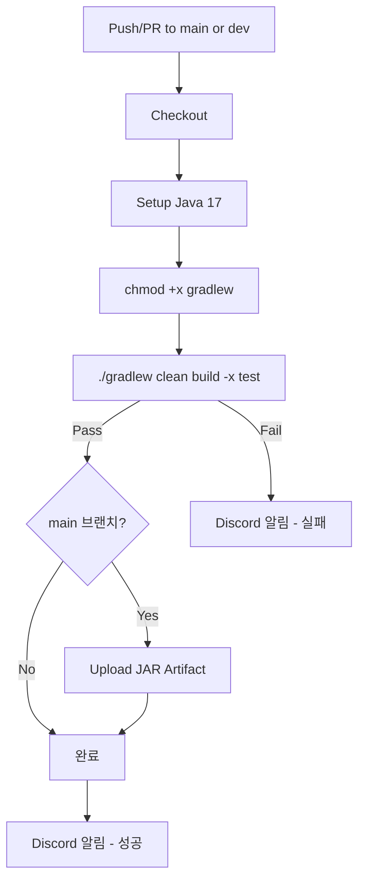

# Backend CI 설정 가이드

- 작성일: 2026-01-07
- 최종수정일: 2026-01-08

<br>

## 목차

1. [개요](#1-개요)
2. [CI 워크플로우](#2-ci-워크플로우)
   - [파일 위치](#21-파일-위치)
   - [워크플로우 파일](#22-워크플로우-파일)
   - [파이프라인 단계 설명](#23-파이프라인-단계-설명)
3. [린트/테스트 설정](#3-린트테스트-설정)
4. [환경 설정](#4-환경-설정)
   - [GitHub Secrets](#41-github-secrets)
   - [빌드 결과물 구조](#42-빌드-결과물-구조)
5. [CI 흐름 다이어그램](#5-ci-흐름-다이어그램)
6. [예상 소요 시간](#6-예상-소요-시간)
7. [실패 시 대응](#7-실패-시-대응)
8. [향후 추가 예정](#8-향후-추가-예정)

<br>

## 1. 개요

이 문서는 **Spring Boot(Backend) 프로젝트**의 GitHub Actions CI 설정을 다룬다.

**기술 스택:**
- Spring Boot 3.x
- Java 17 (Temurin)
- Gradle
- MySQL

> CI 도구 선택 이유, 브랜치 전략 등 공통 내용은 [[Step2 : CI 파이프라인 구축]] 참조

<br>

## 2. CI 워크플로우

### 2.1 파일 위치

```
.github/workflows/ci.yml
```

### 2.2 워크플로우 파일

```yaml
# =============================================================================
# Backend CI Workflow
# =============================================================================
# 목적: PR 및 push 시 자동으로 빌드하여 코드 품질 검증
# 트리거: main/dev 브랜치 push 또는 PR
# 특이사항: MVP 단계에서 테스트는 건너뜀 (-x test)
# =============================================================================

name: Backend CI

# -----------------------------------------------------------------------------
# 트리거 설정
# -----------------------------------------------------------------------------
on:
  push:
    branches: [main, dev]
  pull_request:
    branches: [main, dev]

# -----------------------------------------------------------------------------
# 환경 변수
# -----------------------------------------------------------------------------
env:
  JAVA_VERSION: '17'
  JAVA_DISTRIBUTION: 'temurin'

# -----------------------------------------------------------------------------
# Jobs 정의
# -----------------------------------------------------------------------------
jobs:
  ci:
    name: Build & Package
    runs-on: ubuntu-latest
    # Ubuntu 환경에서 실행 (서버 환경과 동일)

    steps:
      # -----------------------------------------------------------------------
      # Step 1: 코드 체크아웃
      # -----------------------------------------------------------------------
      - name: Checkout repository
        uses: actions/checkout@v4

      # -----------------------------------------------------------------------
      # Step 2: Java 설치
      # -----------------------------------------------------------------------
      # Temurin(AdoptOpenJDK 후속) 배포판 사용, Gradle 캐시 활성화
      - name: Setup Java
        uses: actions/setup-java@v4
        with:
          java-version: ${{ env.JAVA_VERSION }}
          distribution: ${{ env.JAVA_DISTRIBUTION }}
          cache: 'gradle'
          # cache: gradle → .gradle 디렉토리 캐싱으로 빌드 시간 단축

      # -----------------------------------------------------------------------
      # Step 3: Gradle 래퍼 실행 권한 부여
      # -----------------------------------------------------------------------
      - name: Grant execute permission for gradlew
        run: chmod +x gradlew

      # -----------------------------------------------------------------------
      # Step 4: Gradle 빌드
      # -----------------------------------------------------------------------
      # clean: 이전 빌드 결과물 삭제
      # build: 컴파일 + 패키징
      # -x test: 테스트 건너뛰기 (MVP 단계)
      - name: Build with Gradle
        run: ./gradlew clean build -x test
        #
        # [참고] 테스트 포함 시:
        # run: ./gradlew clean build
        #
        # [참고] 테스트만 실행 시:
        # run: ./gradlew test

      # -----------------------------------------------------------------------
      # Step 5: JAR 아티팩트 저장 (main 브랜치만)
      # -----------------------------------------------------------------------
      # CD에서 재빌드 없이 사용하기 위해 JAR 파일 저장
      - name: Upload JAR artifact
        if: github.ref == 'refs/heads/main'
        uses: actions/upload-artifact@v4
        with:
          name: backend-jar-${{ github.sha }}
          path: build/libs/*.jar
          retention-days: 7
          # 7일간 보관 후 자동 삭제
          #
          # [참고] JAR 파일 위치 확인:
          # ls -la build/libs/

      # -----------------------------------------------------------------------
      # Step 6: Discord 알림 (성공/실패 모두)
      # -----------------------------------------------------------------------
      - name: Discord Notification
        if: always()
        uses: sarisia/actions-status-discord@v1
        with:
          webhook: ${{ secrets.DISCORD_WEBHOOK }}
          title: "Backend CI"
          description: |
            **Branch**: ${{ github.ref_name }}
            **Commit**: ${{ github.event.head_commit.message || github.event.pull_request.title }}
          color: ${{ job.status == 'success' && '0x00ff00' || '0xff0000' }}
```

### 2.3 파이프라인 단계 설명

| 단계 | 설명 | 비고 |
|------|------|------|
| Checkout | 코드 체크아웃 | actions/checkout@v4 |
| Setup | Java 17 설치 | Temurin + Gradle 캐시 |
| Permission | Gradle Wrapper 권한 부여 | `chmod +x gradlew` |
| Build | Gradle 빌드 | `./gradlew clean build -x test` |
| Artifact | JAR 파일 저장 | main 브랜치만, 7일 보관 |
| Notify | Discord 알림 | 성공/실패 모두 알림 |

<br>

## 3. 린트/테스트 설정

### 린트 도구

**현재 방식**: IntelliJ 기반 로컬 환경에서 lint 체크
- IntelliJ 내장 검사 기능 활용
- lint 설정 파일(`.idea/inspectionProfiles/`)을 팀 내 공유 예정
- CI에서는 빌드 검증 중심, lint는 로컬에서 사전 검증

### 테스트 도구 (향후 추가 예정)

| 분류 | 도구 | 용도 |
|------|------|------|
| **단위 테스트** | JUnit 5 | 테스트 프레임워크 |
| | AssertJ | 가독성 높은 assertion |
| | Mockito | 목(mock) 객체 생성 |
| **통합 테스트** | Testcontainers | 실제 DB/인프라를 Docker로 구동 |
| **외부 연동** | WireMock | HTTP API 목킹 |
| | LocalStack | AWS 서비스 로컬 에뮬레이션 |
| **비동기 테스트** | Awaitility | 비동기 코드 테스트 유틸리티 |
| **분석/문서화** | JaCoCo | 테스트 커버리지 측정 |

### CI에 테스트 단계 추가 시

```yaml
      # -----------------------------------------------------------------------
      # Step: 테스트 실행 (Testcontainers용 Docker 자동 지원)
      # -----------------------------------------------------------------------
      - name: Run tests
        run: ./gradlew test

      # -----------------------------------------------------------------------
      # Step: 커버리지 리포트 생성
      # -----------------------------------------------------------------------
      - name: Generate coverage report
        run: ./gradlew jacocoTestReport
```

> 린트 도구 상세 비교는 [[Step2 : CI 파이프라인 구축]]#부록-a-lint-심화 참조

<br>

## 4. 환경 설정

### 4.1 GitHub Secrets

CI가 Discord 알림을 보내려면 아래 Secret 설정 필요:

```
Repository → Settings → Secrets and variables → Actions
→ New repository secret
→ Name: DISCORD_WEBHOOK
→ Value: https://discord.com/api/webhooks/xxxxx/yyyyy
```

### 4.2 빌드 결과물 구조

```
build/
├── libs/
│   ├── app-0.0.1-SNAPSHOT.jar      ← 실행 가능한 fat JAR
│   └── app-0.0.1-SNAPSHOT-plain.jar ← 의존성 미포함 JAR
├── classes/
│   └── ...
└── reports/
    └── ...
```

**주의**: CD에서 사용할 JAR은 `-plain.jar`이 아닌 일반 JAR 파일

plain JAR 생성 비활성화 (권장):

```groovy
// build.gradle
jar {
    enabled = false
}
```

<br>

## 5. CI 흐름 다이어그램



<br>

## 6. 예상 소요 시간

| 단계 | 예상 시간 | 비고 |
|------|----------|------|
| Checkout | ~10초 | |
| Setup Java | ~30초 | 캐시 활용 시 |
| Gradle build | ~3분 | 캐시 활용 시 2분 |
| Upload artifact | ~10초 | |
| **총합** | **~4분** | |

<br>

## 7. 실패 시 대응

### 컴파일 오류

```bash
# 로컬에서 빌드 실행
./gradlew clean build -x test

# 상세 로그 확인
./gradlew clean build -x test --stacktrace
```

### 의존성 문제

```bash
# 의존성 캐시 삭제 후 재시도
./gradlew clean build -x test --refresh-dependencies
```

### Gradle 버전 문제

```bash
# Gradle 래퍼 버전 확인
./gradlew --version

# 래퍼 업데이트 (필요 시)
./gradlew wrapper --gradle-version 8.5
```

> 상세 실패 대응 프로세스는 [[Step2 : CI 파이프라인 구축]] #6-실패-시-대응-방안 참조

<br>

## 8. 향후 추가 예정

- [ ] 테스트 단계 CI에 활성화 (`-x test` 제거)
- [ ] Checkstyle 린트 검사
- [ ] JaCoCo 커버리지 리포트 CI 연동
- [ ] SonarQube 연동 (코드 품질 분석)
- [ ] 커버리지 임계값 설정 (예: 80% 미만 시 실패)
