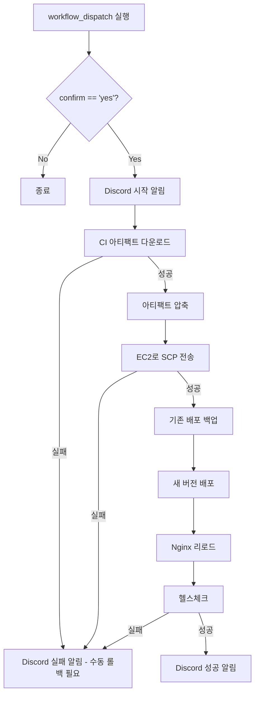

# Frontend CD 설정 가이드

- 작성일: 2026-01-08
- 최종수정일: 2026-01-08

<br>

## 목차

1. [개요](#1-개요)
   - [기술 스택](#기술-스택)
   - [배포 방식 요약](#배포-방식-요약)
2. [CD 워크플로우 파일](#2-cd-워크플로우-파일)
   - [파일 위치](#파일-위치)
   - [전체 yml 파일](#전체-yml-파일)
3. [GitHub Secrets 설정](#3-github-secrets-설정)
4. [CD 흐름](#4-cd-흐름)
5. [예상 소요 시간](#5-예상-소요-시간)
6. [롤백 절차](#6-롤백-절차)
   - [백업 위치](#백업-위치)
   - [수동 롤백 방법](#수동-롤백-방법)
7. [실패 시 대응](#7-실패-시-대응)
8. [서버 설정](#8-서버-설정)
9. [향후 추가 예정](#향후-추가-예정)

<br>

## 1. 개요

### 이 문서의 범위

이 문서는 **React(Frontend) 프로젝트**의 GitHub Actions CD 설정을 다룬다.

### 기술 스택

| 항목 | 내용 |
|------|------|
| 프레임워크 | React (CSR) |
| 웹서버 | Nginx (static file serving) |
| 인프라 | EC2 CPU Instance |

### 배포 방식 요약

| 항목 | 내용 |
|------|------|
| 아티팩트 | CI에서 빌드한 `build/` 폴더 |
| 배포 방식 | Nginx 서빙 디렉토리에 파일 교체 |
| 다운타임 | **0분** (Nginx 리로드만으로 적용) |
| 롤백 방식 | 백업 폴더 복원 |
| 헬스체크 | http://localhost (HTTP 200) |

> Frontend는 정적 파일 서빙이므로 서비스 재시작 없이 파일 교체만으로 배포가 완료된다.

<br>

## 2. CD 워크플로우 파일

### 파일 위치
```
.github/workflows/cd.yml
```

### 전체 yml 파일

```yaml
# =============================================================================
# Frontend CD Workflow
# =============================================================================
# 목적: main 브랜치의 빌드 아티팩트를 EC2 서버에 배포
# 트리거: 수동 실행 (workflow_dispatch)
# 전제조건: CI에서 빌드 아티팩트가 업로드되어 있어야 함
# =============================================================================

name: Frontend CD

# -----------------------------------------------------------------------------
# 트리거 설정 - 수동 실행만 허용
# -----------------------------------------------------------------------------
on:
  workflow_dispatch:
    inputs:
      confirm:
        description: '배포를 진행하시겠습니까? (yes 입력)'
        required: true
        type: string

# -----------------------------------------------------------------------------
# 환경 변수
# -----------------------------------------------------------------------------
env:
  DEPLOY_PATH: /var/www/dojangkok          # Nginx 서빙 디렉토리
  BACKUP_PATH: /var/www/backup/frontend    # 백업 디렉토리

# -----------------------------------------------------------------------------
# Jobs 정의
# -----------------------------------------------------------------------------
jobs:
  deploy:
    name: Deploy to Production
    runs-on: ubuntu-latest
    # confirm 입력이 'yes'일 때만 실행
    if: github.event.inputs.confirm == 'yes'

    steps:
      # -----------------------------------------------------------------------
      # Step 1: 배포 시작 알림
      # -----------------------------------------------------------------------
      - name: Discord - Deploy Started
        uses: sarisia/actions-status-discord@v1
        with:
          webhook: ${{ secrets.DISCORD_WEBHOOK }}
          title: "Frontend 배포 시작"
          description: |
            **Branch**: ${{ github.ref_name }}
            **Triggered by**: ${{ github.actor }}
          color: 0xffaa00

      # -----------------------------------------------------------------------
      # Step 2: CI 빌드 아티팩트 다운로드
      # -----------------------------------------------------------------------
      - name: Download build artifact
        uses: dawidd6/action-download-artifact@v3
        with:
          workflow: ci.yml
          branch: main
          name: frontend-build-${{ github.sha }}
          path: ./build

      # -----------------------------------------------------------------------
      # Step 4: 아티팩트 압축
      # -----------------------------------------------------------------------
      - name: Create deployment archive
        run: |
          cd build
          tar -czvf ../frontend-build.tar.gz .
          cd ..
          ls -la frontend-build.tar.gz

      # -----------------------------------------------------------------------
      # Step 5: EC2로 아티팩트 전송
      # -----------------------------------------------------------------------
      - name: Copy artifact to EC2
        uses: appleboy/scp-action@v0.1.7
        with:
          host: ${{ secrets.EC2_HOST }}
          username: ${{ secrets.SSH_USERNAME }}
          key: ${{ secrets.SSH_PRIVATE_KEY }}
          source: "frontend-build.tar.gz"
          target: "/tmp/"

      # -----------------------------------------------------------------------
      # Step 6: EC2에서 배포 실행
      # -----------------------------------------------------------------------
      - name: Deploy on EC2
        uses: appleboy/ssh-action@v1.0.3
        with:
          host: ${{ secrets.EC2_HOST }}
          username: ${{ secrets.SSH_USERNAME }}
          key: ${{ secrets.SSH_PRIVATE_KEY }}
          script: |
            set -e

            echo "=== Frontend 배포 시작 ==="

            # 1. 백업 디렉토리 생성 (타임스탬프 포함)
            BACKUP_DIR="${{ env.BACKUP_PATH }}/$(date +%Y%m%d_%H%M%S)"
            sudo mkdir -p "$BACKUP_DIR"

            # 2. 현재 배포 백업 (롤백용)
            if [ -d "${{ env.DEPLOY_PATH }}" ] && [ "$(ls -A ${{ env.DEPLOY_PATH }})" ]; then
              echo "기존 배포 백업 중..."
              sudo cp -r ${{ env.DEPLOY_PATH }}/* "$BACKUP_DIR/" 2>/dev/null || true
              # 최신 백업 경로 저장 (롤백 시 사용)
              echo "$BACKUP_DIR" | sudo tee /tmp/frontend-latest-backup > /dev/null
            fi

            # 3. 임시 디렉토리에 압축 해제
            TEMP_DIR="/tmp/frontend-deploy-$(date +%s)"
            mkdir -p "$TEMP_DIR"
            tar -xzvf /tmp/frontend-build.tar.gz -C "$TEMP_DIR"

            # 4. 배포 디렉토리 교체
            echo "새 버전 배포 중..."
            sudo rm -rf ${{ env.DEPLOY_PATH }}/*
            sudo cp -r "$TEMP_DIR"/* ${{ env.DEPLOY_PATH }}/

            # 5. 권한 설정
            sudo chown -R www-data:www-data ${{ env.DEPLOY_PATH }}
            sudo chmod -R 755 ${{ env.DEPLOY_PATH }}

            # 6. Nginx 설정 검증 및 리로드
            echo "Nginx 리로드 중..."
            sudo nginx -t && sudo nginx -s reload

            # 7. 정리
            rm -rf "$TEMP_DIR"
            rm -f /tmp/frontend-build.tar.gz

            # 8. 오래된 백업 정리 (최근 5개만 유지)
            cd ${{ env.BACKUP_PATH }}
            ls -dt */ 2>/dev/null | tail -n +6 | xargs -r sudo rm -rf

            echo "=== Frontend 배포 완료 ==="

      # -----------------------------------------------------------------------
      # Step 7: 헬스체크
      # -----------------------------------------------------------------------
      - name: Health check
        id: healthcheck
        continue-on-error: true
        uses: appleboy/ssh-action@v1.0.3
        with:
          host: ${{ secrets.EC2_HOST }}
          username: ${{ secrets.SSH_USERNAME }}
          key: ${{ secrets.SSH_PRIVATE_KEY }}
          script: |
            echo "헬스체크 실행 중..."

            # 최대 3번 재시도
            for i in {1..3}; do
              HTTP_STATUS=$(curl -s -o /dev/null -w "%{http_code}" http://localhost)

              if [ "$HTTP_STATUS" -eq 200 ]; then
                echo "헬스체크 성공 (HTTP $HTTP_STATUS)"
                exit 0
              fi

              echo "대기 중... ($i/3) - HTTP $HTTP_STATUS"
              sleep 5
            done

            echo "헬스체크 실패"
            exit 1

      # -----------------------------------------------------------------------
      # Step 8: Discord 성공 알림
      # -----------------------------------------------------------------------
      - name: Discord - Deploy Success
        if: steps.healthcheck.outcome == 'success'
        uses: sarisia/actions-status-discord@v1
        with:
          webhook: ${{ secrets.DISCORD_WEBHOOK }}
          title: "Frontend 배포 성공"
          description: |
            **Branch**: ${{ github.ref_name }}
            **Deployed by**: ${{ github.actor }}
            서비스가 정상 동작 중입니다.
          color: 0x00ff00

      # -----------------------------------------------------------------------
      # Step 9: Discord 실패 알림
      # -----------------------------------------------------------------------
      - name: Discord - Deploy Failed
        if: steps.healthcheck.outcome == 'failure'
        uses: sarisia/actions-status-discord@v1
        with:
          webhook: ${{ secrets.DISCORD_WEBHOOK }}
          title: "Frontend 배포 실패 - 수동 롤백 필요"
          description: |
            **Branch**: ${{ github.ref_name }}
            **Triggered by**: ${{ github.actor }}
            헬스체크 실패. 수동 롤백이 필요합니다.
          color: 0xff0000

      # -----------------------------------------------------------------------
      # Step 10: 헬스체크 실패 시 워크플로우 실패 처리
      # -----------------------------------------------------------------------
      - name: Fail workflow on health check failure
        if: steps.healthcheck.outcome == 'failure'
        run: exit 1
```

<br>

## 3. GitHub Secrets 설정

CD가 동작하려면 아래 Secrets 설정 필요:

```
Repository → Settings → Secrets and variables → Actions
```

| Secret 이름 | 설명 | 예시 |
|------------|------|------|
| `EC2_HOST` | EC2 퍼블릭 IP 또는 도메인 | `3.35.xxx.xxx` |
| `SSH_USERNAME` | SSH 접속 사용자명 | `ubuntu` |
| `SSH_PRIVATE_KEY` | SSH 프라이빗 키 (전체 내용) | `-----BEGIN OPENSSH...` |
| `DISCORD_WEBHOOK` | Discord 웹훅 URL | `https://discord.com/api/webhooks/...` |

<br>

## 4. CD 흐름



<Br>

## 5. 예상 소요 시간

**측정 기준**: 초기 추정치 (운영 후 실제 배포 로그 기반으로 업데이트 예정)

| 단계 | 예상 시간 | 산정 근거 |
|------|----------|----------|
| 아티팩트 다운로드 | ~30초 | build 폴더 ~50MB 기준 |
| 압축 및 SCP 전송 | ~30초 | 네트워크 상태에 따라 변동 |
| EC2 배포 (백업 + 교체) | ~20초 | 파일 복사 시간 |
| Nginx 리로드 | ~5초 | |
| 헬스체크 | ~5초 | 최대 15초 (3회 재시도) |
| **총합** | **~2분** | 다운타임 0분 |

> Frontend는 정적 파일 교체 후 Nginx 리로드만 수행하므로 **다운타임이 없다**.

<br>

## 6. 롤백 절차

### 백업 위치
```
/var/www/backup/frontend/YYYYMMDD_HHMMSS/
```
- 매 배포 시 자동 백업 생성
- 최근 5개 백업만 유지

### 수동 롤백 방법

```bash
# 1. SSH 접속
ssh -i key.pem ubuntu@<EC2_HOST>

# 2. 백업 목록 확인
ls -la /var/www/backup/frontend/

# 3. 원하는 백업으로 롤백
BACKUP_DIR="/var/www/backup/frontend/20260108_143000"
sudo rm -rf /var/www/dojangkok/*
sudo cp -r $BACKUP_DIR/* /var/www/dojangkok/
sudo chown -R www-data:www-data /var/www/dojangkok

# 4. Nginx 리로드
sudo nginx -s reload

# 5. 확인
curl http://localhost
```

<Br>

## 7. 실패 시 대응

### 아티팩트 다운로드 실패
- **원인**: CI가 아직 완료되지 않음, 아티팩트 만료 (7일)
- **해결**: CI 실행 확인 후 재시도, 또는 CI 재실행 후 CD 실행

### SSH 접속 실패
- **원인**: EC2 보안 그룹 설정, SSH 키 불일치
- **해결**: 보안 그룹에서 GitHub Actions IP 대역 허용 확인

### 헬스체크 실패
- **확인사항**: Discord 실패 알림 확인
- **원인 분석**:
  ```bash
  # Nginx 에러 로그 확인
  sudo tail -f /var/log/nginx/error.log

  # 배포된 파일 확인
  ls -la /var/www/dojangkok/
  ```
- **수동 롤백**: 6장 롤백 절차 참조

<Br>

## 8. 서버 설정

### Nginx 설정 예시

```nginx
# /etc/nginx/sites-available/dojangkok
server {
    listen 80;
    server_name your-domain.com;

    root /var/www/dojangkok;
    index index.html;

    # React Router 지원 (SPA)
    location / {
        try_files $uri $uri/ /index.html;
    }

    # 정적 파일 캐싱
    location ~* \.(js|css|png|jpg|jpeg|gif|ico|svg)$ {
        expires 1y;
        add_header Cache-Control "public, immutable";
    }
}
```

<Br>

## 향후 추가 예정

- [ ] 배포 전 Lighthouse CI 점수 확인
- [ ] CDN 캐시 무효화 (CloudFront 사용 시)
- [ ] 배포 diff 알림 (변경된 파일 목록)
