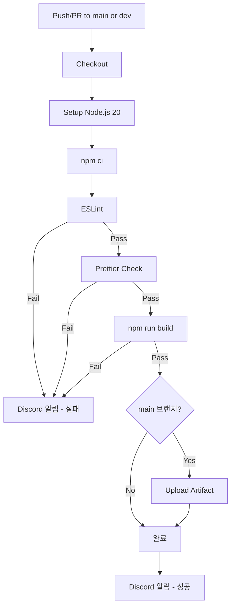

# Frontend CI 설정 가이드

- 작성일: 2026-01-07
- 최종수정일: 2026-01-08


<br>

## 목차

1. [개요](#1-개요)
2. [CI 워크플로우](#2-ci-워크플로우)
   - [파일 위치](#21-파일-위치)
   - [워크플로우 파일](#22-워크플로우-파일)
   - [파이프라인 단계 설명](#23-파이프라인-단계-설명)
3. [린트/테스트 설정](#3-린트테스트-설정)
4. [환경 설정](#4-환경-설정)
   - [GitHub Secrets](#41-github-secrets)
   - [package.json 스크립트 요구사항](#42-packagejson-스크립트-요구사항)
5. [CI 흐름 다이어그램](#5-ci-흐름-다이어그램)
6. [예상 소요 시간](#6-예상-소요-시간)
7. [실패 시 대응](#7-실패-시-대응)
8. [향후 추가 예정](#8-향후-추가-예정)

---

## 1. 개요

이 문서는 **React(Frontend) 프로젝트**의 GitHub Actions CI 설정을 다룬다.

**기술 스택:**
- React (CSR)
- Node.js 20.x
- npm
- ESLint + Prettier

> CI 도구 선택 이유, 브랜치 전략 등 공통 내용은 [[Step2 : CI 파이프라인 구축]] 참조

<br>

## 2. CI 워크플로우

### 2.1 파일 위치

```
.github/workflows/ci.yml
```

### 2.2 워크플로우 파일

```yaml
# =============================================================================
# Frontend CI Workflow
# =============================================================================
# 목적: PR 및 push 시 자동으로 린트, 빌드를 실행하여 코드 품질 검증
# 트리거: main/dev 브랜치 push 또는 PR
# =============================================================================

name: Frontend CI

# -----------------------------------------------------------------------------
# 트리거 설정
# -----------------------------------------------------------------------------
on:
  push:
    branches: [main, dev]
  pull_request:
    branches: [main, dev]

# -----------------------------------------------------------------------------
# 환경 변수 (필요 시 추가)
# -----------------------------------------------------------------------------
env:
  NODE_VERSION: '20'

# -----------------------------------------------------------------------------
# Jobs 정의
# -----------------------------------------------------------------------------
jobs:
  ci:
    name: Lint & Build
    runs-on: ubuntu-latest
    # Ubuntu 환경에서 실행 (서버 환경과 동일)

    steps:
      # -----------------------------------------------------------------------
      # Step 1: 코드 체크아웃
      # -----------------------------------------------------------------------
      # GitHub 저장소의 코드를 Runner에 다운로드
      - name: Checkout repository
        uses: actions/checkout@v4

      # -----------------------------------------------------------------------
      # Step 2: Node.js 설치
      # -----------------------------------------------------------------------
      # 지정된 버전의 Node.js 설치 및 npm 캐시 활성화
      - name: Setup Node.js
        uses: actions/setup-node@v4
        with:
          node-version: ${{ env.NODE_VERSION }}
          cache: 'npm'
          # cache: npm → node_modules 캐싱으로 설치 시간 단축

      # -----------------------------------------------------------------------
      # Step 3: 의존성 설치
      # -----------------------------------------------------------------------
      # npm ci: package-lock.json 기반 정확한 버전 설치 (npm install보다 빠르고 안정적)
      - name: Install dependencies
        run: npm ci

      # -----------------------------------------------------------------------
      # Step 4: ESLint 검사
      # -----------------------------------------------------------------------
      # 코드 스타일 및 잠재적 오류 검사
      - name: Run ESLint
        run: npm run lint
        # package.json에 "lint": "eslint src/" 스크립트 필요

      # -----------------------------------------------------------------------
      # Step 5: Prettier 포맷 검사
      # -----------------------------------------------------------------------
      # 코드 포맷팅 일관성 검사 (수정하지 않고 검사만)
      - name: Check Prettier formatting
        run: npm run format:check
        # package.json에 "format:check": "prettier --check src/" 스크립트 필요

      # -----------------------------------------------------------------------
      # Step 6: 프로덕션 빌드
      # -----------------------------------------------------------------------
      # 빌드 가능 여부 검증 (TypeScript 컴파일 오류, import 오류 등 발견)
      - name: Build production
        run: npm run build

      # -----------------------------------------------------------------------
      # Step 7: 빌드 아티팩트 저장 (main 브랜치만)
      # -----------------------------------------------------------------------
      # CD에서 재빌드 없이 사용하기 위해 빌드 결과물 저장
      - name: Upload build artifact
        if: github.ref == 'refs/heads/main'
        uses: actions/upload-artifact@v4
        with:
          name: frontend-build-${{ github.sha }}
          path: build/
          retention-days: 7
          # 7일간 보관 후 자동 삭제

      # -----------------------------------------------------------------------
      # Step 8: Discord 알림 (성공/실패 모두)
      # -----------------------------------------------------------------------
      - name: Discord Notification
        if: always()
        uses: sarisia/actions-status-discord@v1
        with:
          webhook: ${{ secrets.DISCORD_WEBHOOK }}
          title: "Frontend CI"
          description: |
            **Branch**: ${{ github.ref_name }}
            **Commit**: ${{ github.event.head_commit.message || github.event.pull_request.title }}
          color: ${{ job.status == 'success' && '0x00ff00' || '0xff0000' }}
          # 성공: 초록색, 실패: 빨간색
```

### 2.3 파이프라인 단계 설명

| 단계 | 설명 | 비고 |
|------|------|------|
| Checkout | 코드 체크아웃 | actions/checkout@v4 |
| Setup | Node.js 20 설치 | actions/setup-node@v4 + npm 캐시 |
| Install | 의존성 설치 | `npm ci` (lock 파일 기반) |
| Lint | ESLint + Prettier 검사 | 코드 스타일 검증 |
| Build | 프로덕션 빌드 | `npm run build` |
| Artifact | 빌드 결과물 저장 | main 브랜치만, 7일 보관 |
| Notify | Discord 알림 | 성공/실패 모두 알림 |

<br>

## 3. 린트/테스트 설정

### 린트 도구

| 도구 | 역할 |
|------|------|
| **ESLint** | 코드 스타일 및 잠재적 오류 검사 |
| **Prettier** | 코드 포맷팅 일관성 검사 |

### 테스트 도구 (향후 추가 예정)

| 도구 | 역할 |
|------|------|
| **Vitest** | 테스트 프레임워크 (테스트 실행, assertion, mocking) |
| **React Testing Library** | 테스트 유틸리티 (React 컴포넌트 렌더링, DOM 쿼리) |

> 린트 도구 상세 비교는 [CI 설계 개요 - 부록 A](../technical/ci_overview_v1_4_0.md#부록-a-lint-심화) 참조

<br>

## 4. 환경 설정

### 4.1 GitHub Secrets

CI가 Discord 알림을 보내려면 아래 Secret 설정 필요:

```
Repository → Settings → Secrets and variables → Actions
→ New repository secret
→ Name: DISCORD_WEBHOOK
→ Value: https://discord.com/api/webhooks/xxxxx/yyyyy
```

### 4.2 package.json 스크립트 요구사항

CI가 정상 동작하려면 아래 스크립트가 필요:

```json
{
  "scripts": {
    "lint": "eslint src/",
    "format:check": "prettier --check src/",
    "build": "react-scripts build"
  }
}
```

**스크립트 설명:**
| 스크립트 | 설명 |
|----------|------|
| `lint` | ESLint로 코드 검사 (에러 발견 시 exit code 1) |
| `format:check` | Prettier 포맷 검사만 수행 (자동 수정 안함) |
| `build` | 프로덕션 빌드 생성 |

<br>

## 5. CI 흐름 다이어그램



<br>

## 6. 예상 소요 시간

| 단계 | 예상 시간 | 비고 |
|------|----------|------|
| Checkout | ~10초 | |
| Setup Node.js | ~15초 | 캐시 활용 시 |
| npm ci | ~1분 | 캐시 활용 시 30초 |
| ESLint | ~30초 | 프로젝트 크기에 따라 |
| Prettier | ~10초 | |
| Build | ~2분 | 프로젝트 크기에 따라 |
| **총합** | **~4분** | |

---

## 7. 실패 시 대응

### 린트 실패

```bash
# 로컬에서 자동 수정
npm run lint -- --fix
npm run format:write  # prettier --write src/
```

### 빌드 실패

1. 로컬에서 `npm run build` 실행하여 에러 확인
2. TypeScript 타입 에러, import 경로 오류 등 수정
3. 새 커밋 push

> 상세 실패 대응 프로세스는 [Step2 : CI 파이프라인 구축]] #6-실패-시-대응-방안 참조

<br>

## 8. 향후 추가 예정

- [ ] 테스트 단계 CI에 추가 (`npm run test:run`)
- [ ] Lighthouse CI (성능 검사)
- [ ] 번들 사이즈 체크
